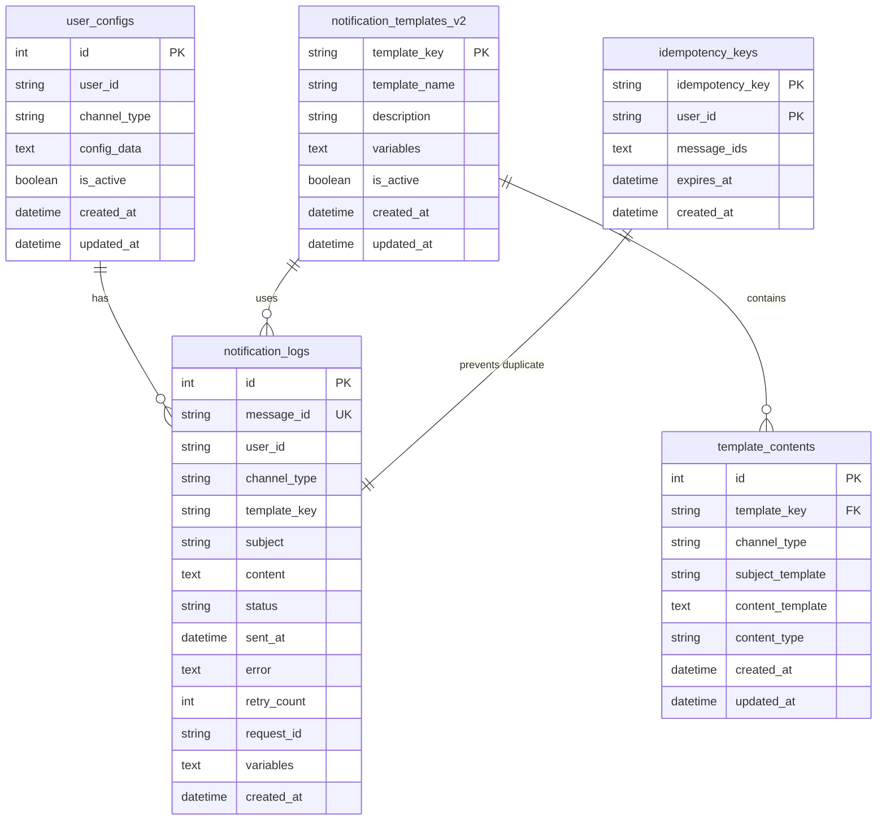

# 数据库完整指南

本文档提供通知系统数据库的完整指南，包括架构设计、Drizzle ORM 使用、迁移管理和最佳实践。

## 目录

- [概述](#概述)
- [技术架构](#技术架构)
- [数据库设计](#数据库设计)
- [Drizzle ORM 配置](#drizzle-orm-配置)
- [基础操作](#基础操作)
- [高级查询](#高级查询)
- [数据库迁移](#数据库迁移)
- [自动迁移](#自动迁移)
- [性能优化](#性能优化)
- [运维管理](#运维管理)
- [最佳实践](#最佳实践)
- [故障排查](#故障排查)

## 概述

通知系统使用 Cloudflare D1 作为数据库，配合 Drizzle ORM 提供类型安全的数据库操作。这种组合特别适合边缘计算环境，提供了高性能和良好的开发体验。

### 核心特性

- **边缘原生**：D1 数据库直接部署在 Cloudflare 边缘节点
- **类型安全**：Drizzle ORM 提供完整的 TypeScript 支持
- **自动迁移**：支持开发环境自动迁移和生产环境受控迁移
- **高性能**：利用 SQLite 的高效查询和 D1 的全球分布

## 技术架构

### 技术栈

| 组件 | 技术选择 | 说明 |
|------|---------|------|
| 数据库 | Cloudflare D1 | 基于 SQLite 的边缘数据库 |
| ORM | Drizzle ORM | 轻量级、类型安全的 TypeScript ORM |
| 迁移工具 | Drizzle Kit | 自动生成和管理数据库迁移 |
| GUI 工具 | Drizzle Studio | 本地数据库可视化管理 |

### 项目结构

```
notification/
├── src/
│   └── db/
│       ├── index.ts         # 数据库连接和导出
│       ├── schema.ts        # 表结构定义
│       └── auto-migrate.ts  # 自动迁移逻辑
├── drizzle/
│   ├── 0000_xxx.sql        # 自动生成的迁移文件
│   ├── 0001_xxx.sql
│   └── meta/               # 迁移元数据
├── drizzle.config.ts       # Drizzle 配置文件
└── scripts/
    └── database/           # 数据库管理脚本
```

## 数据库设计

### ER 图



### 表结构详解

#### 1. user_configs（用户配置表）

存储用户的通知渠道配置信息。

| 字段 | 类型 | 说明 |
|------|------|------|
| id | INTEGER | 主键，自增 |
| user_id | TEXT | 用户标识符 |
| channel_type | TEXT | 渠道类型（webhook/telegram/lark等） |
| config_data | TEXT | JSON 格式的配置数据 |
| is_active | INTEGER | 是否启用（0/1） |
| created_at | TEXT | 创建时间 |
| updated_at | TEXT | 更新时间 |

**索引**：
- `idx_user_channel` - 复合索引 (user_id, channel_type)
- `user_channel_unique` - 唯一约束 (user_id, channel_type)

#### 2. notification_templates_v2（通知模板表）

V2 版本的模板定义，支持多渠道。

| 字段 | 类型 | 说明 |
|------|------|------|
| template_key | TEXT | 模板键，主键 |
| template_name | TEXT | 模板名称 |
| description | TEXT | 模板描述 |
| variables | TEXT | JSON 数组，定义变量 |
| is_active | INTEGER | 是否启用 |
| created_at | TEXT | 创建时间 |
| updated_at | TEXT | 更新时间 |

#### 3. template_contents（模板内容表）

存储每个模板在不同渠道的具体内容。

| 字段 | 类型 | 说明 |
|------|------|------|
| id | INTEGER | 主键，自增 |
| template_key | TEXT | 模板键，外键 |
| channel_type | TEXT | 渠道类型 |
| content_type | TEXT | 内容类型（text/json/html） |
| subject_template | TEXT | 主题模板（可选） |
| content_template | TEXT | 内容模板 |
| created_at | TEXT | 创建时间 |
| updated_at | TEXT | 更新时间 |

**约束**：
- 外键约束到 notification_templates_v2.template_key
- 唯一约束 (template_key, channel_type)

#### 4. notification_logs（通知日志表）

记录所有发送的通知历史。

| 字段 | 类型 | 说明 |
|------|------|------|
| id | INTEGER | 主键，自增 |
| message_id | TEXT | 消息ID，唯一 |
| user_id | TEXT | 用户ID |
| channel_type | TEXT | 发送渠道 |
| template_key | TEXT | 使用的模板 |
| subject | TEXT | 消息主题 |
| content | TEXT | 消息内容 |
| status | TEXT | 状态（pending/success/failed） |
| sent_at | TEXT | 发送时间 |
| error | TEXT | 错误信息 |
| retry_count | INTEGER | 重试次数 |
| request_id | TEXT | 请求ID |
| variables | TEXT | 使用的变量（JSON） |
| created_at | TEXT | 创建时间 |

**索引**：
- `idx_notification_user` - user_id
- `idx_notification_status` - status
- `idx_notification_created` - created_at
- `idx_notification_request_id` - request_id

## Drizzle ORM 配置

### 安装依赖

```bash
npm install drizzle-orm
npm install -D drizzle-kit @types/better-sqlite3
```

### 配置文件

```typescript
// drizzle.config.ts
import type { Config } from "drizzle-kit";

export default {
  schema: "./src/db/schema.ts",
  out: "./drizzle",
  driver: "d1",
  dbCredentials: {
    wranglerConfigPath: "wrangler.toml",
    dbName: "notification-system"
  },
  verbose: true,
  strict: true
} satisfies Config;
```

### Schema 定义

```typescript
// src/db/schema.ts
import { sqliteTable, text, integer, primaryKey, index, unique } from 'drizzle-orm/sqlite-core';
import { sql } from 'drizzle-orm';

// 用户配置表
export const userConfigs = sqliteTable('user_configs', {
  id: integer('id').primaryKey({ autoIncrement: true }),
  user_id: text('user_id').notNull(),
  channel_type: text('channel_type').notNull(),
  config_data: text('config_data').notNull(),
  is_active: integer('is_active', { mode: 'boolean' }).notNull().default(true),
  created_at: text('created_at').notNull().default(sql`CURRENT_TIMESTAMP`),
  updated_at: text('updated_at').notNull().default(sql`CURRENT_TIMESTAMP`),
}, (table) => ({
  userChannelIdx: index('idx_user_channel').on(table.user_id, table.channel_type),
  userChannelUnique: unique('user_channel_unique').on(table.user_id, table.channel_type),
}));

// 通知模板 V2
export const notificationTemplatesV2 = sqliteTable('notification_templates_v2', {
  template_key: text('template_key').primaryKey(),
  template_name: text('template_name').notNull(),
  description: text('description'),
  variables: text('variables'), // JSON array
  is_active: integer('is_active', { mode: 'boolean' }).notNull().default(true),
  created_at: text('created_at').notNull().default(sql`CURRENT_TIMESTAMP`),
  updated_at: text('updated_at').notNull().default(sql`CURRENT_TIMESTAMP`),
});

// 模板内容
export const templateContents = sqliteTable('template_contents', {
  id: integer('id').primaryKey({ autoIncrement: true }),
  template_key: text('template_key').notNull().references(() => notificationTemplatesV2.template_key),
  channel_type: text('channel_type').notNull(),
  content_type: text('content_type').notNull().default('text'),
  subject_template: text('subject_template'),
  content_template: text('content_template').notNull(),
  created_at: text('created_at').notNull().default(sql`CURRENT_TIMESTAMP`),
  updated_at: text('updated_at').notNull().default(sql`CURRENT_TIMESTAMP`),
}, (table) => ({
  templateChannelIdx: index('idx_template_channel_content').on(table.template_key, table.channel_type),
  templateChannelUnique: unique('template_channel_unique').on(table.template_key, table.channel_type),
}));

// 通知日志
export const notificationLogs = sqliteTable('notification_logs', {
  id: integer('id').primaryKey({ autoIncrement: true }),
  message_id: text('message_id').notNull().unique(),
  user_id: text('user_id').notNull(),
  channel_type: text('channel_type').notNull(),
  template_key: text('template_key'),
  subject: text('subject'),
  content: text('content'),
  status: text('status').notNull().default('pending'),
  sent_at: text('sent_at'),
  error: text('error'),
  retry_count: integer('retry_count').notNull().default(0),
  request_id: text('request_id'),
  variables: text('variables'), // JSON
  created_at: text('created_at').notNull().default(sql`CURRENT_TIMESTAMP`),
}, (table) => ({
  userIdx: index('idx_notification_user').on(table.user_id),
  statusIdx: index('idx_notification_status').on(table.status),
  createdAtIdx: index('idx_notification_created').on(table.created_at),
  requestIdIdx: index('idx_notification_request_id').on(table.request_id),
}));

// 幂等键
export const idempotencyKeys = sqliteTable('idempotency_keys', {
  idempotency_key: text('idempotency_key').notNull(),
  user_id: text('user_id').notNull(),
  message_ids: text('message_ids').notNull(), // JSON array
  expires_at: text('expires_at').notNull(),
  created_at: text('created_at').notNull().default(sql`CURRENT_TIMESTAMP`),
}, (table) => ({
  pk: primaryKey({ columns: [table.idempotency_key, table.user_id] }),
  expiresIdx: index('idx_idempotency_expires').on(table.expires_at),
}));

// 类型导出
export type UserConfig = typeof userConfigs.$inferSelect;
export type NewUserConfig = typeof userConfigs.$inferInsert;
export type NotificationTemplateV2 = typeof notificationTemplatesV2.$inferSelect;
export type TemplateContent = typeof templateContents.$inferSelect;
export type NotificationLog = typeof notificationLogs.$inferSelect;
```

### 数据库连接

```typescript
// src/db/index.ts
import { drizzle } from 'drizzle-orm/d1';
import * as schema from './schema';
import type { Env } from '../types';

// 单例模式管理数据库连接
const dbCache = new WeakMap<Env, ReturnType<typeof drizzle>>();

export function getDb(env: Env) {
  if (!dbCache.has(env)) {
    const db = drizzle(env.DB, { 
      schema,
      logger: env.ENVIRONMENT === 'development'
    });
    dbCache.set(env, db);
  }
  return dbCache.get(env)!;
}

// 导出 schema 和类型
export * from './schema';
```

## 基础操作

### 查询操作

#### 单条查询

```typescript
import { getDb } from '../db';
import { userConfigs } from '../db/schema';
import { eq, and } from 'drizzle-orm';

// 查询单个用户配置
export async function getUserConfig(env: Env, userId: string, channelType: string) {
  const db = getDb(env);
  
  const config = await db
    .select()
    .from(userConfigs)
    .where(
      and(
        eq(userConfigs.user_id, userId),
        eq(userConfigs.channel_type, channelType),
        eq(userConfigs.is_active, true)
      )
    )
    .limit(1);
  
  return config[0] || null;
}
```

#### 批量查询

```typescript
// 查询用户的所有配置
export async function getUserAllConfigs(env: Env, userId: string) {
  const db = getDb(env);
  
  return db
    .select()
    .from(userConfigs)
    .where(eq(userConfigs.user_id, userId))
    .orderBy(userConfigs.channel_type);
}

// 分页查询
export async function getNotificationLogs(
  env: Env, 
  userId: string,
  page: number = 1,
  pageSize: number = 20
) {
  const db = getDb(env);
  const offset = (page - 1) * pageSize;
  
  const logs = await db
    .select()
    .from(notificationLogs)
    .where(eq(notificationLogs.user_id, userId))
    .orderBy(desc(notificationLogs.created_at))
    .limit(pageSize)
    .offset(offset);
  
  // 获取总数
  const countResult = await db
    .select({ count: count() })
    .from(notificationLogs)
    .where(eq(notificationLogs.user_id, userId));
  
  return {
    data: logs,
    pagination: {
      page,
      pageSize,
      total: countResult[0]?.count || 0,
      totalPages: Math.ceil((countResult[0]?.count || 0) / pageSize)
    }
  };
}
```

### 插入操作

```typescript
// 创建用户配置
export async function createUserConfig(
  env: Env,
  userId: string,
  channelType: string,
  configData: any
) {
  const db = getDb(env);
  
  const [config] = await db
    .insert(userConfigs)
    .values({
      user_id: userId,
      channel_type: channelType,
      config_data: JSON.stringify(configData),
      is_active: true,
    })
    .returning();
  
  return config;
}

// 批量插入
export async function createNotificationLogs(
  env: Env,
  logs: NewNotificationLog[]
) {
  const db = getDb(env);
  
  return db
    .insert(notificationLogs)
    .values(logs)
    .returning({ id: notificationLogs.id, message_id: notificationLogs.message_id });
}
```

### 更新操作

```typescript
// 更新配置
export async function updateUserConfig(
  env: Env,
  userId: string,
  channelType: string,
  updates: Partial<UserConfig>
) {
  const db = getDb(env);
  
  const [updated] = await db
    .update(userConfigs)
    .set({
      ...updates,
      updated_at: new Date().toISOString(),
    })
    .where(
      and(
        eq(userConfigs.user_id, userId),
        eq(userConfigs.channel_type, channelType)
      )
    )
    .returning();
  
  return updated;
}

// 批量更新状态
export async function updateNotificationStatus(
  env: Env,
  messageIds: string[],
  status: 'success' | 'failed',
  error?: string
) {
  const db = getDb(env);
  
  return db
    .update(notificationLogs)
    .set({
      status,
      error,
      sent_at: new Date().toISOString(),
    })
    .where(inArray(notificationLogs.message_id, messageIds));
}
```

### 删除操作

```typescript
// 删除配置
export async function deleteUserConfig(
  env: Env,
  userId: string,
  channelType: string
) {
  const db = getDb(env);
  
  const [deleted] = await db
    .delete(userConfigs)
    .where(
      and(
        eq(userConfigs.user_id, userId),
        eq(userConfigs.channel_type, channelType)
      )
    )
    .returning();
  
  return deleted;
}

// 清理过期数据
export async function cleanupExpiredIdempotencyKeys(env: Env) {
  const db = getDb(env);
  
  const deleted = await db
    .delete(idempotencyKeys)
    .where(lte(idempotencyKeys.expires_at, new Date().toISOString()))
    .returning({ key: idempotencyKeys.idempotency_key });
  
  return deleted.length;
}
```

## 高级查询

### 联表查询

```typescript
// 获取模板及其内容
export async function getTemplateWithContents(
  env: Env,
  templateKey: string
) {
  const db = getDb(env);
  
  const result = await db
    .select({
      template: notificationTemplatesV2,
      content: templateContents,
    })
    .from(notificationTemplatesV2)
    .leftJoin(
      templateContents,
      eq(notificationTemplatesV2.template_key, templateContents.template_key)
    )
    .where(eq(notificationTemplatesV2.template_key, templateKey));
  
  // 整理数据结构
  if (result.length === 0) return null;
  
  const template = result[0].template;
  const contents = result
    .filter(r => r.content !== null)
    .map(r => r.content!);
  
  return { ...template, contents };
}
```

### 聚合查询

```typescript
// 统计通知发送情况
export async function getNotificationStats(
  env: Env,
  userId: string,
  startDate: string
) {
  const db = getDb(env);
  
  const stats = await db
    .select({
      channel_type: notificationLogs.channel_type,
      total: count(),
      success: count(
        case_(eq(notificationLogs.status, 'success'), 1)
      ),
      failed: count(
        case_(eq(notificationLogs.status, 'failed'), 1)
      ),
    })
    .from(notificationLogs)
    .where(
      and(
        eq(notificationLogs.user_id, userId),
        gte(notificationLogs.created_at, startDate)
      )
    )
    .groupBy(notificationLogs.channel_type);
  
  return stats;
}
```

### 复杂条件查询

```typescript
// 搜索通知日志
export async function searchNotificationLogs(
  env: Env,
  filters: {
    userId?: string;
    channelType?: string;
    status?: string;
    startDate?: string;
    endDate?: string;
    keyword?: string;
  }
) {
  const db = getDb(env);
  
  const conditions = [];
  
  if (filters.userId) {
    conditions.push(eq(notificationLogs.user_id, filters.userId));
  }
  
  if (filters.channelType) {
    conditions.push(eq(notificationLogs.channel_type, filters.channelType));
  }
  
  if (filters.status) {
    conditions.push(eq(notificationLogs.status, filters.status));
  }
  
  if (filters.startDate) {
    conditions.push(gte(notificationLogs.created_at, filters.startDate));
  }
  
  if (filters.endDate) {
    conditions.push(lte(notificationLogs.created_at, filters.endDate));
  }
  
  if (filters.keyword) {
    conditions.push(
      or(
        like(notificationLogs.subject, `%${filters.keyword}%`),
        like(notificationLogs.content, `%${filters.keyword}%`)
      )
    );
  }
  
  return db
    .select()
    .from(notificationLogs)
    .where(conditions.length > 0 ? and(...conditions) : undefined)
    .orderBy(desc(notificationLogs.created_at))
    .limit(100);
}
```

### 事务处理

```typescript
// 使用事务确保数据一致性
export async function processNotificationWithIdempotency(
  env: Env,
  notification: {
    userId: string;
    channelType: string;
    templateKey: string;
    variables: Record<string, any>;
    idempotencyKey?: string;
  }
) {
  const db = getDb(env);
  
  return db.transaction(async (tx) => {
    // 1. 检查幂等性
    if (notification.idempotencyKey) {
      const existing = await tx
        .select()
        .from(idempotencyKeys)
        .where(
          and(
            eq(idempotencyKeys.idempotency_key, notification.idempotencyKey),
            eq(idempotencyKeys.user_id, notification.userId)
          )
        );
      
      if (existing.length > 0) {
        // 返回已存在的消息ID
        return {
          isDuplicate: true,
          messageIds: JSON.parse(existing[0].message_ids)
        };
      }
    }
    
    // 2. 创建通知记录
    const messageId = generateMessageId();
    
    const [log] = await tx
      .insert(notificationLogs)
      .values({
        message_id: messageId,
        user_id: notification.userId,
        channel_type: notification.channelType,
        template_key: notification.templateKey,
        variables: JSON.stringify(notification.variables),
        status: 'pending',
      })
      .returning();
    
    // 3. 记录幂等键
    if (notification.idempotencyKey) {
      await tx.insert(idempotencyKeys).values({
        idempotency_key: notification.idempotencyKey,
        user_id: notification.userId,
        message_ids: JSON.stringify([messageId]),
        expires_at: new Date(Date.now() + 24 * 60 * 60 * 1000).toISOString(),
      });
    }
    
    return {
      isDuplicate: false,
      messageIds: [messageId],
      log
    };
  });
}
```

## 数据库迁移

### 使用 Drizzle Kit

#### 生成迁移

```bash
# 生成迁移文件
npm run db:generate

# 推送到数据库（开发环境）
npm run db:push

# 查看当前状态
npm run db:studio
```

#### package.json 脚本

```json
{
  "scripts": {
    "db:generate": "drizzle-kit generate:sqlite",
    "db:push": "drizzle-kit push:sqlite",
    "db:studio": "drizzle-kit studio",
    "db:migrate": "wrangler d1 migrations apply notification-system",
    "db:migrate:local": "wrangler d1 migrations apply notification-system --local"
  }
}
```

### 手动迁移

#### 创建迁移文件

```sql
-- drizzle/0001_add_system_configs.sql
CREATE TABLE IF NOT EXISTS system_configs (
  config_key TEXT PRIMARY KEY,
  config_value TEXT NOT NULL,
  description TEXT,
  created_at TEXT NOT NULL DEFAULT CURRENT_TIMESTAMP,
  updated_at TEXT NOT NULL DEFAULT CURRENT_TIMESTAMP
);

-- 添加索引
CREATE INDEX IF NOT EXISTS idx_config_key ON system_configs(config_key);
```

#### 应用迁移

```bash
# 本地环境
wrangler d1 migrations apply notification-system --local

# 生产环境
wrangler d1 migrations apply notification-system
```

## 自动迁移

### 实现原理

自动迁移系统在应用启动时检查数据库 schema，并自动应用必要的迁移。

### 自动迁移实现

```typescript
// src/db/auto-migrate.ts
import { sql } from 'drizzle-orm';
import { getDb } from './index';
import { Logger } from '../utils/logger';
import type { Env } from '../types';

const logger = Logger.getInstance();

export class AutoMigrate {
  private static readonly MIGRATION_TABLE = 'schema_migrations';
  private static isRunning = false;
  
  // 定义迁移
  private static migrations = [
    {
      name: '001_initial_schema',
      up: async (env: Env) => {
        const db = getDb(env);
        
        // 创建用户配置表
        await db.run(sql`
          CREATE TABLE IF NOT EXISTS user_configs (
            id INTEGER PRIMARY KEY AUTOINCREMENT,
            user_id TEXT NOT NULL,
            channel_type TEXT NOT NULL,
            config_data TEXT NOT NULL,
            is_active INTEGER NOT NULL DEFAULT 1,
            created_at TEXT NOT NULL DEFAULT CURRENT_TIMESTAMP,
            updated_at TEXT NOT NULL DEFAULT CURRENT_TIMESTAMP,
            UNIQUE(user_id, channel_type)
          )
        `);
        
        // 创建索引
        await db.run(sql`
          CREATE INDEX IF NOT EXISTS idx_user_channel 
          ON user_configs(user_id, channel_type)
        `);
        
        // 创建其他表...
      },
    },
    {
      name: '002_add_task_execution_records',
      up: async (env: Env) => {
        const db = getDb(env);
        await db.run(sql`
          CREATE TABLE IF NOT EXISTS task_execution_records (
            id INTEGER PRIMARY KEY AUTOINCREMENT,
            task_name TEXT NOT NULL,
            execution_time TEXT NOT NULL,
            status TEXT NOT NULL DEFAULT 'completed',
            error TEXT,
            duration_ms INTEGER,
            created_at TEXT NOT NULL DEFAULT CURRENT_TIMESTAMP
          )
        `);
        
        await db.run(sql`
          CREATE INDEX IF NOT EXISTS idx_task_name 
          ON task_execution_records(task_name)
        `);
        
        await db.run(sql`
          CREATE INDEX IF NOT EXISTS idx_execution_time 
          ON task_execution_records(execution_time)
        `);
      },
    },
    {
      name: '003_add_user_config_metadata',
      up: async (env: Env) => {
        const db = getDb(env);
        
        // 检查列是否已存在
        const columnExists = await db.get(sql`
          SELECT COUNT(*) as count FROM pragma_table_info('user_configs') 
          WHERE name = 'metadata'
        `);
        
        if (columnExists.count === 0) {
          await db.run(sql`
            ALTER TABLE user_configs 
            ADD COLUMN metadata TEXT
          `);
        }
      },
    },
    {
      name: '004_add_notification_logs_indexes',
      up: async (env: Env) => {
        const db = getDb(env);
        
        // 复合索引优化常见查询
        await db.run(sql`
          CREATE INDEX IF NOT EXISTS idx_logs_user_status 
          ON notification_logs(user_id, status)
        `);
        
        await db.run(sql`
          CREATE INDEX IF NOT EXISTS idx_logs_user_created 
          ON notification_logs(user_id, created_at)
        `);
      },
    },
  ];
  
  /**
   * 执行自动迁移
   */
  static async migrate(env: Env): Promise<{
    success: boolean;
    executed: string[];
    error?: string;
  }> {
    // 防止并发执行
    if (this.isRunning) {
      return { success: true, executed: [] };
    }
    
    this.isRunning = true;
    const executed: string[] = [];
    
    try {
      // 创建迁移表
      await this.createMigrationsTable(env);
      
      // 获取已执行的迁移
      const executedMigrations = await this.getExecutedMigrations(env);
      
      // 执行待处理的迁移
      for (const migration of this.migrations) {
        if (!executedMigrations.includes(migration.name)) {
          logger.info(`Executing migration: ${migration.name}`);
          
          const startTime = Date.now();
          await migration.up(env);
          const duration = Date.now() - startTime;
          
          await this.recordMigration(env, migration.name);
          executed.push(migration.name);
          
          logger.info(`Migration ${migration.name} completed in ${duration}ms`);
        }
      }
      
      return { success: true, executed };
    } catch (error) {
      logger.error('Migration failed', error);
      return {
        success: false,
        executed,
        error: error instanceof Error ? error.message : String(error),
      };
    } finally {
      this.isRunning = false;
    }
  }
  
  /**
   * 检查数据库状态
   */
  static async checkStatus(env: Env): Promise<{
    initialized: boolean;
    tables: string[];
    migrations: {
      executed: string[];
      pending: string[];
    };
  }> {
    const db = getDb(env);
    
    // 获取所有表
    const tables = await db.all<{ name: string }>(sql`
      SELECT name FROM sqlite_master 
      WHERE type = 'table' AND name NOT LIKE 'sqlite_%'
      ORDER BY name
    `);
    
    // 检查迁移状态
    const hasTable = await this.checkMigrationsTable(env);
    const executed = hasTable ? await this.getExecutedMigrations(env) : [];
    const pending = this.migrations
      .filter(m => !executed.includes(m.name))
      .map(m => m.name);
    
    return {
      initialized: tables.length > 0,
      tables: tables.map(t => t.name),
      migrations: { executed, pending },
    };
  }
  
  // 私有方法
  private static async createMigrationsTable(env: Env): Promise<void> {
    const db = getDb(env);
    await db.run(sql`
      CREATE TABLE IF NOT EXISTS ${sql.identifier(this.MIGRATION_TABLE)} (
        id INTEGER PRIMARY KEY AUTOINCREMENT,
        name TEXT NOT NULL UNIQUE,
        executed_at TEXT NOT NULL DEFAULT CURRENT_TIMESTAMP
      )
    `);
  }
  
  private static async checkMigrationsTable(env: Env): Promise<boolean> {
    try {
      const db = getDb(env);
      const result = await db.get(sql`
        SELECT name FROM sqlite_master 
        WHERE type='table' AND name=${this.MIGRATION_TABLE}
      `);
      return !!result;
    } catch (error) {
      return false;
    }
  }
  
  private static async getExecutedMigrations(env: Env): Promise<string[]> {
    const db = getDb(env);
    const results = await db.all<{ name: string }>(sql`
      SELECT name FROM ${sql.identifier(this.MIGRATION_TABLE)} 
      ORDER BY id
    `);
    return results.map(r => r.name);
  }
  
  private static async recordMigration(env: Env, name: string): Promise<void> {
    const db = getDb(env);
    await db.run(sql`
      INSERT INTO ${sql.identifier(this.MIGRATION_TABLE)} (name) 
      VALUES (${name})
    `);
  }
}
```

#### 2. 添加新迁移

编辑 `/src/db/auto-migrate.ts`：

```typescript
{
  name: '005_add_user_stats_table',
  up: async (env: Env) => {
    const db = getDb(env);
    
    await db.run(sql`
      CREATE TABLE IF NOT EXISTS user_stats (
        user_id TEXT PRIMARY KEY,
        notification_count INTEGER NOT NULL DEFAULT 0,
        last_notification_at TEXT,
        created_at TEXT NOT NULL DEFAULT CURRENT_TIMESTAMP,
        updated_at TEXT NOT NULL DEFAULT CURRENT_TIMESTAMP
      )
    `);
  },
}
```

#### 3. 在应用启动时执行

```typescript
// src/index.ts
import { AutoMigrate } from './db/auto-migrate';

export default {
  async fetch(request: Request, env: Env): Promise<Response> {
    // 开发环境自动执行迁移
    if (env.ENVIRONMENT === 'development') {
      const migrationResult = await AutoMigrate.migrate(env);
      if (!migrationResult.success) {
        console.error('Migration failed:', migrationResult.error);
      }
    }
    
    // 处理请求...
    return handleRequest(request, env);
  },
};
```

## 性能优化

### 索引优化

#### 1. 分析查询模式

```typescript
// 分析慢查询
export async function analyzeSlowQueries(env: Env) {
  const db = getDb(env);
  
  // 获取查询计划
  const plan = await db.run(sql`
    EXPLAIN QUERY PLAN
    SELECT * FROM notification_logs
    WHERE user_id = 'user123' AND status = 'pending'
    ORDER BY created_at DESC
    LIMIT 10
  `);
  
  console.log('Query plan:', plan);
  
  // 如果看到 "SCAN TABLE"，说明没有使用索引
  // 如果看到 "SEARCH TABLE...USING INDEX"，说明使用了索引
}
```

#### 2. 创建合适的索引

```typescript
// 为常见查询创建索引
export async function createOptimizedIndexes(env: Env) {
  const db = getDb(env);
  
  // 复合索引 - 用户状态查询
  await db.run(sql`
    CREATE INDEX IF NOT EXISTS idx_logs_user_status_created
    ON notification_logs(user_id, status, created_at DESC)
  `);
  
  // 覆盖索引 - 包含查询所需的所有列
  await db.run(sql`
    CREATE INDEX IF NOT EXISTS idx_logs_covering
    ON notification_logs(user_id, created_at DESC)
    INCLUDE (status, channel_type, template_key)
  `);
  
  // 部分索引 - 只索引特定条件的数据
  await db.run(sql`
    CREATE INDEX IF NOT EXISTS idx_pending_notifications
    ON notification_logs(user_id, created_at)
    WHERE status = 'pending'
  `);
}
```

### 查询优化

#### 1. 使用预编译语句

```typescript
// 缓存常用查询
class QueryCache {
  private static queries = new Map<string, any>();
  
  static getUserConfigQuery() {
    const key = 'getUserConfig';
    if (!this.queries.has(key)) {
      this.queries.set(key, 
        db.select()
          .from(userConfigs)
          .where(
            and(
              eq(userConfigs.user_id, sql.placeholder('userId')),
              eq(userConfigs.channel_type, sql.placeholder('channelType'))
            )
          )
          .prepare()
      );
    }
    return this.queries.get(key);
  }
}

// 使用预编译查询
const query = QueryCache.getUserConfigQuery();
const result = await query.execute({ userId: 'user123', channelType: 'email' });
```

#### 2. 批量操作优化

```typescript
// 批量插入优化
export async function batchInsertNotifications(
  env: Env,
  notifications: NewNotificationLog[]
) {
  const db = getDb(env);
  const batchSize = 100; // SQLite 限制
  
  const results = [];
  
  for (let i = 0; i < notifications.length; i += batchSize) {
    const batch = notifications.slice(i, i + batchSize);
    const inserted = await db
      .insert(notificationLogs)
      .values(batch)
      .returning({ id: notificationLogs.id });
    results.push(...inserted);
  }
  
  return results;
}
```

#### 3. 分页优化

```typescript
// 使用游标分页代替 OFFSET
export async function getCursorPaginatedLogs(
  env: Env,
  userId: string,
  cursor?: { id: number; created_at: string },
  limit: number = 20
) {
  const db = getDb(env);
  
  let query = db
    .select()
    .from(notificationLogs)
    .where(eq(notificationLogs.user_id, userId));
  
  if (cursor) {
    // 使用复合条件避免跳过相同时间戳的记录
    query = query.where(
      or(
        lt(notificationLogs.created_at, cursor.created_at),
        and(
          eq(notificationLogs.created_at, cursor.created_at),
          gt(notificationLogs.id, cursor.id)
        )
      )
    );
  }
  
  const results = await query
    .orderBy(desc(notificationLogs.created_at), asc(notificationLogs.id))
    .limit(limit + 1); // 多取一条判断是否有下一页
  
  const hasMore = results.length > limit;
  const data = hasMore ? results.slice(0, -1) : results;
  
  const nextCursor = hasMore ? {
    id: data[data.length - 1].id,
    created_at: data[data.length - 1].created_at
  } : null;
  
  return { data, nextCursor, hasMore };
}
```

### 缓存策略

```typescript
// 使用 KV 缓存常用数据
export class ConfigCache {
  private static readonly CACHE_TTL = 5 * 60; // 5分钟
  
  static async getUserConfig(
    env: Env,
    userId: string,
    channelType: string
  ): Promise<UserConfig | null> {
    const cacheKey = `config:${userId}:${channelType}`;
    
    // 尝试从缓存获取
    const cached = await env.CONFIG_CACHE.get(cacheKey, 'json');
    if (cached) {
      return cached as UserConfig;
    }
    
    // 从数据库获取
    const db = getDb(env);
    const config = await db
      .select()
      .from(userConfigs)
      .where(
        and(
          eq(userConfigs.user_id, userId),
          eq(userConfigs.channel_type, channelType)
        )
      )
      .limit(1);
    
    const result = config[0] || null;
    
    // 写入缓存
    if (result) {
      await env.CONFIG_CACHE.put(
        cacheKey,
        JSON.stringify(result),
        { expirationTtl: this.CACHE_TTL }
      );
    }
    
    return result;
  }
  
  static async invalidateUserConfig(
    env: Env,
    userId: string,
    channelType?: string
  ) {
    if (channelType) {
      await env.CONFIG_CACHE.delete(`config:${userId}:${channelType}`);
    } else {
      // 清除用户的所有配置缓存
      const list = await env.CONFIG_CACHE.list({ prefix: `config:${userId}:` });
      for (const key of list.keys) {
        await env.CONFIG_CACHE.delete(key.name);
      }
    }
  }
}
```

### 数据库连接池优化

```typescript
// 高级连接管理
export class DatabaseConnectionManager {
  private static pools = new Map<string, any>();
  
  static getConnection(env: Env, options?: {
    readonly?: boolean;
    timeout?: number;
  }) {
    const key = `${env.ENVIRONMENT}-${options?.readonly ? 'ro' : 'rw'}`;
    
    if (!this.pools.has(key)) {
      const db = drizzle(env.DB, {
        schema,
        logger: env.ENVIRONMENT === 'development',
      });
      
      // 设置连接参数
      if (options?.timeout) {
        // D1 不支持直接设置超时，但可以在应用层实现
        this.pools.set(key, this.wrapWithTimeout(db, options.timeout));
      } else {
        this.pools.set(key, db);
      }
    }
    
    return this.pools.get(key);
  }
  
  private static wrapWithTimeout(db: any, timeout: number) {
    return new Proxy(db, {
      get(target, prop) {
        if (typeof target[prop] === 'function') {
          return async (...args: any[]) => {
            const timeoutPromise = new Promise((_, reject) => {
              setTimeout(() => reject(new Error('Query timeout')), timeout);
            });
            
            return Promise.race([
              target[prop](...args),
              timeoutPromise
            ]);
          };
        }
        return target[prop];
      }
    });
  }
}
```

## 运维管理

### 备份策略

#### 自动备份脚本

```bash
#!/bin/bash
# scripts/database/backup.sh

# 配置
DB_NAME="notification-system"
BACKUP_DIR="./backups"
DATE=$(date +%Y%m%d_%H%M%S)
ENV=${1:-development}

# 创建备份目录
mkdir -p $BACKUP_DIR

echo "Starting backup for $ENV environment..."

# 导出数据库
if [ "$ENV" = "production" ]; then
  wrangler d1 export $DB_NAME \
    --output-file="$BACKUP_DIR/backup_${ENV}_${DATE}.sql"
else
  wrangler d1 export $DB_NAME --local \
    --output-file="$BACKUP_DIR/backup_${ENV}_${DATE}.sql"
fi

# 压缩备份
gzip "$BACKUP_DIR/backup_${ENV}_${DATE}.sql"

# 上传到 R2（可选）
if [ "$ENV" = "production" ]; then
  wrangler r2 object put "$R2_BUCKET/db-backups/backup_${ENV}_${DATE}.sql.gz" \
    --file "backups/backup_${ENV}_${DATE}.sql.gz"
fi

# 清理旧备份（保留最近 30 天）
find backups/ -name "backup_*.sql.gz" -mtime +30 -delete

echo "Backup completed: backup_${ENV}_${DATE}.sql.gz"
```

#### 定期备份配置

```yaml
# .github/workflows/backup.yml
name: Database Backup

on:
  schedule:
    - cron: '0 2 * * *'  # 每天凌晨 2 点
  workflow_dispatch:

jobs:
  backup:
    runs-on: ubuntu-latest
    steps:
      - uses: actions/checkout@v4
      
      - name: Setup Wrangler
        run: npm install -g wrangler
      
      - name: Backup Production Database
        env:
          CLOUDFLARE_API_TOKEN: ${{ secrets.CLOUDFLARE_API_TOKEN }}
        run: ./scripts/database/backup.sh production
      
      - name: Upload to Artifacts
        uses: actions/upload-artifact@v4
        with:
          name: db-backup-${{ github.run_id }}
          path: backups/*.gz
          retention-days: 30
```

### 恢复流程

#### 1. 从备份恢复

```bash
# 解压备份
gunzip backup_production_20250105.sql.gz

# 恢复到新数据库
wrangler d1 create notification-system-restore
wrangler d1 execute notification-system-restore \
  --file backup_production_20250105.sql

# 验证数据
wrangler d1 execute notification-system-restore \
  --command "SELECT COUNT(*) FROM notification_logs"
```

#### 2. 数据迁移

```typescript
// 数据迁移脚本
export async function migrateData(sourceEnv: Env, targetEnv: Env) {
  const sourceDb = getDb(sourceEnv);
  const targetDb = getDb(targetEnv);
  
  // 1. 迁移用户配置
  const configs = await sourceDb.select().from(userConfigs);
  await targetDb.insert(userConfigs).values(configs);
  
  // 2. 迁移模板
  const templates = await sourceDb.select().from(notificationTemplatesV2);
  await targetDb.insert(notificationTemplatesV2).values(templates);
  
  // 3. 迁移模板内容
  const contents = await sourceDb.select().from(templateContents);
  await targetDb.insert(templateContents).values(contents);
  
  console.log(`Migrated: ${configs.length} configs, ${templates.length} templates`);
}
```

### 监控和维护

#### 数据库健康检查

```typescript
export async function checkDatabaseHealth(env: Env) {
  const db = getDb(env);
  const checks = {
    tables: true,
    queries: true,
    size: true,
    performance: true,
  };
  
  try {
    // 检查表是否存在
    const tables = await db.run(sql`
      SELECT name FROM sqlite_master 
      WHERE type='table' AND name NOT LIKE 'sqlite_%'
    `);
    checks.tables = tables.results.length > 0;
    
    // 检查查询性能
    const start = Date.now();
    await db.select().from(notificationLogs).limit(1);
    const queryTime = Date.now() - start;
    checks.performance = queryTime < 100; // 100ms 阈值
    
    // 检查数据库大小
    const stats = await db.run(sql`
      SELECT page_count * page_size as size 
      FROM pragma_page_count(), pragma_page_size()
    `);
    const sizeMB = stats.results[0].size / 1024 / 1024;
    checks.size = sizeMB < 100; // 100MB 阈值
    
  } catch (error) {
    return { healthy: false, error: error.message, checks };
  }
  
  return {
    healthy: Object.values(checks).every(v => v),
    checks,
  };
}
```

#### 定期清理任务

```typescript
// 清理过期数据
export async function cleanupExpiredData(env: Env) {
  const db = getDb(env);
  const results = {
    idempotencyKeys: 0,
    oldLogs: 0,
  };
  
  // 清理过期的幂等键
  const expiredKeys = await db
    .delete(idempotencyKeys)
    .where(lte(idempotencyKeys.expires_at, new Date().toISOString()))
    .returning({ id: idempotencyKeys.idempotency_key });
  results.idempotencyKeys = expiredKeys.length;
  
  // 清理超过 90 天的日志
  const cutoffDate = new Date();
  cutoffDate.setDate(cutoffDate.getDate() - 90);
  
  const deletedLogs = await db
    .delete(notificationLogs)
    .where(lte(notificationLogs.created_at, cutoffDate.toISOString()))
    .returning({ id: notificationLogs.id });
  results.oldLogs = deletedLogs.length;
  
  return results;
}
```

## 最佳实践

### 1. 连接管理

#### 单例模式与连接池

```typescript
// src/db/connection-pool.ts
import { drizzle } from 'drizzle-orm/d1';
import * as schema from './schema';

class DatabaseConnectionPool {
  private connections = new WeakMap<Env, ReturnType<typeof drizzle>>();
  private metrics = {
    hits: 0,
    misses: 0,
    errors: 0
  };
  
  getConnection(env: Env, options?: {
    readonly?: boolean;
    logger?: boolean;
  }) {
    try {
      // 检查缓存
      if (this.connections.has(env)) {
        this.metrics.hits++;
        return this.connections.get(env)!;
      }
      
      // 创建新连接
      this.metrics.misses++;
      const db = drizzle(env.DB, {
        schema,
        logger: options?.logger ?? env.ENVIRONMENT === 'development'
      });
      
      // 设置连接选项
      if (options?.readonly) {
        // D1 暂不支持只读模式，但可以在应用层实现
        return this.wrapReadOnly(db);
      }
      
      this.connections.set(env, db);
      return db;
    } catch (error) {
      this.metrics.errors++;
      throw error;
    }
  }
  
  private wrapReadOnly(db: any) {
    // 包装数据库对象，禁用写操作
    return new Proxy(db, {
      get(target, prop) {
        if (['insert', 'update', 'delete'].includes(String(prop))) {
          throw new Error('写操作在只读模式下被禁用');
        }
        return target[prop];
      }
    });
  }
  
  getMetrics() {
    return {
      ...this.metrics,
      hitRate: this.metrics.hits / (this.metrics.hits + this.metrics.misses)
    };
  }
}

export const dbPool = new DatabaseConnectionPool();
```

### 2. 事务处理最佳实践

#### 事务管理器

```typescript
// src/db/transaction-manager.ts
export class TransactionManager {
  static async executeInTransaction<T>(
    db: any,
    operation: (tx: any) => Promise<T>,
    options?: {
      retries?: number;
      isolationLevel?: 'read-uncommitted' | 'read-committed' | 'repeatable-read' | 'serializable';
      timeout?: number;
    }
  ): Promise<T> {
    const { retries = 3, timeout = 5000 } = options || {};
    let lastError: Error | null = null;
    
    for (let attempt = 1; attempt <= retries; attempt++) {
      try {
        // 创建超时 Promise
        const timeoutPromise = new Promise((_, reject) => {
          setTimeout(() => reject(new Error('事务超时')), timeout);
        });
        
        // 执行事务
        const transactionPromise = db.transaction(async (tx: any) => {
          // D1 不支持设置隔离级别，但记录下来用于监控
          if (options?.isolationLevel) {
            console.log(`事务隔离级别: ${options.isolationLevel}`);
          }
          
          return await operation(tx);
        });
        
        // 竞态：事务 vs 超时
        return await Promise.race([
          transactionPromise,
          timeoutPromise
        ]) as T;
        
      } catch (error) {
        lastError = error as Error;
        
        // 判断是否应该重试
        if (this.shouldRetry(error, attempt, retries)) {
          console.warn(`事务失败，重试 ${attempt}/${retries}:`, error);
          await this.delay(attempt * 100); // 指数退避
          continue;
        }
        
        throw error;
      }
    }
    
    throw lastError || new Error('事务执行失败');
  }
  
  private static shouldRetry(error: any, attempt: number, maxRetries: number): boolean {
    // 已达到最大重试次数
    if (attempt >= maxRetries) return false;
    
    // 分析错误类型
    const errorMessage = error?.message || '';
    
    // 可重试的错误
    const retryableErrors = [
      'SQLITE_BUSY',
      'SQLITE_LOCKED',
      'database is locked',
      '事务超时'
    ];
    
    return retryableErrors.some(e => errorMessage.includes(e));
  }
  
  private static delay(ms: number): Promise<void> {
    return new Promise(resolve => setTimeout(resolve, ms));
  }
}

// 使用示例
export async function createNotificationWithRetry(
  env: Env,
  notificationData: any
) {
  const db = getDb(env);
  
  return TransactionManager.executeInTransaction(
    db,
    async (tx) => {
      // 1. 插入通知记录
      const [notification] = await tx.insert(notificationLogs)
        .values(notificationData)
        .returning();
      
      // 2. 更新用户统计
      await tx.run(sql`
        INSERT INTO user_stats (user_id, notification_count)
        VALUES (${notificationData.user_id}, 1)
        ON CONFLICT(user_id) DO UPDATE SET
          notification_count = notification_count + 1,
          last_notification_at = CURRENT_TIMESTAMP
      `);
      
      // 3. 记录幂等键
      if (notificationData.idempotency_key) {
        await tx.insert(idempotencyKeys).values({
          idempotency_key: notificationData.idempotency_key,
          user_id: notificationData.user_id,
          message_ids: JSON.stringify([notification.message_id]),
          expires_at: new Date(Date.now() + 24 * 60 * 60 * 1000).toISOString()
        });
      }
      
      return notification;
    },
    {
      retries: 3,
      timeout: 5000
    }
  );
}
```

### 3. 查询优化进阶

#### 查询构建器优化

```typescript
// src/db/query-builder.ts
export class OptimizedQueryBuilder {
  // 批量查询优化
  static async batchQuery<T>(
    db: any,
    ids: string[],
    queryFn: (batch: string[]) => Promise<T[]>,
    batchSize = 100
  ): Promise<T[]> {
    const results: T[] = [];
    
    // 分批处理
    for (let i = 0; i < ids.length; i += batchSize) {
      const batch = ids.slice(i, i + batchSize);
      const batchResults = await queryFn(batch);
      results.push(...batchResults);
    }
    
    return results;
  }
  
  // 游标分页优化
  static async *cursorPaginate<T>(
    db: any,
    table: any,
    options: {
      where?: any;
      orderBy?: any;
      pageSize?: number;
      cursorColumn?: string;
    }
  ): AsyncGenerator<T[], void, unknown> {
    const { 
      where, 
      orderBy, 
      pageSize = 100,
      cursorColumn = 'id'
    } = options;
    
    let cursor: any = null;
    
    while (true) {
      // 构建查询
      let query = db.select().from(table);
      
      // 添加条件
      const conditions = [];
      if (where) conditions.push(where);
      if (cursor) {
        conditions.push(sql`${table[cursorColumn]} > ${cursor}`);
      }
      
      if (conditions.length > 0) {
        query = query.where(and(...conditions));
      }
      
      // 排序和限制
      query = query
        .orderBy(orderBy || table[cursorColumn])
        .limit(pageSize);
      
      // 执行查询
      const results = await query;
      
      if (results.length === 0) break;
      
      yield results as T[];
      
      // 更新游标
      cursor = results[results.length - 1][cursorColumn];
    }
  }
  
  // 预编译查询缓存
  private static preparedQueries = new Map<string, any>();
  
  static prepareCachedQuery(
    key: string,
    queryBuilder: () => any
  ) {
    if (!this.preparedQueries.has(key)) {
      this.preparedQueries.set(key, queryBuilder());
    }
    return this.preparedQueries.get(key);
  }
}

// 使用示例：高效的日志查询
export async function* streamUserLogs(
  env: Env,
  userId: string,
  startDate: string
) {
  const db = getDb(env);
  
  // 使用游标分页流式处理大量数据
  const logStream = OptimizedQueryBuilder.cursorPaginate(
    db,
    notificationLogs,
    {
      where: and(
        eq(notificationLogs.user_id, userId),
        gte(notificationLogs.created_at, startDate)
      ),
      orderBy: notificationLogs.created_at,
      pageSize: 200,
      cursorColumn: 'id'
    }
  );
  
  for await (const batch of logStream) {
    // 处理每批数据
    yield batch;
  }
}
```

### 4. 数据安全最佳实践

#### 安全层实现

```typescript
// src/db/security-layer.ts
import { AES } from '../utils/crypto';

export class DatabaseSecurityLayer {
  constructor(private encryptionKey: string) {}
  
  // 字段级加密
  async encryptField(value: string): Promise<string> {
    return AES.encrypt(value, this.encryptionKey);
  }
  
  async decryptField(encrypted: string): Promise<string> {
    return AES.decrypt(encrypted, this.encryptionKey);
  }
  
  // 安全的用户配置存储
  async secureUserConfig(
    db: any,
    userId: string,
    channelType: string,
    configData: any
  ) {
    // 1. 验证输入
    this.validateInput({ userId, channelType, configData });
    
    // 2. 加密敏感数据
    const encryptedData = await this.encryptSensitiveFields(configData);
    
    // 3. 审计日志
    await this.logConfigChange(db, userId, channelType, 'create');
    
    // 4. 存储数据
    return db.insert(userConfigs).values({
      user_id: userId,
      channel_type: channelType,
      config_data: JSON.stringify(encryptedData),
      is_active: true
    });
  }
  
  private async encryptSensitiveFields(data: any): Promise<any> {
    const sensitiveFields = [
      'webhook_url',
      'api_key',
      'token',
      'password',
      'secret'
    ];
    
    const encrypted = { ...data };
    
    for (const field of sensitiveFields) {
      if (field in encrypted && encrypted[field]) {
        encrypted[field] = await this.encryptField(encrypted[field]);
        encrypted[`${field}_encrypted`] = true;
      }
    }
    
    return encrypted;
  }
  
  private validateInput(input: any) {
    // SQL 注入防护（Drizzle 已经提供）
    // XSS 防护
    const dangerousPatterns = [
      /<script/i,
      /javascript:/i,
      /on\w+=/i
    ];
    
    const inputStr = JSON.stringify(input);
    for (const pattern of dangerousPatterns) {
      if (pattern.test(inputStr)) {
        throw new Error('检测到潜在的安全威胁');
      }
    }
  }
  
  private async logConfigChange(
    db: any,
    userId: string,
    channelType: string,
    action: string
  ) {
    // 记录审计日志
    await db.insert(auditLogs).values({
      user_id: userId,
      action: `config_${action}`,
      resource: `${channelType}_config`,
      timestamp: new Date().toISOString(),
      ip_address: null, // 从请求上下文获取
      user_agent: null  // 从请求上下文获取
    });
  }
}

// 数据脱敏工具
export class DataMasking {
  static maskEmail(email: string): string {
    const [local, domain] = email.split('@');
    const maskedLocal = local.charAt(0) + '***' + local.slice(-1);
    return `${maskedLocal}@${domain}`;
  }
  
  static maskPhone(phone: string): string {
    return phone.slice(0, 3) + '****' + phone.slice(-4);
  }
  
  static maskWebhookUrl(url: string): string {
    try {
      const urlObj = new URL(url);
      return `${urlObj.protocol}//${urlObj.hostname}/***`;
    } catch {
      return '***';
    }
  }
  
  // 导出数据时自动脱敏
  static async exportUserData(db: any, userId: string) {
    const configs = await db.select()
      .from(userConfigs)
      .where(eq(userConfigs.user_id, userId));
    
    return configs.map(config => {
      const data = JSON.parse(config.config_data);
      
      // 根据渠道类型脱敏
      switch (config.channel_type) {
        case 'email':
          if (data.to_email) {
            data.to_email = this.maskEmail(data.to_email);
          }
          break;
        case 'webhook':
          if (data.webhook_url) {
            data.webhook_url = this.maskWebhookUrl(data.webhook_url);
          }
          break;
        case 'sms':
          if (data.phone_number) {
            data.phone_number = this.maskPhone(data.phone_number);
          }
          break;
      }
      
      return {
        ...config,
        config_data: JSON.stringify(data)
      };
    });
  }
}
```

### 5. 监控和告警

#### 数据库健康检查

```typescript
// src/db/health-check.ts
export class DatabaseHealthCheck {
  static async performHealthCheck(env: Env): Promise<HealthReport> {
    const report: HealthReport = {
      status: 'healthy',
      checks: [],
      timestamp: new Date().toISOString()
    };
    
    try {
      const db = getDb(env);
      
      // 1. 连接测试
      const connectStart = Date.now();
      await db.get(sql`SELECT 1`);
      const connectTime = Date.now() - connectStart;
      
      report.checks.push({
        name: '数据库连接',
        status: connectTime < 100 ? 'healthy' : 'degraded',
        responseTime: connectTime,
        details: `连接耗时: ${connectTime}ms`
      });
      
      // 2. 表完整性检查
      const tableCheck = await this.checkTableIntegrity(db);
      report.checks.push(tableCheck);
      
      // 3. 性能指标
      const perfCheck = await this.checkPerformanceMetrics(db);
      report.checks.push(perfCheck);
      
      // 4. 存储空间
      const storageCheck = await this.checkStorageUsage(db);
      report.checks.push(storageCheck);
      
      // 5. 索引健康度
      const indexCheck = await this.checkIndexHealth(db);
      report.checks.push(indexCheck);
      
      // 综合评估
      const hasIssues = report.checks.some(c => 
        c.status === 'unhealthy' || c.status === 'degraded'
      );
      
      report.status = hasIssues ? 'degraded' : 'healthy';
      
    } catch (error) {
      report.status = 'unhealthy';
      report.error = error instanceof Error ? error.message : '未知错误';
    }
    
    return report;
  }
  
  private static async checkTableIntegrity(db: any): Promise<HealthCheck> {
    const requiredTables = [
      'user_configs',
      'notification_templates_v2',
      'template_contents',
      'notification_logs'
    ];
    
    const missingTables: string[] = [];
    
    for (const table of requiredTables) {
      const exists = await db.get(sql`
        SELECT name FROM sqlite_master 
        WHERE type='table' AND name=${table}
      `);
      
      if (!exists) {
        missingTables.push(table);
      }
    }
    
    return {
      name: '表完整性',
      status: missingTables.length === 0 ? 'healthy' : 'unhealthy',
      details: missingTables.length === 0 
        ? '所有必需的表都存在' 
        : `缺少表: ${missingTables.join(', ')}`
    };
  }
  
  private static async checkPerformanceMetrics(db: any): Promise<HealthCheck> {
    // 测试查询性能
    const queries = [
      {
        name: '简单查询',
        sql: sql`SELECT COUNT(*) FROM notification_logs`,
        threshold: 50
      },
      {
        name: '索引查询',
        sql: sql`
          SELECT * FROM notification_logs 
          WHERE user_id = 'test' 
          LIMIT 1
        `,
        threshold: 20
      }
    ];
    
    const slowQueries: string[] = [];
    
    for (const query of queries) {
      const start = Date.now();
      await db.get(query.sql);
      const duration = Date.now() - start;
      
      if (duration > query.threshold) {
        slowQueries.push(`${query.name} (${duration}ms)`);
      }
    }
    
    return {
      name: '查询性能',
      status: slowQueries.length === 0 ? 'healthy' : 'degraded',
      details: slowQueries.length === 0
        ? '所有查询响应正常'
        : `慢查询: ${slowQueries.join(', ')}`
    };
  }
  
  private static async checkStorageUsage(db: any): Promise<HealthCheck> {
    // 获取各表记录数
    const tableSizes = await db.all(sql`
      SELECT 
        'notification_logs' as table_name,
        COUNT(*) as row_count
      FROM notification_logs
      UNION ALL
      SELECT 'user_configs', COUNT(*) FROM user_configs
      UNION ALL
      SELECT 'template_contents', COUNT(*) FROM template_contents
    `);
    
    const totalRows = tableSizes.reduce((sum, t) => sum + t.row_count, 0);
    
    // D1 限制：500MB 存储，假设平均每行 1KB
    const estimatedSizeMB = (totalRows * 1024) / (1024 * 1024);
    const usagePercent = (estimatedSizeMB / 500) * 100;
    
    return {
      name: '存储使用',
      status: usagePercent < 80 ? 'healthy' : 'degraded',
      details: `估计使用: ${estimatedSizeMB.toFixed(2)}MB (${usagePercent.toFixed(1)}%)`,
      metrics: {
        totalRows,
        estimatedSizeMB,
        usagePercent
      }
    };
  }
  
  private static async checkIndexHealth(db: any): Promise<HealthCheck> {
    // 检查索引碎片（SQLite 特定）
    const result = await db.get(sql`
      SELECT 
        COUNT(*) as index_count
      FROM sqlite_master 
      WHERE type = 'index'
    `);
    
    return {
      name: '索引健康',
      status: 'healthy',
      details: `活跃索引数: ${result.index_count}`
    };
  }
}

// 类型定义
interface HealthReport {
  status: 'healthy' | 'degraded' | 'unhealthy';
  checks: HealthCheck[];
  timestamp: string;
  error?: string;
}

interface HealthCheck {
  name: string;
  status: 'healthy' | 'degraded' | 'unhealthy';
  details: string;
  responseTime?: number;
  metrics?: Record<string, any>;
}
```

## 故障排查

### 常见问题

#### 1. 数据库连接失败

**症状**：
```
Error: D1_ERROR: Database not found
Error: No database binding found
```

**解决方案**：
```bash
# 1. 检查数据库是否存在
wrangler d1 list

# 2. 确认 wrangler.toml 配置正确
[[d1_databases]]
binding = "DB"
database_name = "notification-system"
database_id = "your-database-id"

# 3. 重新创建数据库绑定
wrangler d1 create notification-system

# 4. 更新环境变量
wrangler secret put DB_ID
```

#### 2. 迁移执行失败

**症状**：
```
Error: SQLITE_CONSTRAINT: UNIQUE constraint failed
Error: table already exists
```

**解决方案**：
```typescript
// 使用事务确保原子性
const db = getDb(env);
await db.transaction(async (tx) => {
  try {
    // 检查约束冲突
    const existing = await tx.select()
      .from(userConfigs)
      .where(and(
        eq(userConfigs.user_id, 'user123'),
        eq(userConfigs.channel_type, 'email')
      ));
    
    if (existing.length > 0) {
      // 更新而不是插入
      await tx.update(userConfigs)
        .set({ config_data: newData })
        .where(eq(userConfigs.id, existing[0].id));
    } else {
      await tx.insert(userConfigs).values(newConfig);
    }
  } catch (error) {
    // 事务自动回滚
    throw error;
  }
});
```

#### 3. 查询性能问题

**症状**：
- 查询超时（超过 30 秒）
- CPU 时间超限
- 内存使用过高

**诊断脚本**：
```typescript
// scripts/database/diagnose-performance.ts
import { getDb } from '../../src/db';
import { sql } from 'drizzle-orm';

export async function diagnosePerformance(env: Env) {
  const db = getDb(env);
  
  console.log('=== 数据库性能诊断 ===');
  
  // 1. 表大小分析
  const tableSizes = await db.all(sql`
    SELECT 
      name as table_name,
      COUNT(*) as row_count
    FROM sqlite_master 
    WHERE type='table'
    GROUP BY name
  `);
  
  console.log('\n表大小：');
  console.table(tableSizes);
  
  // 2. 索引使用情况
  const indexes = await db.all(sql`
    SELECT 
      name as index_name,
      tbl_name as table_name,
      sql
    FROM sqlite_master 
    WHERE type='index' AND name NOT LIKE 'sqlite_%'
  `);
  
  console.log('\n索引列表：');
  console.table(indexes);
  
  // 3. 慢查询分析（模拟）
  const slowQueries = [
    {
      query: 'SELECT * FROM notification_logs WHERE status = ?',
      issue: '缺少 status 索引',
      solution: 'CREATE INDEX idx_status ON notification_logs(status)'
    },
    {
      query: 'SELECT * FROM notification_logs WHERE user_id = ? ORDER BY created_at',
      issue: '缺少复合索引',
      solution: 'CREATE INDEX idx_user_created ON notification_logs(user_id, created_at)'
    }
  ];
  
  console.log('\n潜在的慢查询：');
  console.table(slowQueries);
  
  // 4. 数据库统计
  await db.run(sql`ANALYZE`);
  console.log('\n✅ 数据库统计信息已更新');
}
```

#### 4. 数据完整性问题

**症状**：
- 外键约束失败
- 数据不一致
- 孤立记录

**数据完整性检查脚本**：
```typescript
// scripts/database/check-integrity.ts
export async function checkDataIntegrity(env: Env) {
  const db = getDb(env);
  const issues: string[] = [];
  
  // 1. 检查孤立的模板内容
  const orphanedContents = await db.all(sql`
    SELECT tc.* FROM template_contents tc
    LEFT JOIN notification_templates_v2 nt ON tc.template_key = nt.template_key
    WHERE nt.template_key IS NULL
  `);
  
  if (orphanedContents.length > 0) {
    issues.push(`发现 ${orphanedContents.length} 个孤立的模板内容记录`);
  }
  
  // 2. 检查无效的通知日志
  const invalidLogs = await db.all(sql`
    SELECT * FROM notification_logs
    WHERE user_id IS NULL OR channel_type IS NULL
  `);
  
  if (invalidLogs.length > 0) {
    issues.push(`发现 ${invalidLogs.length} 个无效的通知日志`);
  }
  
  // 3. 检查过期的幂等键
  const expiredKeys = await db.all(sql`
    SELECT COUNT(*) as count FROM idempotency_keys
    WHERE datetime(expires_at) < datetime('now')
  `);
  
  if (expiredKeys[0]?.count > 0) {
    issues.push(`发现 ${expiredKeys[0].count} 个过期的幂等键`);
  }
  
  return { issues, healthy: issues.length === 0 };
}
```

### 调试工具

#### 1. 本地调试环境设置

```bash
# 创建调试配置
cat > .vscode/launch.json << 'EOF'
{
  "version": "0.2.0",
  "configurations": [
    {
      "name": "Debug Database Scripts",
      "type": "node",
      "request": "launch",
      "runtimeExecutable": "npm",
      "runtimeArgs": ["run", "db:debug"],
      "console": "integratedTerminal",
      "env": {
        "NODE_ENV": "development",
        "DEBUG": "drizzle:*"
      }
    }
  ]
}
EOF
```

#### 2. 实时查询监控

```typescript
// src/utils/db-monitor.ts
export class DatabaseMonitor {
  private queries: QueryLog[] = [];
  
  logQuery(sql: string, params: any[], duration: number) {
    this.queries.push({
      sql,
      params,
      duration,
      timestamp: new Date().toISOString()
    });
    
    // 保留最近 100 条查询
    if (this.queries.length > 100) {
      this.queries.shift();
    }
    
    // 慢查询警告
    if (duration > 1000) {
      console.warn(`慢查询检测 (${duration}ms):`, sql);
    }
  }
  
  getSlowQueries(threshold = 500): QueryLog[] {
    return this.queries.filter(q => q.duration > threshold);
  }
  
  getQueryStats() {
    const stats = new Map<string, { count: number; totalTime: number }>();
    
    this.queries.forEach(q => {
      const key = q.sql.substring(0, 50);
      const stat = stats.get(key) || { count: 0, totalTime: 0 };
      stat.count++;
      stat.totalTime += q.duration;
      stats.set(key, stat);
    });
    
    return Array.from(stats.entries())
      .map(([sql, stat]) => ({
        sql,
        count: stat.count,
        avgTime: stat.totalTime / stat.count,
        totalTime: stat.totalTime
      }))
      .sort((a, b) => b.totalTime - a.totalTime);
  }
}
```

### 数据恢复

#### 紧急数据恢复流程

```bash
#!/bin/bash
# scripts/database/emergency-recovery.sh

set -e

echo "🚨 紧急数据恢复流程"

# 1. 导出当前数据（如果可访问）
if wrangler d1 execute notification-system --command="SELECT 1" > /dev/null 2>&1; then
  echo "📦 导出现有数据..."
  wrangler d1 export notification-system --output=backup_$(date +%Y%m%d_%H%M%S).sql
fi

# 2. 创建新数据库
echo "🔨 创建新数据库..."
NEW_DB_NAME="notification-system-recovery-$(date +%Y%m%d_%H%M%S)"
wrangler d1 create $NEW_DB_NAME

# 3. 初始化架构
echo "📋 初始化数据库架构..."
wrangler d1 execute $NEW_DB_NAME --file=sql/schema.sql

# 4. 恢复数据
if [ -f "backup_latest.sql" ]; then
  echo "♻️ 恢复数据..."
  wrangler d1 execute $NEW_DB_NAME --file=backup_latest.sql
fi

# 5. 验证恢复
echo "✅ 验证数据恢复..."
wrangler d1 execute $NEW_DB_NAME --command="
  SELECT 
    'user_configs' as table_name, COUNT(*) as count FROM user_configs
  UNION ALL
  SELECT 'notification_logs', COUNT(*) FROM notification_logs
  UNION ALL
  SELECT 'templates', COUNT(*) FROM notification_templates_v2
"

echo "\n🎉 恢复完成！"
echo "新数据库名称: $NEW_DB_NAME"
echo "请更新 wrangler.toml 中的 database_name 和 database_id"
```

### 性能分析工具

#### 查询计划分析器

```typescript
// scripts/database/query-analyzer.ts
import { sql } from 'drizzle-orm';

export class QueryAnalyzer {
  constructor(private db: any) {}
  
  async analyzeQuery(query: string, params: any[] = []) {
    console.log('\n=== 查询分析 ===');
    console.log('查询:', query);
    console.log('参数:', params);
    
    // 获取查询计划
    const plan = await this.db.all(
      sql.raw(`EXPLAIN QUERY PLAN ${query}`, params)
    );
    
    console.log('\n查询计划:');
    plan.forEach((step: any) => {
      console.log(`  ${step.detail}`);
    });
    
    // 分析索引使用
    const indexUsage = this.analyzeIndexUsage(plan);
    console.log('\n索引使用情况:');
    console.log(indexUsage);
    
    // 性能建议
    const suggestions = this.generateSuggestions(plan, query);
    if (suggestions.length > 0) {
      console.log('\n优化建议:');
      suggestions.forEach((s, i) => {
        console.log(`  ${i + 1}. ${s}`);
      });
    }
    
    return { plan, indexUsage, suggestions };
  }
  
  private analyzeIndexUsage(plan: any[]): string {
    const hasTableScan = plan.some(p => 
      p.detail.includes('SCAN TABLE')
    );
    const usesIndex = plan.some(p => 
      p.detail.includes('USING INDEX')
    );
    
    if (hasTableScan && !usesIndex) {
      return '⚠️ 全表扫描，未使用索引';
    } else if (usesIndex) {
      return '✅ 使用了索引';
    } else {
      return 'ℹ️ 查询计划正常';
    }
  }
  
  private generateSuggestions(plan: any[], query: string): string[] {
    const suggestions: string[] = [];
    
    // 检查是否有全表扫描
    if (plan.some(p => p.detail.includes('SCAN TABLE'))) {
      const table = plan.find(p => p.detail.includes('SCAN TABLE'))
        ?.detail.match(/SCAN TABLE (\w+)/)?.[1];
      if (table) {
        suggestions.push(
          `考虑为表 ${table} 添加索引以避免全表扫描`
        );
      }
    }
    
    // 检查是否有排序操作
    if (query.toLowerCase().includes('order by')) {
      suggestions.push(
        '考虑创建覆盖索引包含 ORDER BY 字段以提升排序性能'
      );
    }
    
    // 检查是否有 LIKE 操作
    if (query.includes('LIKE')) {
      suggestions.push(
        '使用前缀匹配 (LIKE "prefix%") 而非通配符匹配 (LIKE "%pattern%") 以使用索引'
      );
    }
    
    return suggestions;
  }
}

// 使用示例
async function analyzePerformance(env: Env) {
  const analyzer = new QueryAnalyzer(getDb(env));
  
  // 分析常见查询
  await analyzer.analyzeQuery(
    'SELECT * FROM notification_logs WHERE user_id = ? AND created_at > ? ORDER BY created_at DESC LIMIT 10',
    ['user123', '2024-01-01']
  );
}
```

### 数据库维护最佳实践

#### 定期维护计划

```typescript
// scripts/database/maintenance-plan.ts
export class DatabaseMaintenancePlan {
  static async executeDailyMaintenance(env: Env) {
    const tasks = [
      { name: '清理过期数据', fn: this.cleanupExpiredData },
      { name: '更新统计信息', fn: this.updateStatistics },
      { name: '检查数据完整性', fn: this.checkIntegrity },
      { name: '优化表碎片', fn: this.optimizeTables },
    ];
    
    const results = [];
    
    for (const task of tasks) {
      try {
        const startTime = Date.now();
        const result = await task.fn(env);
        const duration = Date.now() - startTime;
        
        results.push({
          task: task.name,
          status: 'success',
          duration,
          result,
        });
      } catch (error) {
        results.push({
          task: task.name,
          status: 'failed',
          error: error.message,
        });
      }
    }
    
    // 记录维护日志
    await this.logMaintenanceResults(env, results);
    
    return results;
  }
  
  private static async cleanupExpiredData(env: Env) {
    const db = getDb(env);
    
    // 清理过期的幂等键
    const deletedKeys = await db
      .delete(idempotencyKeys)
      .where(lte(idempotencyKeys.expires_at, new Date().toISOString()))
      .returning();
    
    // 归档旧日志
    const archiveDate = new Date();
    archiveDate.setDate(archiveDate.getDate() - 30);
    
    const archivedLogs = await db
      .select()
      .from(notificationLogs)
      .where(lte(notificationLogs.created_at, archiveDate.toISOString()))
      .limit(1000); // 批量处理
    
    // 这里可以将日志导出到外部存储
    
    return {
      deletedKeys: deletedKeys.length,
      archivedLogs: archivedLogs.length,
    };
  }
  
  private static async updateStatistics(env: Env) {
    const db = getDb(env);
    await db.run(sql`ANALYZE`);
    return { analyzed: true };
  }
  
  private static async checkIntegrity(env: Env) {
    const db = getDb(env);
    const result = await db.get(sql`PRAGMA integrity_check`);
    return { integrity: result.integrity_check };
  }
  
  private static async optimizeTables(env: Env) {
    const db = getDb(env);
    // SQLite 的 VACUUM 在 D1 中可能不可用
    // 但可以通过重建索引来优化
    const indexes = await db.all(sql`
      SELECT name FROM sqlite_master 
      WHERE type = 'index' AND name NOT LIKE 'sqlite_%'
    `);
    
    for (const index of indexes) {
      await db.run(sql`REINDEX ${sql.identifier(index.name)}`);
    }
    
    return { reindexed: indexes.length };
  }
  
  private static async logMaintenanceResults(env: Env, results: any[]) {
    const db = getDb(env);
    await db.insert(taskExecutionRecords).values({
      task_name: 'daily_maintenance',
      execution_time: new Date().toISOString(),
      status: results.every(r => r.status === 'success') ? 'completed' : 'partial',
      details: JSON.stringify(results),
    });
  }
}
```

#### 容量规划

```typescript
// scripts/database/capacity-planning.ts
export async function analyzeCapacity(env: Env) {
  const db = getDb(env);
  
  // 1. 当前使用情况
  const currentUsage = await db.all(sql`
    SELECT 
      'notification_logs' as table_name,
      COUNT(*) as row_count,
      AVG(LENGTH(content)) as avg_row_size
    FROM notification_logs
    UNION ALL
    SELECT 
      'user_configs',
      COUNT(*),
      AVG(LENGTH(config_data))
    FROM user_configs
  `);
  
  // 2. 增长趋势分析
  const growthTrend = await db.all(sql`
    SELECT 
      DATE(created_at) as date,
      COUNT(*) as daily_count
    FROM notification_logs
    WHERE created_at >= datetime('now', '-30 days')
    GROUP BY DATE(created_at)
    ORDER BY date
  `);
  
  // 3. 预测未来容量需求
  const avgDailyGrowth = growthTrend.reduce((sum, day) => 
    sum + day.daily_count, 0
  ) / growthTrend.length;
  
  const projections = {
    current: currentUsage,
    dailyGrowth: avgDailyGrowth,
    projectedMonthly: avgDailyGrowth * 30,
    projectedYearly: avgDailyGrowth * 365,
  };
  
  // 4. 容量建议
  const recommendations = [];
  
  if (avgDailyGrowth > 10000) {
    recommendations.push('考虑实施更激进的数据归档策略');
  }
  
  const totalRows = currentUsage.reduce((sum, table) => 
    sum + table.row_count, 0
  );
  
  if (totalRows > 1000000) {
    recommendations.push('考虑分表或分片策略');
  }
  
  return {
    ...projections,
    recommendations,
  };
}
```

## 总结

本文档提供了通知系统数据库的完整指南，涵盖了从基础配置到高级优化的所有方面。关键要点：

1. **使用 Drizzle ORM** 获得类型安全和良好的开发体验
2. **实施自动迁移** 简化数据库架构管理
3. **优化查询性能** 通过合理的索引和查询设计
4. **确保数据安全** 通过加密、验证和访问控制
5. **定期维护** 保持数据库健康和高性能

遵循这些最佳实践，可以构建一个可靠、高效、安全的数据库系统，支撑通知系统的长期稳定运行。

### 下一步

- 阅读 [API 参考文档](./complete-api-reference.md) 了解如何使用数据库 API
- 查看 [V2 模板系统文档](./v2-template-system.md) 学习模板管理
- 参考 [开发指南](./development.md) 获取更多开发技巧