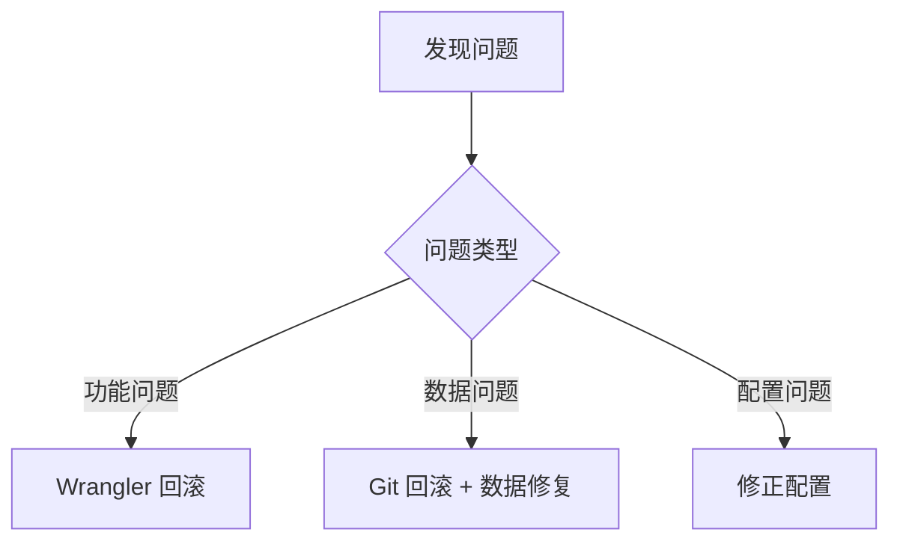
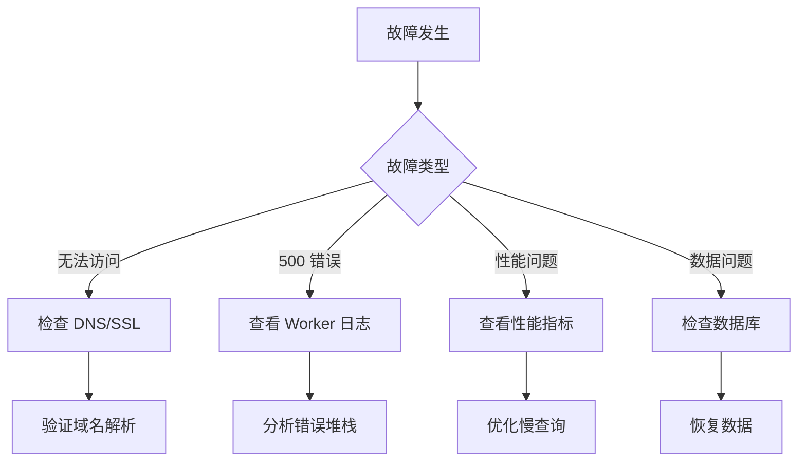

# 部署指南

本文档提供通知系统的完整部署流程，包括自动化部署、手动部署、故障排查和最佳实践。系统使用 Cloudflare Workers 作为运行环境，GitHub Actions 实现 CI/CD。

## 目录

- [前置条件](#前置条件)
- [快速部署](#快速部署)
- [详细部署步骤](#详细部署步骤)
  - [1. Cloudflare 资源准备](#1-cloudflare-资源准备)
  - [2. GitHub Actions 配置](#2-github-actions-配置)
  - [3. 部署到生产环境](#3-部署到生产环境)
  - [4. 部署验证](#4-部署验证)
- [手动部署](#手动部署)
- [故障排查](#故障排查)
- [部署最佳实践](#部署最佳实践)
- [回滚策略](#回滚策略)
- [监控和维护](#监控和维护)

## 前置条件

### 必需账户
- **Cloudflare 账户**（免费版即可）
- **GitHub 账户**（用于 CI/CD）

### 必需工具
```bash
# Node.js 18+ （推荐使用 nvm）
node --version  # >= 18.0.0

# 安装 Wrangler CLI
npm install -g wrangler
wrangler --version  # >= 3.0.0

# Git
git --version
```

### 权限要求

#### GitHub 权限
- 仓库的管理员权限（配置 Secrets）
- Actions 的执行权限

#### Cloudflare API Token 权限
创建 API Token 时需要以下权限：
- **Account** → Workers Scripts: Edit
- **Account** → Workers KV Storage: Edit  
- **Account** → D1: Edit
- **Account** → Workers Queues: Edit
- **Account** → Account Settings: Read
- **Zone** → Workers Routes: Edit（如使用自定义域名）

## 快速部署

最快速的部署方式，适合第一次部署：

```bash
# 1. 克隆项目
git clone https://github.com/caasxyz/notification.git
cd notification

# 2. 安装依赖
npm install

# 3. 登录 Cloudflare
wrangler login

# 4. 初始化 Cloudflare 资源（自动创建所有必需资源）
./scripts/setup/cloudflare-init.sh
# 脚本会输出所有创建的资源 ID，请保存这些 ID

# 5. 配置 GitHub Secrets（见下文详细步骤）
# 在 GitHub 仓库设置中添加必需的 Secrets

# 6. 推送到 main 分支触发自动部署
git push origin main

# 7. 验证部署（部署完成后）
curl https://your-worker.workers.dev/api/health
```

## 详细部署步骤

### 1. Cloudflare 资源准备

#### 方式一：自动创建（推荐）

使用初始化脚本自动创建所有 Cloudflare 资源：

```bash
# 确保脚本有执行权限
chmod +x ./scripts/setup/cloudflare-init.sh

# 运行初始化脚本
./scripts/setup/cloudflare-init.sh
```

脚本会自动创建以下资源：
- **D1 数据库**
  - `notification-system`（生产环境）
  - `notification-system-dev`（开发环境）
- **KV 命名空间**
  - `CONFIG_CACHE`（生产环境）
  - `CONFIG_CACHE-preview`（开发环境）
- **队列**
  - `retry-queue`（重试队列）
  - `failed-queue`（失败队列）

**重要**：脚本输出的资源 ID 需要保存到 GitHub Secrets 中。

#### 方式二：手动创建

如果脚本执行失败，可以手动创建资源：

```bash
# 1. 创建 D1 数据库
wrangler d1 create notification-system
# 输出示例：
# ✅ Successfully created DB 'notification-system' in region APAC
# Created your new D1 database.
# [[d1_databases]]
# binding = "DB"
# database_name = "notification-system"
# database_id = "xxxx-xxxx-xxxx-xxxx"  ← 保存此 ID 为 PROD_DB_ID

wrangler d1 create notification-system-dev
# 保存输出的 database_id 为 DEV_DB_ID

# 2. 创建 KV 命名空间
wrangler kv:namespace create CONFIG_CACHE
# 输出示例：
# 🌀 Creating namespace with title "notification-system-CONFIG_CACHE"
# ✨ Success!
# Add the following to your configuration file in your kv_namespaces array:
# { binding = "CONFIG_CACHE", id = "xxxx-xxxx-xxxx-xxxx" }  ← 保存此 ID 为 PROD_KV_ID

wrangler kv:namespace create CONFIG_CACHE --preview
# 保存输出的 id 为 DEV_KV_ID

# 3. 创建队列
wrangler queues create retry-queue
wrangler queues create failed-queue

# 4. 初始化数据库（首次部署后）
wrangler d1 execute notification-system --file sql/schema.sql --env production
```

### 2. GitHub Actions 配置

#### 创建 API Token

1. 访问 [Cloudflare Dashboard](https://dash.cloudflare.com/profile/api-tokens)
2. 点击 "Create Token"
3. 选择 "Create Custom Token"
4. 配置 Token：
   - **Token name**: `GitHub Actions Deploy`
   - **Permissions**:
     - Account → Workers Scripts → Edit
     - Account → Workers KV Storage → Edit
     - Account → D1 → Edit
     - Account → Workers Queues → Edit
     - Account → Account Settings → Read
   - **Account Resources**: Include → Your Account
   - **IP Address Filtering**: （可选）添加 GitHub Actions IP 范围
5. 点击 "Continue to summary"
6. 确认权限无误后点击 "Create Token"
7. **重要**：立即复制 Token（仅显示一次）

#### 配置 GitHub Secrets

在您的 GitHub 仓库中配置以下 Secrets：

1. 进入仓库设置：Settings → Secrets and variables → Actions
2. 添加以下 Secrets：

**必需的 Secrets：**

| Secret 名称 | 说明 | 示例值 | 获取方式 |
|------------|------|--------|----------|
| `CLOUDFLARE_API_TOKEN` | Cloudflare API Token | `v1.0-e24fd...` | 上一步创建 |
| `CLOUDFLARE_ACCOUNT_ID` | Cloudflare 账户 ID | `1234567890abcdef` | Dashboard 右侧边栏 |
| `PROD_DB_ID` | 生产 D1 数据库 ID | `xxxx-xxxx-xxxx` | 创建数据库时输出 |
| `PROD_KV_ID` | 生产 KV 命名空间 ID | `yyyy-yyyy-yyyy` | 创建 KV 时输出 |
| `PROD_API_SECRET` | API 签名密钥（64字符） | 使用 `openssl rand -hex 32` 生成 |
| `PROD_ENCRYPT_KEY` | 数据加密密钥（32字符） | 使用下方命令生成 |

**可选但推荐的 Secrets：**
```yaml
# 开发环境资源（用于测试）
DEV_DB_ID: <开发数据库 ID>
DEV_KV_ID: <开发 KV ID>
DEV_API_SECRET: <开发 API 密钥，默认: dev-secret>
DEV_ENCRYPT_KEY: <开发加密密钥，默认: dev-encrypt-key-32-chars-exactly>

# Grafana 集成（用于监控告警）
PROD_GRAFANA_USERNAME: <Grafana 用户名>
PROD_GRAFANA_PASSWORD: <Grafana 密码>
DEV_GRAFANA_USERNAME: <开发环境 Grafana 用户名，默认: grafana>
DEV_GRAFANA_PASSWORD: <开发环境 Grafana 密码，默认: grafana-password>

# 开发环境配置
CLOUDFLARE_SUBDOMAIN: <Workers 子域名，用于开发环境 URL>

# 集成测试配置（可选）
LARK_WEBHOOK_URL: <Lark webhook URL，用于集成测试>
LARK_WEBHOOK_SECRET: <Lark webhook 密钥>
```

#### 生成安全密钥

```bash
# 生成 API Secret（64字符十六进制）
openssl rand -hex 32
# 输出示例: a1b2c3d4e5f6789012345678901234567890123456789012345678901234abcd

# 生成加密密钥（32字符，仅字母数字）
openssl rand -base64 32 | tr -d "=+/" | cut -c1-32
# 输出示例: AbCdEfGhIjKlMnOpQrStUvWxYz123456

# 或使用 Node.js 生成
node -e "console.log(require('crypto').randomBytes(32).toString('hex'))"
node -e "console.log(require('crypto').randomBytes(24).toString('base64').replace(/[=+/]/g, '').substring(0, 32))"
```

**安全提示**：
- 每个环境使用不同的密钥
- 定期轮换密钥（建议每 90 天）
- 不要在代码中硬编码密钥
- 使用密码管理器保存密钥备份

### 3. 部署到生产环境

#### 自动部署（推荐）

配置完成后，每次推送到 `main` 分支都会自动触发部署：

```bash
git add .
git commit -m "feat: 新功能"
git push origin main
```

查看部署进度：
1. 访问仓库的 Actions 标签
2. 查看 "Deploy to Cloudflare Workers" 工作流
3. 等待部署完成（约 3-5 分钟）

#### 手动触发部署

在 GitHub Actions 页面手动触发：
1. 进入 Actions → Deploy to Cloudflare Workers
2. 点击 "Run workflow"
3. 选择分支
4. 选择环境（production 或 development）
5. 点击 "Run workflow"

**注意**：数据库初始化是自动的，无需手动选择。系统会检测数据库是否需要初始化。

### 4. 部署验证

部署完成后，GitHub Actions 会自动执行验证步骤。您也可以手动验证：

#### 自动验证（GitHub Actions）
- ✅ 健康检查（3次重试，间隔10秒）
- ✅ 数据库连接测试
- ✅ 集成测试（仅生产环境）
- ✅ 部署报告生成

#### 手动验证

```bash
# 1. 健康检查
# 生产环境
curl https://notification-system.workers.dev/api/health
# 或自定义域名
curl https://notification-system.yourdomain.com/api/health

# 期望响应：
# {
#   "status": "healthy",
#   "timestamp": "2025-01-05T12:00:00.000Z",
#   "version": "1.0.0",
#   "environment": "production",
#   "database": "connected",
#   "cache": "connected",
#   "queues": "connected"
# }

# 2. 验证部署
npm run deploy:verify production
# 会检查：
# - Worker 响应状态
# - 数据库连接
# - KV 存储访问
# - 队列配置
# - API 认证

# 3. 查看实时日志
wrangler tail --env production

# 4. 测试 API 认证
curl -X POST https://notification-system.workers.dev/api/send-notification \
  -H "Content-Type: application/json" \
  -d '{"test": true}'
# 应返回 401 Unauthorized（未提供签名）
```

#### 验证项目
- ✅ Worker 正常响应
- ✅ 数据库连接正常
- ✅ KV 存储可访问
- ✅ 队列配置正确
- ✅ API 认证工作
- ✅ 通知发送功能

## 手动部署

如果需要绕过 GitHub Actions 直接部署（用于开发测试或紧急情况）：

```bash
# 1. 准备环境
export CLOUDFLARE_API_TOKEN="your-api-token"
export CLOUDFLARE_ACCOUNT_ID="your-account-id"

# 2. 创建 wrangler.toml（从模板）
cp wrangler.toml.template wrangler.toml

# 3. 替换配置占位符
# macOS
sed -i '' "s/PLACEHOLDER_ACCOUNT_ID/$CLOUDFLARE_ACCOUNT_ID/g" wrangler.toml
sed -i '' "s/PLACEHOLDER_PROD_DB_ID/your-prod-db-id/g" wrangler.toml
sed -i '' "s/PLACEHOLDER_PROD_KV_ID/your-prod-kv-id/g" wrangler.toml

# Linux
sed -i "s/PLACEHOLDER_ACCOUNT_ID/$CLOUDFLARE_ACCOUNT_ID/g" wrangler.toml
sed -i "s/PLACEHOLDER_PROD_DB_ID/your-prod-db-id/g" wrangler.toml
sed -i "s/PLACEHOLDER_PROD_KV_ID/your-prod-kv-id/g" wrangler.toml

# 4. 设置密钥（交互式输入）
wrangler secret put API_SECRET_KEY --env production
# 输入您的 64 字符 API 密钥

wrangler secret put ENCRYPT_KEY --env production  
# 输入您的 32 字符加密密钥

# 5. 初始化数据库（首次部署）
wrangler d1 execute notification-system --file sql/schema.sql --env production

# 6. 部署到生产环境
wrangler deploy --env production

# 7. 验证部署
curl https://your-worker.workers.dev/api/health
```

## 故障排查

### 常见问题及解决方案

#### 1. 部署失败：认证错误

**错误信息：**
```
Authentication error: Invalid API Token
Authentication error: Invalid request headers
Error: Failed to authenticate with Cloudflare
```

**可能原因及解决方法：**

1. **Token 错误或过期**
   ```bash
   # 验证 Token 是否有效
   curl -X GET "https://api.cloudflare.com/client/v4/user/tokens/verify" \
     -H "Authorization: Bearer YOUR_TOKEN"
   ```

2. **权限不足**
   - 检查 Token 权限是否包含所有必需项
   - 重新创建 Token 并确保选择所有必需权限

3. **GitHub Secrets 配置错误**
   - 检查 Secret 名称拼写
   - 确保没有多余的空格或换行符
   - 重新设置 Secret

#### 2. 数据库连接失败

**错误信息：**
```
Error: D1 database not found
Error: Database "DB" not found in your wrangler.toml
Error: No such table: notification_templates_v2
```

**解决方法：**

1. **检查数据库是否存在**
   ```bash
   # 列出所有数据库
   wrangler d1 list
   
   # 获取数据库详情
   wrangler d1 info notification-system
   ```

2. **验证数据库 ID**
   ```bash
   # 在 wrangler.toml 中查找
   grep "database_id" wrangler.toml
   
   # 确保 ID 与实际一致
   ```

3. **初始化数据库表**
   ```bash
   # 手动执行 schema
   wrangler d1 execute notification-system \
     --file sql/schema.sql \
     --env production
   
   # 检查表是否创建
   wrangler d1 execute notification-system \
     --command "SELECT name FROM sqlite_master WHERE type='table'" \
     --env production
   ```

#### 3. KV 命名空间错误

**错误信息：**
```
Error: KV namespace binding not found
```

**解决方法：**
```bash
# 列出所有 KV 命名空间
wrangler kv:namespace list

# 确认 binding 名称匹配
# wrangler.toml 中的 binding 必须是 CONFIG_CACHE
```

#### 4. 集成测试失败

**错误信息：**
```
Integration tests failed: Signature verification failed
Error: Invalid signature
Error: Request expired
```

**解决方法：**

1. **验证 API 密钥**
   ```bash
   # 检查密钥长度（应为 64 字符）
   echo -n "your-api-secret" | wc -c
   
   # 重新设置密钥
   wrangler secret put API_SECRET_KEY --env production
   ```

2. **检查时间同步**
   ```bash
   # 检查系统时间
   date +%s
   
   # 与标准时间比较
   curl -I https://www.cloudflare.com | grep -i date
   ```

3. **查看详细日志**
   ```bash
   # 实时日志
   wrangler tail --env production --format pretty
   
   # 过滤错误
   wrangler tail --env production --filter "status:error"
   ```

4. **测试签名生成**
   ```bash
   # 使用测试脚本
   npm run test:local
   ```

#### 5. 队列配置错误

**错误信息：**
```
Error: Queue binding not found
```

**解决方法：**
```bash
# 列出所有队列
wrangler queues list

# 创建缺失的队列
wrangler queues create retry-queue
wrangler queues create failed-queue
```

### 调试技巧

#### 1. 日志调试

```bash
# 实时日志（所有级别）
wrangler tail --env production

# 格式化输出
wrangler tail --env production --format pretty

# 过滤特定内容
wrangler tail --env production --filter "error"
wrangler tail --env production --filter "api/send-notification"
wrangler tail --env production --filter "status:500"

# 保存日志到文件
wrangler tail --env production > logs.txt
```

#### 2. 部署状态检查

```bash
# 查看所有部署
wrangler deployments list --env production

# 查看当前活跃部署
wrangler deployments list --env production | grep ACTIVE

# 查看 Worker 详情
wrangler deployments view <deployment-id> --env production
```

#### 3. 本地调试

```bash
# 使用生产配置本地调试
wrangler dev --env production --local

# 指定端口
wrangler dev --env production --local --port 8788

# 开启调试模式
DEBUG=* wrangler dev --env production --local
```

#### 4. 性能分析

```bash
# 运行性能测试
npm run test:performance

# 查看资源使用
wrangler tail --env production --format json | \
  jq '.logs[] | select(.message | contains("CPU"))'
```

## 部署最佳实践

### 1. 部署前检查清单

#### 自动检查
```bash
# 运行完整检查
npm run deploy:check

# 检查项目：
# ✅ Git 工作区状态
# ✅ 依赖完整性
# ✅ TypeScript 编译
# ✅ 单元测试
# ✅ 环境变量
# ✅ 数据库迁移状态
```

#### 手动检查项
- [ ] 确认所有功能在开发环境测试通过
- [ ] 检查是否有破坏性变更（Breaking Changes）
- [ ] 确认数据库迁移脚本准备就绪
- [ ] 检查安全配置（API 密钥、加密密钥）
- [ ] 通知相关人员部署计划

### 2. 分阶段部署策略

#### 阶段 1：开发环境
```bash
# 本地开发
npm run dev

# 部署到开发环境
git push origin feature/your-feature

# 手动部署开发环境（如需要）
wrangler deploy --env development
```

#### 阶段 2：预发布验证
```bash
# 创建 Pull Request
# 1. 自动触发 CI 测试
# 2. Code Review
# 3. 部署预览环境
```

#### 阶段 3：生产部署
```bash
# 合并到 main 分支后自动部署
# 或手动触发
# GitHub Actions → Run workflow → production
```

#### 阶段 4：部署后验证
```bash
# 自动执行
# - 健康检查
# - 集成测试
# - 性能监控

# 手动验证
npm run deploy:verify production
```

### 3. 部署时间窗口

#### 推荐部署时间

| 部署类型 | 建议时间 | 原因 |
|---------|---------|------|
| 常规更新 | 工作日 10:00-16:00 | 团队在线，可快速响应 |
| 紧急修复 | 任何时间 | 优先修复线上问题 |
| 重大升级 | 周二至周四上午 | 有充足时间处理问题 |
| 数据库迁移 | 非高峰期 | 减少对用户影响 |

#### 避免部署时间
- ❌ 周五下午（周末前）
- ❌ 节假日前一天
- ❌ 系统高峰期
- ❌ 团队人员不齐时

### 4. 部署通知机制

#### 自动通知（GitHub Actions）

GitHub Actions 中已配置部署通知：
- ✅ 部署开始通知
- ✅ 部署成功/失败通知
- ✅ 部署报告链接

#### 配置飞书通知（可选）

1. 创建飞书机器人
2. 获取 Webhook URL
3. 添加到 GitHub Secrets：
   ```yaml
   LARK_DEPLOY_WEBHOOK: https://open.larksuite.com/...
   ```

#### 通知内容模板
```
🚀 部署通知
环境：{environment}
分支：{branch}
提交：{commit}
状态：{status}
耗时：{duration}
链接：{url}
```

## 回滚策略

### 快速回滚决策树



### 回滚方案

#### 1. Wrangler 快速回滚（推荐）

```bash
# 1. 查看最近 10 次部署
wrangler deployments list --env production | head -10

# 输出示例：
# Deployment ID                          Created              Author
# a1b2c3d4-xxxx-xxxx-xxxx-xxxxxxxxxxxx  2025-01-05 10:30:00  user@example.com
# e5f6g7h8-yyyy-yyyy-yyyy-yyyyyyyyyyyy  2025-01-05 09:00:00  user@example.com  ← 上一个稳定版本

# 2. 回滚到指定版本
wrangler rollback --env production \
  --deployment-id e5f6g7h8-yyyy-yyyy-yyyy-yyyyyyyyyyyy

# 3. 验证回滚
curl https://your-worker.workers.dev/api/health
```

#### 2. Git 回滚（需要重新部署）

```bash
# 方法一：回滚最近提交
git revert HEAD --no-edit
git push origin main

# 方法二：回滚到特定提交
git log --oneline -10  # 查看提交历史
git revert <commit-hash> --no-edit
git push origin main

# 方法三：强制重置（谨慎使用）
git reset --hard <commit-hash>
git push origin main --force-with-lease
```

### 数据库回滚

#### 回滚前准备

```bash
# 1. 备份当前数据（必做！）
wrangler d1 export notification-system \
  --output "backup-$(date +%Y%m%d-%H%M%S).sql" \
  --env production

# 2. 下载备份并验证
wrangler d1 execute notification-system \
  --command "SELECT COUNT(*) FROM notification_templates_v2" \
  --env production
```

#### 执行回滚

```bash
# 方法一：使用 Drizzle 迁移回滚
# 如果有回滚脚本
wrangler d1 execute notification-system \
  --file drizzle/rollback/0001_rollback.sql \
  --env production

# 方法二：恢复之前的备份
# 警告：这将删除所有数据并重新导入
wrangler d1 execute notification-system \
  --file backup-20250105.sql \
  --env production
```

#### 验证回滚

```bash
# 检查数据完整性
npm run db:check

# 测试功能
npm run test:integration
```

## 监控和维护

### 监控指标

部署后应持续监控以下指标：

| 指标 | 阈值 | 告警级别 |
|------|------|----------|
| Worker 错误率 | > 1% | 警告 |
| 响应时间 | > 1秒 | 警告 |
| 队列积压 | > 1000 | 严重 |
| 内存使用 | > 100MB | 警告 |
| CPU 时间 | > 50ms | 信息 |

### 定期维护

#### 每日任务
- 检查错误日志
- 监控队列状态
- 查看性能指标

#### 每周任务
- 清理过期日志
- 审查慢查询
- 更新依赖项

#### 每月任务
- 性能优化评估
- 安全审计
- 容量规划

### 数据库管理

#### Drizzle ORM 工作流

```bash
# 1. 修改 schema
# 编辑 src/db/schema.ts

# 2. 生成迁移文件
npm run db:generate
# 输出: drizzle/0001_xxx.sql

# 3. 审查迁移文件
cat drizzle/0001_*.sql

# 4. 本地测试
npm run db:push  # 应用到本地数据库
npm run dev       # 测试功能

# 5. 生产部署
./scripts/database/drizzle-migrate-production.sh
```

#### 数据库维护命令

| 命令 | 说明 | 使用场景 |
|------|------|----------|
| `npm run db:generate` | 生成迁移 SQL | Schema 变更后 |
| `npm run db:push` | 直接同步 Schema | 开发环境 |
| `npm run db:migrate` | 执行迁移 | 生产环境 |
| `npm run db:studio` | GUI 管理界面 | 数据查看 |
| `npm run db:check` | 检查一致性 | 部署前 |
| `npm run db:reset` | 重置数据库 | 开发环境 |
| `npm run db:seed` | 填充测试数据 | 开发环境 |

### 维护命令

```bash
# 清理过期日志（30天前）
curl -X POST https://your-worker.workers.dev/api/cleanup-logs \
  -H "X-API-Key: your-api-key"

# 检查数据库状态
./scripts/database/db-status.sh

# 性能测试
npm run test:performance
# 或
tsx scripts/testing/performance-test.ts

# 安全扫描
npm audit
```

## 集成测试配置

部署到生产环境后，GitHub Actions 会自动运行集成测试。测试包括：
- API 端点验证
- 用户配置管理
- 模板创建和使用
- 通知发送（会真实发送测试通知）
- 日志查询

如果您想自定义测试通知的接收方式，可以配置以下 Secrets：

```yaml
# Lark 测试通知（可选）
LARK_WEBHOOK_URL: https://open.larksuite.com/open-apis/bot/v2/hook/xxx
LARK_WEBHOOK_SECRET: your-lark-secret
```

如果未配置，测试将使用默认的测试 webhook。

## 高级配置

### 自定义域名

配置自定义域名：

1. 在 Cloudflare Dashboard 中添加域名
2. 创建 CNAME 记录指向 Worker
3. 更新 wrangler.toml：
   ```toml
   routes = [
     { pattern = "notification-system.yourdomain.com/*", custom_domain = true }
   ]
   ```

**注意**：生产环境默认使用 `notification.caas.xyz` 作为自定义域名。

### 多环境部署

支持多个环境：

```toml
# wrangler.toml
[env.staging]
name = "notification-system-staging"
vars = { ENVIRONMENT = "staging" }

[env.production]
name = "notification-system"
vars = { ENVIRONMENT = "production" }
```

### 蓝绿部署

实现零停机部署：

1. 部署到新版本
2. 运行冒烟测试
3. 切换流量
4. 监控错误率
5. 必要时回滚

## 故障处理流程

### 快速故障定位



### 常用故障处理命令

```bash
# 1. 快速诊断
wrangler tail --env production --format json | jq '.logs[] | select(.level == "error")'

# 2. 性能分析
wrangler tail --env production --format json | \
  jq '.logs[] | select(.message | contains("duration")) | .duration' | \
  awk '{sum+=$1; count++} END {print "Average:", sum/count, "ms"}'

# 3. 数据库问题
wrangler d1 execute notification-system \
  --command "SELECT name FROM sqlite_master WHERE type='table'" \
  --env production

# 4. 队列状态
wrangler queues list --env production
```

## 总结

### 部署核心要点

1. **自动化优先**：使用 GitHub Actions 实现 CI/CD
2. **安全第一**：所有敏感信息通过 Secrets 管理
3. **分阶段部署**：开发 → 预发布 → 生产
4. **监控必不可少**：实时日志、性能指标、错误告警
5. **快速回滚**：Wrangler 回滚最快，Git 回滚最稳

### 下一步

- 📖 阅读[开发指南](./development.md)设置本地环境
- 🔧 查看[API 文档](../03-reference/api/complete-api-reference.md)了解接口
- 🏗️ 学习[架构设计](../03-reference/architecture/system-design.md)理解系统
- 🔍 收藏[故障排查](../05-operations/troubleshooting.md)以备不时之需

## 相关文档

- [开发指南](./development.md) - 本地开发设置
- [API 参考](../03-reference/api/complete-api-reference.md) - API 端点文档
- [架构设计](../03-reference/architecture/system-design.md) - 系统架构说明
- [故障排查](../05-operations/troubleshooting.md) - 详细故障排查
- [Drizzle ORM 指南](./development/drizzle-orm.md) - 数据库管理

---

**最后更新**: 2025-01-05  
**版本**: 3.0  
**维护者**: 运维团队