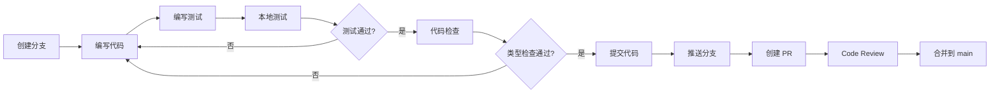
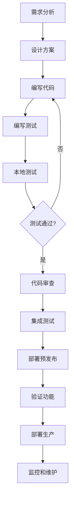

# 开发指南

本文档提供通知系统的开发环境设置、项目结构、开发流程和最佳实践指南。

## 目录

- [快速开始](#快速开始)
- [项目结构](#项目结构)
- [开发环境设置](#开发环境设置)
- [开发工作流](#开发工作流)
- [代码规范](#代码规范)
- [调试技巧](#调试技巧)
- [常用开发任务](#常用开发任务)
- [性能优化](#性能优化)
- [相关文档](#相关文档)

## 快速开始

### 1. 克隆项目
```bash
git clone https://github.com/caasxyz/notification.git
cd notification
```

### 2. 安装依赖
```bash
# 使用正确的 Node.js 版本
nvm use  # 读取 .nvmrc 文件

# 安装项目依赖
npm install

# 安装全局工具
npm install -g wrangler tsx
```

### 3. 环境配置
```bash
# 创建本地环境变量文件
cp .env.example .dev.vars

# 编辑 .dev.vars，设置必要的环境变量
# API_SECRET_KEY=test-secret-key-for-local-dev
# ENCRYPT_KEY=test-encryption-key-32-characters
```

### 4. 数据库初始化
```bash
# 生成数据库迁移文件
npm run db:generate

# 应用到本地数据库
npm run db:push

# 初始化测试数据
npm run db:seed
```

### 5. 启动开发服务器
```bash
npm run dev
```

服务器启动后可访问：
- API: http://localhost:8788
- 测试界面: http://localhost:8788/test-ui
- 健康检查: http://localhost:8788/api/health

## 项目结构

```
notification/
├── src/                      # 源代码目录
│   ├── index.ts             # Worker 入口文件
│   ├── api/                 # API 层
│   │   ├── router.ts        # 主路由器
│   │   ├── secureRouter.ts  # 安全路由器
│   │   ├── handlers/        # API 处理器
│   │   └── middleware/      # 中间件
│   ├── services/            # 业务逻辑层
│   │   ├── NotificationDispatcherV2.ts  # 通知调度器
│   │   ├── TemplateEngineV2.ts          # 模板引擎
│   │   ├── QueueProcessorV2.ts          # 队列处理器
│   │   └── transformers/    # 数据转换器
│   ├── adapters/            # 渠道适配器
│   │   ├── BaseAdapter.ts   # 基础适配器
│   │   ├── LarkAdapter.ts   # 飞书适配器
│   │   ├── TelegramAdapter.ts # Telegram 适配器
│   │   ├── SlackAdapter.ts  # Slack 适配器
│   │   └── WebhookAdapter.ts # Webhook 适配器
│   ├── db/                  # 数据库相关
│   │   ├── schema.ts        # 数据库模式定义
│   │   ├── index.ts         # 数据库连接
│   │   └── auto-migrate.ts  # 自动迁移
│   ├── security/            # 安全相关
│   │   └── SecurityEnhancements.ts # 安全增强
│   ├── types/               # TypeScript 类型定义
│   └── utils/               # 工具函数
│       ├── crypto.ts        # 加密工具
│       ├── enhancedCrypto.ts # 增强加密
├── scripts/                  # 📜 脚本目录
│   ├── setup/               # 设置脚本
│   │   ├── cloudflare-init.sh   # Cloudflare 资源初始化
│   │   └── smart-db-setup.sh    # 智能数据库设置
│   ├── database/            # 数据库脚本
│   │   ├── drizzle-migrate-production.sh
│   │   └── drizzle-reset-database.sh
│   ├── testing/             # 测试脚本
│   │   ├── test-local.ts        # 本地 API 测试
│   │   ├── integration-test.ts  # 集成测试
│   │   └── performance-test.ts  # 性能测试
│   └── deployment/          # 部署脚本
│       └── deploy-helper.ts      # 部署辅助工具
├── sql/                      # 🗺️ SQL 文件
│   └── schema.sql           # V2 数据库架构
├── drizzle/                  # 🔄 数据库迁移
│   ├── 0000_xxx.sql         # 自动生成的迁移文件
│   └── meta/                # 迁移元数据
├── tests/                    # 🧪 单元测试
│   ├── unit/                # 单元测试
│   └── fixtures/            # 测试数据
├── docs/                     # 📖 项目文档
├── sdk/                      # 📦 TypeScript SDK
├── .github/workflows/        # 🤖 GitHub Actions
├── config/                   # ⚙️ 配置文件
│   ├── tsconfig.json        # 基础 TypeScript 配置
│   ├── tsconfig.prod.json   # 生产 TypeScript 配置
│   ├── vitest.config.ts     # 测试配置
│   └── drizzle.config.ts    # Drizzle ORM 配置
├── wrangler.toml.template    # Cloudflare Workers 配置模板
├── package.json              # 项目依赖和脚本
├── .nvmrc                    # Node.js 版本指定
└── README.md                 # 项目说明
```

### 核心模块说明

| 模块 | 职责 | 依赖关系 |
|------|------|------------|
| **API 层** | 处理 HTTP 请求，路由分发 | 依赖业务层 |
| **业务层** | 核心业务逻辑，模板处理 | 依赖适配器、数据库 |
| **适配器层** | 各渠道实现 | 依赖基础类 |
| **数据层** | 数据存储和查询 | 依赖 Drizzle ORM |
| **工具层** | 公共工具函数 | 无外部依赖 |

### 核心组件详解

#### 1. API 层 (`src/api/`)

**主路由器** (`router.ts`)
- 处理所有 HTTP 请求
- CORS 配置
- 签名认证验证
- 路由分发

**API 处理器** (`handlers/`)
| 处理器 | 功能 | 路径 |
|-------|------|------|
| `sendNotification.ts` | 发送通知 | `POST /api/send-notification` |
| `templateManagementV2.ts` | V2 模板管理 | `/api/templates/*` |
| `userConfig.ts` | 用户配置管理 | `/api/users/*/configs` |
| `notificationLogs.ts` | 日志查询 | `GET /api/logs` |
| `grafanaWebhook.ts` | Grafana 集成 | `POST /api/webhooks/grafana` |
| `testUIv2.ts` | 测试界面 | `GET /test-ui` |

#### 2. 服务层 (`src/services/`)

**NotificationDispatcherV2**
```typescript
// 核心调度器，负责：
- 用户配置获取和缓存
- 模板渲染
- 多渠道并发发送
- 幂等性控制
- 日志记录
```

**TemplateEngineV2**
```typescript
// 模板引擎，负责：
- 模板存储和管理
- 变量替换（简单字符串替换）
- 渠道特定内容获取
- 模板缓存
```

**QueueProcessorV2**
```typescript
// 队列处理器，负责：
- 重试队列处理
- 失败队列处理
- 指数退避策略
- 死信处理
```

#### 3. 适配器层 (`src/adapters/`)

**基础适配器类**
```typescript
abstract class BaseAdapter {
  abstract send(config: NotificationConfig, content: string): Promise<unknown>;
  // 子类必须实现 send 方法
}
```

**已实现的适配器**
| 适配器 | 支持功能 | 特殊要求 |
|---------|---------|----------|
| **LarkAdapter** | 富文本、签名验证 | webhook URL + secret |
| **TelegramAdapter** | Markdown、按钮 | bot_token + chat_id |
| **SlackAdapter** | 附件、交互 | webhook URL |
| **WebhookAdapter** | 通用 JSON | webhook URL + 可选头部 |

## 开发环境设置

### 环境变量配置

#### 必需配置 (.dev.vars)

```bash
# 核心安全配置
API_SECRET_KEY=dev-secret-key-for-testing-only-64-chars-long-1234567890abcdef
ENCRYPT_KEY=dev-encrypt-key-32-chars-secure!

# 数据库配置
AUTO_MIGRATE=true    # 开发环境自动迁移
FORCE_MIGRATE=false  # 强制重新迁移（谨慎使用）

# 开发环境标识
ENVIRONMENT=development
DEBUG=true
```

#### 可选配置

```bash
# Grafana 集成（用于测试 Grafana 告警）
GRAFANA_USERNAME=grafana
GRAFANA_PASSWORD=grafana-password

# 测试通知渠道
# 飞书
LARK_WEBHOOK_URL=https://open.larksuite.com/open-apis/bot/v2/hook/xxx
LARK_WEBHOOK_SECRET=your-lark-secret

# Telegram
TELEGRAM_BOT_TOKEN=123456789:ABCdefGHIjklMNOpqrsTUVwxyz
TELEGRAM_CHAT_ID=-1001234567890

# Slack
SLACK_WEBHOOK_URL=https://hooks.slack.com/services/xxx/yyy/zzz
```

### 本地开发特性

| 特性 | 本地开发 | 生产环境 |
|------|----------|----------|
| **D1 数据库** | SQLite 文件 | Cloudflare D1 |
| **KV 存储** | 内存模拟 | Cloudflare KV |
| **队列** | 内存队列 | Cloudflare Queues |
| **调试日志** | 详细输出 | 精简输出 |
| **错误信息** | 完整堆栈 | 安全信息 |
| **测试 UI** | 可访问 | 禁用 |

### 数据库管理

#### Drizzle ORM 命令

```bash
# 1. 查看数据库 GUI（推荐）
npm run db:studio
# 打开 https://local.drizzle.studio 查看和编辑数据

# 2. Schema 变更流程
# a. 编辑 src/db/schema.ts
# b. 生成迁移文件
npm run db:generate
# c. 查看生成的 SQL
cat drizzle/0001_*.sql
# d. 应用到本地数据库
npm run db:push

# 3. 数据库操作
# 重置数据库（删除所有数据）
npm run db:reset

# 填充测试数据
npm run db:seed

# 使用不同的数据配置
npm run db:seed -- --profile minimal    # 最小数据集
npm run db:seed -- --profile standard   # 标准数据集
npm run db:seed -- --profile comprehensive # 全面数据集
```

#### 数据库 Schema 结构

```typescript
// src/db/schema.ts 主要表结构

// V2 模板表
notification_templates_v2: {
  id: number
  key: string           // 唯一模板标识
  name: string          // 模板名称
  description: string   // 模板描述
  variables: json       // 变量定义
  is_active: boolean    // 是否激活
  created_at: timestamp
  updated_at: timestamp
}

// 模板内容表（每个渠道一条记录）
template_contents: {
  id: number
  template_id: number   // 关联模板
  channel: string       // webhook|telegram|lark|slack
  subject_template: string  // 标题模板
  content_template: string  // 内容模板
  content_type: string      // text|markdown|html
  created_at: timestamp
  updated_at: timestamp
}

// 用户配置表
user_configs: {
  id: number
  user_id: string       // 用户标识
  channel: string       // 渠道类型
  config: string        // 加密后的配置 JSON
  is_active: boolean
  created_at: timestamp
  updated_at: timestamp
}

// 通知日志表
notification_logs: {
  id: number
  message_id: string    // 唯一消息 ID
  user_id: string
  channel: string
  status: string        // success|failed|pending|retrying
  // ... 其他字段
}
```

### 开发工具配置

#### VS Code 推荐配置

**必装扩展**
- 📦 ESLint - 代码质量检查
- 🎨 Prettier - 代码格式化
- 📝 TypeScript and JavaScript Language Features
- 🧪 Vitest - 测试运行器
- 🗄️ SQLite Viewer - 查看本地数据库
- 🌊 Tailwind CSS IntelliSense - 样式提示

**工作区设置** (`.vscode/settings.json`)
```json
{
  // 保存时自动格式化
  "editor.formatOnSave": true,
  "editor.defaultFormatter": "esbenp.prettier-vscode",
  
  // TypeScript 配置
  "typescript.tsdk": "node_modules/typescript/lib",
  "typescript.enablePromptUseWorkspaceTsdk": true,
  
  // 文件排除
  "files.exclude": {
    "**/.git": true,
    "**/.DS_Store": true,
    "**/node_modules": true,
    "**/dist": true,
    "**/.wrangler": true
  },
  
  // ESLint 自动修复
  "editor.codeActionsOnSave": {
    "source.fixAll.eslint": true
  }
}
```

#### 调试配置

**VS Code 调试配置** (`.vscode/launch.json`)
```json
{
  "version": "0.2.0",
  "configurations": [
    {
      "name": "Wrangler Dev",
      "type": "node",
      "request": "launch",
      "runtimeExecutable": "npm",
      "runtimeArgs": ["run", "dev"],
      "console": "integratedTerminal",
      "env": {
        "NODE_ENV": "development"
      }
    },
    {
      "name": "Run Tests",
      "type": "node",
      "request": "launch",
      "runtimeExecutable": "npm",
      "runtimeArgs": ["test"],
      "console": "integratedTerminal"
    }
  ]
}
```
  "editor.codeActionsOnSave": {
    "source.fixAll.eslint": true
  },
  "typescript.tsdk": "node_modules/typescript/lib"
}
```

## 开发工作流

### 1. 功能开发流程

#### 完整开发流程图


#### 具体步骤

```bash
# 1. 创建功能分支
git checkout -b feature/your-feature

# 2. 进行开发
# - 编写代码
# - 编写测试
# - 本地测试

# 3. 代码检查
npm run typecheck    # TypeScript 类型检查
npm test            # 运行单元测试
npm run test:local  # 测试本地 API

# 4. 检查代码风格（如果配置了 ESLint）
# npm run lint

# 5. 提交代码
git add .
git commit -m "feat: 添加新功能"

# 6. 推送并创建 PR
git push origin feature/your-feature
# 在 GitHub 上创建 Pull Request
```

#### 开发规范检查清单

- [ ] 功能实现完整且正确
- [ ] 包含单元测试（覆盖率 > 80%）
- [ ] 通过 TypeScript 类型检查
- [ ] 更新相关文档
- [ ] 没有硬编码的敏感信息
- [ ] 遵循代码规范
- [ ] 性能影响评估

### 2. 添加新的 API 端点

#### 详细步骤

1. **创建处理器文件**
   - 位置：`src/api/handlers/`
   - 命名：使用 camelCase，如 `myNewEndpoint.ts`

2. **实现处理器逻辑**
   - 参数验证
   - 业务逻辑处理
   - 错误处理
   - 响应格式化

3. **注册路由**
   - 编辑 `src/api/router.ts`
   - 选择合适的 HTTP 方法
   - 配置路径参数

4. **添加类型定义**
   - 请求体类型
   - 响应体类型
   - 路径参数类型

5. **编写测试**
   - 单元测试
   - 集成测试
   - 边界情况测试

6. **更新文档**
   - API 端点文档
   - 使用示例
   - 错误码说明

#### 完整示例：
```typescript
// src/api/handlers/myHandler.ts
import type { Context } from 'hono';
import type { Env } from '../../types';
import { NotificationSystemError } from '../../utils/errors';
import { validateRequest } from '../../utils/validation';
import { getDb } from '../../db';
import { z } from 'zod';

// 1. 定义请求和响应类型
const myEndpointSchema = z.object({
  name: z.string().min(1).max(100),
  value: z.number().positive(),
  optional: z.string().optional()
});

type MyEndpointRequest = z.infer<typeof myEndpointSchema>;

interface MyEndpointResponse {
  success: boolean;
  data: {
    id: string;
    message: string;
    timestamp: string;
  };
}

// 2. 实现处理器
export async function handleMyEndpoint(
  c: Context<{ Bindings: Env }>
): Promise<Response> {
  try {
    // 2.1 验证请求
    const body = await c.req.json();
    const validatedData = myEndpointSchema.parse(body);
    
    // 2.2 获取数据库连接
    const db = getDb(c.env);
    
    // 2.3 业务逻辑
    const result = await db.transaction(async (tx) => {
      // 示例：插入数据
      const inserted = await tx.insert(myTable).values({
        name: validatedData.name,
        value: validatedData.value,
        created_at: new Date()
      }).returning();
      
      return inserted[0];
    });
    
    // 2.4 构造响应
    const response: MyEndpointResponse = {
      success: true,
      data: {
        id: result.id,
        message: `Successfully created ${validatedData.name}`,
        timestamp: new Date().toISOString()
      }
    };
    
    // 2.5 返回响应
    return c.json(response, 200);
    
  } catch (error) {
    // 错误处理
    if (error instanceof z.ZodError) {
      throw new NotificationSystemError(
        'VALIDATION_ERROR',
        'Invalid request data',
        { errors: error.errors }
      );
    }
    
    if (error instanceof NotificationSystemError) {
      throw error;
    }
    
    // 未知错误
    console.error('Unexpected error:', error);
    throw new NotificationSystemError(
      'INTERNAL_ERROR',
      'Failed to process request'
    );
  }
}

// 3. src/api/router.ts - 注册路由
import { Hono } from 'hono';
import { handleMyEndpoint } from './handlers/myHandler';
import { authMiddleware } from './middleware/auth';

const router = new Hono<{ Bindings: Env }>();

// 注册新端点（需要认证）
router.post('/api/my-endpoint', authMiddleware, handleMyEndpoint);

// 4. 编写测试 - tests/api/myHandler.test.ts
import { describe, it, expect, vi } from 'vitest';
import { handleMyEndpoint } from '../../src/api/handlers/myHandler';

describe('My Endpoint Handler', () => {
  it('should create a new record successfully', async () => {
    // 模拟上下文
    const mockContext = {
      req: {
        json: vi.fn().mockResolvedValue({
          name: 'Test',
          value: 100
        })
      },
      env: {
        DB: mockDb,
        // 其他环境变量
      },
      json: vi.fn()
    };
    
    // 调用处理器
    await handleMyEndpoint(mockContext as any);
    
    // 验证结果
    expect(mockContext.json).toHaveBeenCalledWith(
      expect.objectContaining({
        success: true,
        data: expect.objectContaining({
          message: expect.stringContaining('Test')
        })
      }),
      200
    );
  });
  
  it('should validate request data', async () => {
    const mockContext = {
      req: {
        json: vi.fn().mockResolvedValue({
          // 缺少必需字段
          value: 'not-a-number'
        })
      },
      env: mockEnv
    };
    
    // 期望抛出验证错误
    await expect(handleMyEndpoint(mockContext as any))
      .rejects.toThrow('VALIDATION_ERROR');
  });
});
```

### 3. 添加新的通知渠道

#### 实现步骤详解

1. **创建适配器文件**
   ```bash
   touch src/adapters/MyChannelAdapter.ts
   ```

2. **实现适配器类**
   - 继承 `BaseAdapter`
   - 实现必需的 `send` 方法
   - 添加配置验证
   - 处理错误和重试

3. **更新类型定义**
   ```bash
   # 编辑 src/types/index.ts
   # 添加新渠道到 NotificationChannel 类型
   ```

4. **注册到调度器**
   ```bash
   # 编辑 src/services/NotificationDispatcherV2.ts
   # 在 channelAdapters Map 中添加新适配器
   ```

5. **添加配置模板**
   ```bash
   # 编辑 src/types/config.ts
   # 添加新渠道的配置接口
   ```

6. **编写测试**
   ```bash
   touch tests/adapters/MyChannelAdapter.test.ts
   ```

#### 完整实现示例：

```typescript
// 1. src/adapters/MyChannelAdapter.ts
import { BaseAdapter } from './BaseAdapter';
import type { NotificationConfig, NotificationResult } from '../types';
import { NotificationSystemError } from '../utils/errors';
import { z } from 'zod';

// 定义配置模式
const myChannelConfigSchema = z.object({
  webhook_url: z.string().url(),
  api_key: z.string().min(1),
  timeout: z.number().optional().default(30000),
  retry_count: z.number().optional().default(3)
});

type MyChannelConfig = z.infer<typeof myChannelConfigSchema>;

export class MyChannelAdapter extends BaseAdapter {
  async send(
    config: unknown,
    subject: string,
    content: string,
    contentType: 'text' | 'markdown' | 'html' = 'text'
  ): Promise<NotificationResult> {
    // 1. 验证配置
    let validConfig: MyChannelConfig;
    try {
      validConfig = myChannelConfigSchema.parse(config);
    } catch (error) {
      throw new NotificationSystemError(
        'CONFIG_ERROR',
        'Invalid MyChannel configuration',
        { error }
      );
    }
    
    // 2. 准备请求数据
    const payload = {
      subject,
      content,
      content_type: contentType,
      timestamp: new Date().toISOString(),
      source: 'notification-system'
    };
    
    // 3. 发送请求（带重试）
    let lastError: Error | null = null;
    
    for (let attempt = 1; attempt <= validConfig.retry_count; attempt++) {
      try {
        const response = await fetch(validConfig.webhook_url, {
          method: 'POST',
          headers: {
            'Content-Type': 'application/json',
            'Authorization': `Bearer ${validConfig.api_key}`,
            'X-Request-ID': crypto.randomUUID()
          },
          body: JSON.stringify(payload),
          signal: AbortSignal.timeout(validConfig.timeout)
        });
        
        if (!response.ok) {
          const errorText = await response.text();
          throw new Error(
            `MyChannel API error: ${response.status} ${response.statusText} - ${errorText}`
          );
        }
        
        const result = await response.json();
        
        // 4. 返回标准化结果
        return {
          success: true,
          messageId: result.id || crypto.randomUUID(),
          provider: 'mychannel',
          timestamp: new Date().toISOString(),
          metadata: {
            attempts: attempt,
            response_time: result.processing_time
          }
        };
        
      } catch (error) {
        lastError = error as Error;
        
        // 如果不是最后一次尝试，等待后重试
        if (attempt < validConfig.retry_count) {
          const delay = Math.min(1000 * Math.pow(2, attempt - 1), 10000);
          await new Promise(resolve => setTimeout(resolve, delay));
          continue;
        }
      }
    }
    
    // 5. 所有重试失败
    throw new NotificationSystemError(
      'CHANNEL_ERROR',
      `Failed to send via MyChannel after ${validConfig.retry_count} attempts`,
      { lastError: lastError?.message }
    );
  }
  
  // 可选：实现配置验证方法
  static validateConfig(config: unknown): MyChannelConfig {
    return myChannelConfigSchema.parse(config);
  }
}

// 2. src/types/index.ts - 更新类型定义
export type NotificationChannel = 
  | 'webhook' 
  | 'telegram' 
  | 'lark' 
  | 'slack'
  | 'mychannel'; // 添加新渠道

// 3. src/services/NotificationDispatcherV2.ts - 注册适配器
import { MyChannelAdapter } from '../adapters/MyChannelAdapter';

export class NotificationDispatcherV2 {
  private channelAdapters = new Map<NotificationChannel, BaseAdapter>([
    ['webhook', new WebhookAdapter()],
    ['telegram', new TelegramAdapter()],
    ['lark', new LarkAdapter()],
    ['slack', new SlackAdapter()],
    ['mychannel', new MyChannelAdapter()] // 注册新适配器
  ]);
  // ...
}

// 4. tests/adapters/MyChannelAdapter.test.ts - 测试用例
import { describe, it, expect, vi, beforeEach } from 'vitest';
import { MyChannelAdapter } from '../../src/adapters/MyChannelAdapter';

describe('MyChannelAdapter', () => {
  let adapter: MyChannelAdapter;
  
  beforeEach(() => {
    adapter = new MyChannelAdapter();
    vi.clearAllMocks();
  });
  
  it('should send notification successfully', async () => {
    // Mock fetch
    global.fetch = vi.fn().mockResolvedValueOnce({
      ok: true,
      json: async () => ({ id: 'msg-123', processing_time: 150 })
    });
    
    const config = {
      webhook_url: 'https://api.mychannel.com/webhook',
      api_key: 'test-key-123'
    };
    
    const result = await adapter.send(
      config,
      'Test Subject',
      'Test Content'
    );
    
    expect(result.success).toBe(true);
    expect(result.provider).toBe('mychannel');
    expect(result.messageId).toBe('msg-123');
    expect(result.metadata?.attempts).toBe(1);
    
    // 验证请求
    expect(fetch).toHaveBeenCalledWith(
      config.webhook_url,
      expect.objectContaining({
        method: 'POST',
        headers: expect.objectContaining({
          'Authorization': 'Bearer test-key-123'
        })
      })
    );
  });
  
  it('should retry on failure', async () => {
    // Mock 失败后成功
    global.fetch = vi.fn()
      .mockRejectedValueOnce(new Error('Network error'))
      .mockRejectedValueOnce(new Error('Timeout'))
      .mockResolvedValueOnce({
        ok: true,
        json: async () => ({ id: 'msg-456' })
      });
    
    const config = {
      webhook_url: 'https://api.mychannel.com/webhook',
      api_key: 'test-key',
      retry_count: 3
    };
    
    const result = await adapter.send(
      config,
      'Test',
      'Content'
    );
    
    expect(result.success).toBe(true);
    expect(result.metadata?.attempts).toBe(3);
    expect(fetch).toHaveBeenCalledTimes(3);
  });
  
  it('should validate configuration', () => {
    // 无效配置
    const invalidConfig = {
      webhook_url: 'not-a-url',
      // 缺少 api_key
    };
    
    expect(() => MyChannelAdapter.validateConfig(invalidConfig))
      .toThrow();
    
    // 有效配置
    const validConfig = {
      webhook_url: 'https://api.mychannel.com/webhook',
      api_key: 'key-123'
    };
    
    const validated = MyChannelAdapter.validateConfig(validConfig);
    expect(validated.timeout).toBe(30000); // 默认值
    expect(validated.retry_count).toBe(3); // 默认值
  });
});

// 5. 更新配置文档和示例
// docs/03-reference/api/complete-api-reference.md
// 添加 MyChannel 配置示例和说明
```

## 代码规范

### TypeScript 规范

1. **严格模式**：使用 `tsconfig.prod.json` 的严格配置
2. **类型定义**：所有函数参数和返回值必须有类型
3. **命名规范**：
   - 文件名：camelCase 或 kebab-case
   - 类名：PascalCase
   - 函数/变量：camelCase
   - 常量：UPPER_SNAKE_CASE

4. **导入规范**：
   ```typescript
   // 1. Node 内置模块
   import { Buffer } from 'node:buffer';
   
   // 2. 外部依赖
   import { eq } from 'drizzle-orm';
   
   // 3. 内部模块（使用相对路径）
   import { getDb } from '../db';
   import type { Context } from '../types';
   ```

### 代码风格

- 使用 2 空格缩进
- 使用单引号
- 语句末尾不加分号（可选）
- 使用 async/await 而非 Promise 链
- 优先使用函数式编程

### Git 提交规范

使用约定式提交（Conventional Commits）：

```bash
feat: 添加新功能
fix: 修复问题
docs: 更新文档
style: 代码格式调整
refactor: 代码重构
perf: 性能优化
test: 添加测试
chore: 构建/工具链更新
```

## 调试技巧

### 1. 本地调试

```bash
# 查看实时日志
wrangler tail

# 使用 console.log 调试
console.log('Debug info:', { data });

# 使用断点调试（VS Code）
# 在代码中添加 debugger 语句
```

### 2. 远程调试

```bash
# 连接到远程 Worker
wrangler tail --env production

# 过滤特定日志
wrangler tail --env production --filter "error"
```

### 3. 数据库调试

```bash
# 查看数据库内容
npm run db:studio

# 执行 SQL 查询
wrangler d1 execute notification-system --command="SELECT * FROM notification_logs ORDER BY created_at DESC LIMIT 10"
```

### 4. API 调试

使用测试界面：http://localhost:8788/test-ui

或使用 curl：
```bash
# 生成签名的函数
generate_signature() {
  local timestamp="$1"
  local method="$2"
  local path="$3"
  local body="$4"
  local secret="test-secret-key-for-local-dev"
  
  local message="${timestamp}${method}${path}${body}"
  echo -n "$message" | openssl dgst -sha256 -hmac "$secret" -binary | base64
}

# 测试通知发送
timestamp=$(date +%s)000
body='{
  "user_id": "test-user",
  "channels": ["webhook"],
  "subject": "测试主题",
  "content": "测试内容"
}'
signature=$(generate_signature "$timestamp" "POST" "/api/send-notification" "$body")

curl -X POST http://localhost:8788/api/send-notification \
  -H "Content-Type: application/json" \
  -H "X-Timestamp: $timestamp" \
  -H "X-Signature: $signature" \
  -d "$body"
```

## 常用开发任务

### 运行测试

```bash
# 运行所有测试
npm test

# 运行特定测试文件
npm test src/services/TemplateEngineV2.test.ts

# 监听模式
npm run test:watch

# 在监听模式下测试
npm run test:watch
```

### 测试相关命令

所有测试脚本都位于 `scripts/testing/` 目录：

```bash
# 运行集成测试
tsx scripts/testing/integration-test.ts

# 运行性能测试
tsx scripts/testing/performance-test.ts

# 测试本地 API
tsx scripts/testing/test-local.ts

# 测试 Grafana webhook
tsx scripts/testing/test-grafana-webhook.ts
```

### 数据库操作

```bash
# 查看数据库状态
./scripts/database/db-status.sh

# 重置并初始化数据库
./scripts/database/smart-db-setup.sh

# 备份数据库
wrangler d1 export notification-system --output backup.sql
```

## 性能优化

### 1. 代码层面优化

#### 缓存策略
```typescript
// 使用 KV 缓存用户配置
class ConfigCache {
  async get(userId: string, channel: string): Promise<any> {
    const key = `config:${userId}:${channel}`;
    const cached = await env.CONFIG_CACHE.get(key, 'json');
    
    if (cached && cached.expires > Date.now()) {
      return cached.data;
    }
    
    // 缓存未命中，从数据库加载
    const config = await this.loadFromDb(userId, channel);
    
    // 存入缓存（5分钟）
    await env.CONFIG_CACHE.put(key, JSON.stringify({
      data: config,
      expires: Date.now() + 5 * 60 * 1000
    }));
    
    return config;
  }
}
```

#### 批量操作
```typescript
// 批量发送通知
async function sendBulkNotifications(notifications: Notification[]) {
  // 按渠道分组
  const grouped = notifications.reduce((acc, notif) => {
    const channel = notif.channel;
    if (!acc[channel]) acc[channel] = [];
    acc[channel].push(notif);
    return acc;
  }, {} as Record<string, Notification[]>);
  
  // 并行发送各渠道
  const results = await Promise.allSettled(
    Object.entries(grouped).map(([channel, items]) =>
      this.sendChannelBatch(channel, items)
    )
  );
  
  return results;
}
```

#### 懒加载适配器
```typescript
// 按需加载适配器
class LazyAdapterLoader {
  private adapters = new Map<string, Promise<BaseAdapter>>();
  
  async getAdapter(channel: string): Promise<BaseAdapter> {
    if (!this.adapters.has(channel)) {
      this.adapters.set(channel, this.loadAdapter(channel));
    }
    return this.adapters.get(channel)!;
  }
  
  private async loadAdapter(channel: string): Promise<BaseAdapter> {
    switch (channel) {
      case 'lark':
        const { LarkAdapter } = await import('../adapters/LarkAdapter');
        return new LarkAdapter();
      // ... 其他渠道
    }
  }
}
```

### 2. 数据库优化

#### 索引优化
```sql
-- 为常用查询添加索引
CREATE INDEX idx_user_configs_lookup 
  ON user_configs(user_id, channel, is_active);

CREATE INDEX idx_notification_logs_query 
  ON notification_logs(user_id, created_at DESC);

CREATE INDEX idx_templates_active 
  ON notification_templates_v2(key, is_active);
```

#### 查询优化示例
```typescript
// ❌ 不好的做法 - 查询所有字段
const configs = await db.select().from(userConfigs)
  .where(eq(userConfigs.userId, userId));

// ✅ 好的做法 - 只查询需要的字段
const configs = await db.select({
  channel: userConfigs.channel,
  config: userConfigs.config,
  isActive: userConfigs.isActive
}).from(userConfigs)
  .where(and(
    eq(userConfigs.userId, userId),
    eq(userConfigs.isActive, true)
  ));
```

#### 批量插入优化
```typescript
// 批量插入通知日志
async function insertBulkLogs(logs: NotificationLog[]) {
  // 分批插入，每批 100 条
  const batchSize = 100;
  
  for (let i = 0; i < logs.length; i += batchSize) {
    const batch = logs.slice(i, i + batchSize);
    
    await db.insert(notificationLogs)
      .values(batch)
      .onConflictDoNothing(); // 避免重复
  }
}
```

### 3. Worker 优化

#### 减少冷启动
```typescript
// 预热关键模块
export default {
  async fetch(request: Request, env: Env): Promise<Response> {
    // 预初始化常用服务
    if (!globalThis.initialized) {
      await initializeServices(env);
      globalThis.initialized = true;
    }
    
    return router.handle(request, env);
  }
};

// 定期保持 Worker 活跃
async function keepWarm() {
  if (env.ENVIRONMENT === 'production') {
    // 每 4 分钟发送一次健康检查
    setInterval(async () => {
      await fetch('https://your-worker.workers.dev/api/health');
    }, 4 * 60 * 1000);
  }
}
```

#### 内存管理
```typescript
// 避免内存泄漏
class NotificationProcessor {
  private cache = new Map();
  
  async process(notification: Notification) {
    // 处理通知
    const result = await this.send(notification);
    
    // 限制缓存大小
    if (this.cache.size > 1000) {
      // 清理最旧的 500 个条目
      const entries = Array.from(this.cache.entries());
      entries.slice(0, 500).forEach(([key]) => {
        this.cache.delete(key);
      });
    }
    
    return result;
  }
}
```

### 4. 性能监控和分析

#### 详细的性能监控
```typescript
class PerformanceMonitor {
  private metrics: Map<string, number[]> = new Map();
  
  async measureAsync<T>(
    operation: string, 
    fn: () => Promise<T>
  ): Promise<T> {
    const start = performance.now();
    
    try {
      const result = await fn();
      const duration = performance.now() - start;
      
      this.recordMetric(operation, duration);
      
      // 记录慢操作
      if (duration > 1000) {
        console.warn(`Slow operation: ${operation} took ${duration}ms`);
      }
      
      return result;
    } catch (error) {
      const duration = performance.now() - start;
      this.recordMetric(`${operation}_error`, duration);
      throw error;
    }
  }
  
  private recordMetric(operation: string, duration: number) {
    if (!this.metrics.has(operation)) {
      this.metrics.set(operation, []);
    }
    
    const values = this.metrics.get(operation)!;
    values.push(duration);
    
    // 只保留最近 100 次记录
    if (values.length > 100) {
      values.shift();
    }
  }
  
  getStats(operation: string) {
    const values = this.metrics.get(operation) || [];
    if (values.length === 0) return null;
    
    const sorted = [...values].sort((a, b) => a - b);
    
    return {
      count: values.length,
      min: sorted[0],
      max: sorted[sorted.length - 1],
      avg: values.reduce((a, b) => a + b, 0) / values.length,
      p50: sorted[Math.floor(values.length * 0.5)],
      p95: sorted[Math.floor(values.length * 0.95)],
      p99: sorted[Math.floor(values.length * 0.99)]
    };
  }
}

// 使用示例
const monitor = new PerformanceMonitor();

const result = await monitor.measureAsync('send_notification', async () => {
  return await notificationService.send(data);
});

// 定期输出性能统计
setInterval(() => {
  const stats = monitor.getStats('send_notification');
  if (stats) {
    console.log('Performance stats:', stats);
  }
}, 60000);
```

### 5. 性能优化检查清单

- [ ] **缓存优化**
  - [ ] 用户配置缓存已启用
  - [ ] 模板缓存已实现
  - [ ] 缓存过期策略合理

- [ ] **数据库优化**
  - [ ] 必要的索引已创建
  - [ ] 查询只返回需要的字段
  - [ ] 使用批量操作而非循环

- [ ] **代码优化**
  - [ ] 并行处理多渠道发送
  - [ ] 避免同步阻塞操作
  - [ ] 合理使用流式处理

- [ ] **Worker 优化**
  - [ ] 减少依赖包大小
  - [ ] 避免全局变量污染
  - [ ] 正确处理内存释放

- [ ] **监控指标**
  - [ ] API 响应时间 < 500ms
  - [ ] 数据库查询 < 100ms
  - [ ] 内存使用 < 100MB
  - [ ] CPU 时间 < 50ms

## 高级功能

### Grafana 集成

项目支持接收 Grafana 告警并转发到各个通知渠道：

```bash
# Grafana webhook URL
https://your-worker.workers.dev/api/webhooks/grafana

# 配置 Basic Auth（在 Grafana 中设置）
Username: grafana
Password: <your-password>
```

特性：
- 支持模板化通知
- 自动分组和聚合告警
- 支持自定义标签映射

### 安全增强功能

项目包含完整的安全增强模块（`src/security/SecurityEnhancements.ts`）：

#### 速率限制
- 基于 IP 的请求限制
- 默认：60 秒内最多 100 次请求
- 需要 KV 存储支持（`RATE_LIMIT_KV` 绑定）

#### CORS 配置
- 默认允许所有来源
- 可通过环境变量限制特定域名

#### 安全头
- Content-Security-Policy
- X-Content-Type-Options: nosniff
- X-Frame-Options: DENY
- X-XSS-Protection: 1; mode=block

#### SSRF 防护
- 禁止访问内网 IP
- 禁止访问本地回环地址

### 缓存策略

使用 KV 存储缓存用户配置：

```typescript
// ConfigCache 服务
- 缓存时间：5 分钟
- 键格式：config:${userId}:${channelType}
- 自动失效和更新
```

### 队列处理

使用 Cloudflare Queues 处理失败重试：

```typescript
// 重试队列
- 最大重试次数：3
- 重试间隔：指数退避
- 批处理大小：25

// 死信队列
- 存储最终失败的消息
- 便于后续分析和手动处理
```

## 数据库自动迁移

项目支持数据库自动迁移功能（`src/db/auto-migrate.ts`）：

```typescript
// 自动检测并应用迁移
// 通过环境变量控制：
// AUTO_MIGRATE=true  - 启用自动迁移
// FORCE_MIGRATE=true - 强制重新迁移
```

特性：
- 首次启动时自动创建表
- 支持多环境迁移管理
- 安全的迁移状态跟踪

## 故障排查

### 常见问题

1. **TypeScript 错误**
   - 运行 `npm run typecheck` 查看详细错误
   - 确保 VS Code 使用项目的 TypeScript 版本
   - 检查 tsconfig.json 配置

2. **测试失败**
   - 查看测试输出的具体错误信息
   - 使用 `--reporter=verbose` 获取详细输出
   - 检查测试环境配置

3. **数据库错误**
   - 确保数据库已初始化
   - 检查迁移文件是否最新
   - 查看数据库日志

4. **API 请求失败**
   - 检查请求头和签名
   - 查看 Worker 日志
   - 使用测试界面调试

## 开发最佳实践总结

### 快速参考

#### 常用命令速查
```bash
# 开发
npm run dev                    # 启动开发服务器
npm run test:watch            # 监听模式测试
npm run typecheck             # TypeScript 检查
npm run db:studio             # 数据库 GUI

# 测试
npm run test:local            # 本地 API 测试
npm run test:integration      # 集成测试
npm run test:performance      # 性能测试

# 数据库
npm run db:generate           # 生成迁移
npm run db:push              # 应用到本地
npm run db:seed              # 填充测试数据

# 部署
npm run deploy:check         # 部署前检查
npm run deploy:verify        # 验证部署
```

#### 环境变量模板
```bash
# .dev.vars
API_SECRET_KEY=dev-secret-key-for-testing-only-64-chars
ENCRYPT_KEY=dev-encrypt-key-32-chars-secure!
AUTO_MIGRATE=true
DEBUG=true

# 可选 - 测试真实渠道
LARK_WEBHOOK_URL=https://open.larksuite.com/...
LARK_WEBHOOK_SECRET=your-secret
```

### 开发流程图



### 故障快速定位

#### 问题诊断流程
1. **查看错误日志**
   ```bash
   wrangler tail --env production --filter "error"
   ```

2. **检查数据库状态**
   ```bash
   npm run db:studio  # 本地
   wrangler d1 execute notification-system --command="SELECT COUNT(*) FROM notification_logs WHERE status='failed'" --env production
   ```

3. **验证 API 签名**
   ```bash
   npm run test:local  # 使用测试脚本验证
   ```

4. **检查配置**
   - 环境变量是否正确
   - 数据库连接是否正常
   - KV 命名空间是否绑定

### 常见问题快速解决

| 问题 | 可能原因 | 解决方法 |
|------|----------|----------|
| TypeScript 错误 | 类型定义不匹配 | 运行 `npm run typecheck`，查看详细错误 |
| API 401 错误 | 签名验证失败 | 检查时间戳（毫秒级）和密钥 |
| 数据库连接失败 | 未初始化或 ID 错误 | 运行 `npm run db:setup` 或检查配置 |
| 通知发送失败 | 渠道配置错误 | 使用测试界面验证配置 |
| 部署失败 | 权限或资源问题 | 检查 GitHub Secrets 和 Cloudflare 资源 |

### 性能优化要点

1. **关键性能指标**
   - API 响应时间：< 500ms
   - 数据库查询：< 100ms
   - Worker 内存：< 100MB
   - 冷启动时间：< 200ms

2. **优化优先级**
   - P0：数据库索引和查询优化
   - P1：用户配置缓存
   - P2：批量操作和并发处理
   - P3：代码分割和懒加载

### 安全检查清单

- [ ] 不硬编码任何密钥或敏感信息
- [ ] 所有用户输入都经过验证
- [ ] API 端点都有认证保护
- [ ] 敏感数据都已加密存储
- [ ] 日志中不包含敏感信息
- [ ] 依赖包定期更新

## 相关文档

### 开发相关
- [测试指南](./testing.md) - 详细的测试策略和实践
- [数据库指南](./database.md) - Drizzle ORM 使用详解
- [TypeScript 规范](./development/typescript-guidelines.md) - 详细的代码规范
- [错误预防指南](./development/error-prevention.md) - 常见错误和解决方案

### API 和架构
- [完整 API 参考](../03-reference/api/complete-api-reference.md) - 所有 API 端点文档
- [系统架构](../03-reference/architecture/system-design.md) - 整体设计说明
- [V2 模板系统](../03-reference/architecture/v2-template-system.md) - 模板系统详解

### 部署和运维
- [部署指南](./deployment.md) - 完整部署流程
- [监控指南](../05-operations/monitoring.md) - 系统监控设置
- [故障排查](../05-operations/troubleshooting.md) - 详细故障处理

---

**最后更新**: 2025-01-05  
**版本**: 3.0（第三次迭代）  
**下一步**: 阅读[测试指南](./testing.md)开始编写测试