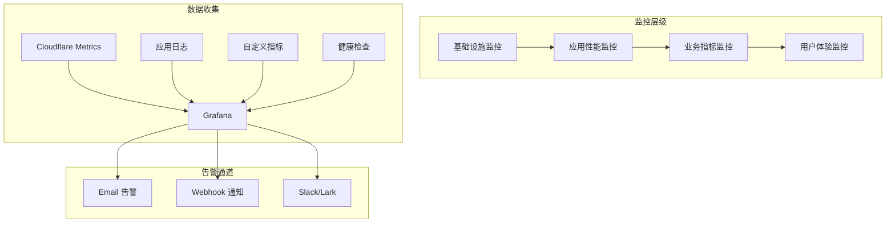
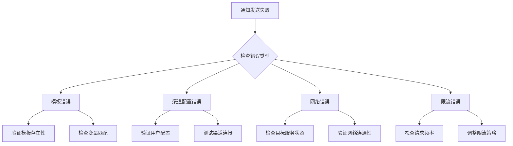
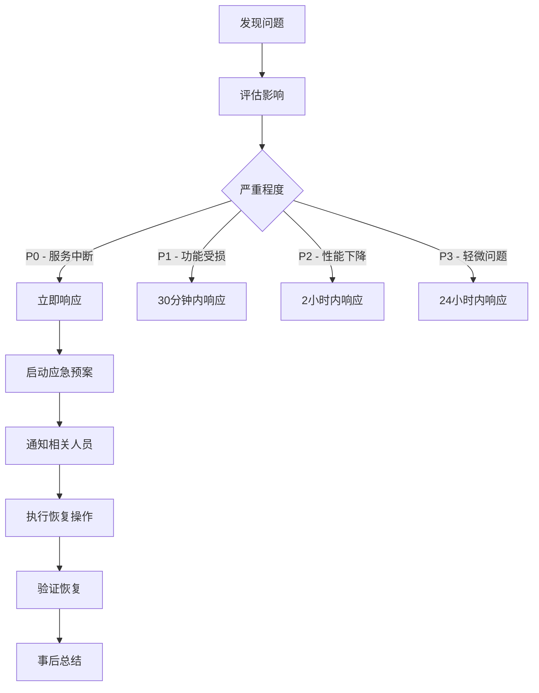

# 监控运维完整指南

本文档提供通知系统的完整监控运维指南，包括监控策略、性能指标、告警配置、日常维护和故障处理。

## 目录

- [概述](#概述)
- [监控架构](#监控架构)
- [健康检查](#健康检查)
- [性能监控](#性能监控)
- [日志管理](#日志管理)
- [告警配置](#告警配置)
- [Grafana 集成](#grafana-集成)
- [运维任务](#运维任务)
- [故障诊断](#故障诊断)
- [性能优化](#性能优化)
- [应急响应](#应急响应)

## 概述

通知系统采用多层次监控策略，确保系统的高可用性和稳定性。监控覆盖基础设施、应用性能、业务指标和用户体验等多个维度。

### 监控目标

- **可用性**：确保系统 99.9% 的正常运行时间
- **性能**：API 响应时间 < 200ms (P95)
- **可靠性**：消息投递成功率 > 99%
- **可观测性**：快速定位和解决问题

### 监控工具栈

| 工具 | 用途 | 说明 |
|------|------|------|
| Cloudflare Analytics | 基础监控 | Workers 性能和错误监控 |
| Grafana | 可视化监控 | 仪表板和告警 |
| Wrangler Tail | 实时日志 | 调试和问题排查 |
| 自定义健康检查 | 主动监控 | API 和依赖项检查 |

## 监控架构

### 架构设计



### 监控维度

1. **基础设施层**
   - Workers 运行状态
   - D1 数据库性能
   - KV 存储延迟
   - Queue 处理能力

2. **应用层**
   - API 响应时间
   - 错误率
   - 并发请求数
   - 内存使用

3. **业务层**
   - 通知发送成功率
   - 渠道可用性
   - 模板使用情况
   - 用户活跃度

4. **用户体验层**
   - 端到端延迟
   - 消息送达时间
   - API 可用性
   - 错误响应

## 健康检查

### 健康检查端点

#### 1. 基础健康检查

```typescript
// GET /api/health
{
  "status": "healthy",
  "timestamp": "2024-01-06T10:00:00Z",
  "version": "1.0.0",
  "environment": "production"
}
```

#### 2. 详细健康检查

```typescript
// GET /api/health/detailed
{
  "status": "healthy",
  "timestamp": "2024-01-06T10:00:00Z",
  "checks": {
    "database": {
      "status": "healthy",
      "responseTime": 5,
      "details": "Connection successful"
    },
    "kv": {
      "status": "healthy",
      "responseTime": 2,
      "details": "Read/write test passed"
    },
    "queue": {
      "status": "healthy",
      "backlog": 0,
      "details": "Queue is processing normally"
    },
    "adapters": {
      "webhook": { "status": "healthy", "available": true },
      "lark": { "status": "healthy", "available": true },
      "telegram": { "status": "healthy", "available": true }
    }
  },
  "metrics": {
    "uptime": 864000,
    "requestsProcessed": 1234567,
    "averageResponseTime": 45
  }
}
```

### 健康检查实现

```typescript
// src/api/handlers/health.ts
export async function handleHealthCheck(
  request: Request,
  env: Env
): Promise<Response> {
  const startTime = Date.now();
  const checks = new Map<string, HealthCheckResult>();
  
  // 1. 数据库检查
  checks.set('database', await checkDatabase(env));
  
  // 2. KV 存储检查
  checks.set('kv', await checkKVStore(env));
  
  // 3. 队列检查
  checks.set('queue', await checkQueue(env));
  
  // 4. 适配器检查
  checks.set('adapters', await checkAdapters(env));
  
  // 汇总状态
  const overallStatus = Array.from(checks.values())
    .every(check => check.status === 'healthy') ? 'healthy' : 'degraded';
  
  return new Response(JSON.stringify({
    status: overallStatus,
    timestamp: new Date().toISOString(),
    checks: Object.fromEntries(checks),
    responseTime: Date.now() - startTime
  }), {
    status: 200,
    headers: { 'Content-Type': 'application/json' }
  });
}

async function checkDatabase(env: Env): Promise<HealthCheckResult> {
  try {
    const start = Date.now();
    const db = getDb(env);
    await db.get(sql`SELECT 1`);
    
    return {
      status: 'healthy',
      responseTime: Date.now() - start,
      details: 'Connection successful'
    };
  } catch (error) {
    return {
      status: 'unhealthy',
      error: error.message,
      details: 'Database connection failed'
    };
  }
}
```

### 自动化健康检查

```bash
#!/bin/bash
# scripts/monitoring/health-check.sh

ENDPOINTS=(
  "https://notification-api.example.com/api/health"
  "https://notification-api-dev.example.com/api/health"
)

for endpoint in "${ENDPOINTS[@]}"; do
  response=$(curl -s -w "\n%{http_code}" "$endpoint")
  http_code=$(echo "$response" | tail -n1)
  body=$(echo "$response" | head -n-1)
  
  if [ "$http_code" -eq 200 ]; then
    status=$(echo "$body" | jq -r '.status')
    if [ "$status" = "healthy" ]; then
      echo "✅ $endpoint is healthy"
    else
      echo "⚠️ $endpoint is degraded: $status"
      # 发送告警
      notify_ops "$endpoint health check failed"
    fi
  else
    echo "❌ $endpoint is down (HTTP $http_code)"
    # 发送紧急告警
    notify_emergency "$endpoint is down"
  fi
done
```

## 性能监控

### 关键性能指标 (KPIs)

| 指标 | 目标值 | 告警阈值 | 监控方式 |
|------|--------|----------|----------|
| API 响应时间 (P50) | < 50ms | > 100ms | Cloudflare Analytics |
| API 响应时间 (P95) | < 200ms | > 500ms | Cloudflare Analytics |
| API 响应时间 (P99) | < 500ms | > 1000ms | Cloudflare Analytics |
| 错误率 | < 0.1% | > 1% | 日志分析 |
| 通知成功率 | > 99% | < 95% | 业务指标 |
| 队列延迟 | < 10s | > 60s | Queue Metrics |
| 数据库查询时间 | < 50ms | > 200ms | 查询日志 |
| 内存使用 | < 100MB | > 120MB | Runtime Metrics |

### 性能监控实现

```typescript
// src/utils/performance-monitor.ts
export class PerformanceMonitor {
  private static metrics = new Map<string, MetricData>();
  
  static recordMetric(name: string, value: number, tags?: Record<string, string>) {
    const key = this.getMetricKey(name, tags);
    
    if (!this.metrics.has(key)) {
      this.metrics.set(key, {
        name,
        tags,
        values: [],
        count: 0,
        sum: 0,
        min: Infinity,
        max: -Infinity
      });
    }
    
    const metric = this.metrics.get(key)!;
    metric.values.push(value);
    metric.count++;
    metric.sum += value;
    metric.min = Math.min(metric.min, value);
    metric.max = Math.max(metric.max, value);
    
    // 保留最近 1000 个数据点
    if (metric.values.length > 1000) {
      metric.values.shift();
    }
  }
  
  static getMetrics(): MetricsSummary {
    const summary: MetricsSummary = {};
    
    for (const [key, data] of this.metrics) {
      const percentiles = this.calculatePercentiles(data.values);
      
      summary[key] = {
        count: data.count,
        mean: data.sum / data.count,
        min: data.min,
        max: data.max,
        p50: percentiles.p50,
        p95: percentiles.p95,
        p99: percentiles.p99
      };
    }
    
    return summary;
  }
  
  private static calculatePercentiles(values: number[]) {
    const sorted = [...values].sort((a, b) => a - b);
    
    return {
      p50: sorted[Math.floor(sorted.length * 0.5)],
      p95: sorted[Math.floor(sorted.length * 0.95)],
      p99: sorted[Math.floor(sorted.length * 0.99)]
    };
  }
}

// 使用示例
export async function trackApiPerformance(
  handler: Function,
  request: Request,
  env: Env
) {
  const start = Date.now();
  
  try {
    const response = await handler(request, env);
    const duration = Date.now() - start;
    
    PerformanceMonitor.recordMetric('api.response_time', duration, {
      endpoint: new URL(request.url).pathname,
      method: request.method,
      status: String(response.status)
    });
    
    return response;
  } catch (error) {
    const duration = Date.now() - start;
    
    PerformanceMonitor.recordMetric('api.response_time', duration, {
      endpoint: new URL(request.url).pathname,
      method: request.method,
      status: 'error'
    });
    
    throw error;
  }
}
```

### 业务指标监控

```typescript
// src/monitoring/business-metrics.ts
export class BusinessMetrics {
  static async collectNotificationMetrics(env: Env): Promise<NotificationMetrics> {
    const db = getDb(env);
    
    // 最近 24 小时的统计
    const last24h = new Date(Date.now() - 24 * 60 * 60 * 1000).toISOString();
    
    // 通知发送统计
    const notificationStats = await db.all(sql`
      SELECT 
        channel_type,
        status,
        COUNT(*) as count,
        AVG(CASE WHEN status = 'success' THEN 1.0 ELSE 0.0 END) as success_rate
      FROM notification_logs
      WHERE created_at >= ${last24h}
      GROUP BY channel_type, status
    `);
    
    // 模板使用统计
    const templateStats = await db.all(sql`
      SELECT 
        template_key,
        COUNT(*) as usage_count,
        COUNT(DISTINCT user_id) as unique_users
      FROM notification_logs
      WHERE created_at >= ${last24h}
      GROUP BY template_key
      ORDER BY usage_count DESC
      LIMIT 10
    `);
    
    // 用户活跃度
    const activeUsers = await db.get(sql`
      SELECT COUNT(DISTINCT user_id) as count
      FROM notification_logs
      WHERE created_at >= ${last24h}
    `);
    
    // 队列状态
    const queueBacklog = await this.getQueueBacklog(env);
    
    return {
      timestamp: new Date().toISOString(),
      notifications: {
        total: notificationStats.reduce((sum, s) => sum + s.count, 0),
        byChannel: this.groupByChannel(notificationStats),
        successRate: this.calculateOverallSuccessRate(notificationStats)
      },
      templates: {
        mostUsed: templateStats,
        totalUsage: templateStats.reduce((sum, t) => sum + t.usage_count, 0)
      },
      users: {
        activeCount: activeUsers.count,
        period: '24h'
      },
      queue: {
        backlog: queueBacklog,
        processingRate: await this.getProcessingRate(env)
      }
    };
  }
}
```

## 日志管理

### 日志收集

#### 1. 实时日志查看

```bash
# 查看生产环境日志
wrangler tail --env production

# 过滤特定路径
wrangler tail --env production --filter "/api/send-notification"

# 搜索错误
wrangler tail --env production --search "error"

# 格式化输出
wrangler tail --env production --format json | jq '.'
```

#### 2. 结构化日志

```typescript
// src/utils/logger.ts
export class Logger {
  private static instance: Logger;
  private context: LogContext = {};
  
  static getInstance(): Logger {
    if (!this.instance) {
      this.instance = new Logger();
    }
    return this.instance;
  }
  
  setContext(context: LogContext) {
    this.context = { ...this.context, ...context };
  }
  
  private formatLog(level: LogLevel, message: string, data?: any) {
    return {
      timestamp: new Date().toISOString(),
      level,
      message,
      ...this.context,
      ...(data && { data })
    };
  }
  
  info(message: string, data?: any) {
    console.log(JSON.stringify(this.formatLog('info', message, data)));
  }
  
  warn(message: string, data?: any) {
    console.warn(JSON.stringify(this.formatLog('warn', message, data)));
  }
  
  error(message: string, error?: any) {
    const errorData = error instanceof Error ? {
      name: error.name,
      message: error.message,
      stack: error.stack
    } : error;
    
    console.error(JSON.stringify(this.formatLog('error', message, errorData)));
  }
  
  metric(name: string, value: number, tags?: Record<string, string>) {
    console.log(JSON.stringify({
      timestamp: new Date().toISOString(),
      type: 'metric',
      name,
      value,
      tags,
      ...this.context
    }));
  }
}
```

### 日志分析

#### 1. 错误模式分析

```bash
#!/bin/bash
# scripts/monitoring/analyze-errors.sh

# 收集最近1小时的日志
wrangler tail --env production --format json > logs.json

# 分析错误模式
echo "=== 错误统计 ==="
jq 'select(.level == "error") | .message' logs.json | sort | uniq -c | sort -nr

echo -e "\n=== 错误详情 ==="
jq 'select(.level == "error") | {time: .timestamp, error: .data.message, stack: .data.stack}' logs.json

echo -e "\n=== 按端点统计错误 ==="
jq 'select(.level == "error") | .endpoint' logs.json | sort | uniq -c | sort -nr
```

#### 2. 性能分析脚本

```typescript
// scripts/monitoring/analyze-performance.ts
import { readFileSync } from 'fs';

interface LogEntry {
  timestamp: string;
  type?: string;
  name?: string;
  value?: number;
  tags?: Record<string, string>;
}

function analyzePerformanceLogs(logFile: string) {
  const logs = readFileSync(logFile, 'utf-8')
    .split('\n')
    .filter(line => line)
    .map(line => JSON.parse(line));
  
  // 筛选性能指标
  const metrics = logs.filter((log: LogEntry) => log.type === 'metric');
  
  // 按指标名称分组
  const groupedMetrics = metrics.reduce((acc, metric) => {
    const key = metric.name!;
    if (!acc[key]) acc[key] = [];
    acc[key].push(metric.value!);
    return acc;
  }, {} as Record<string, number[]>);
  
  // 计算统计信息
  console.log('=== 性能指标分析 ===\n');
  
  Object.entries(groupedMetrics).forEach(([name, values]) => {
    const sorted = values.sort((a, b) => a - b);
    const sum = values.reduce((a, b) => a + b, 0);
    
    console.log(`${name}:`);
    console.log(`  样本数: ${values.length}`);
    console.log(`  平均值: ${(sum / values.length).toFixed(2)}ms`);
    console.log(`  最小值: ${sorted[0]}ms`);
    console.log(`  最大值: ${sorted[sorted.length - 1]}ms`);
    console.log(`  P50: ${sorted[Math.floor(sorted.length * 0.5)]}ms`);
    console.log(`  P95: ${sorted[Math.floor(sorted.length * 0.95)]}ms`);
    console.log(`  P99: ${sorted[Math.floor(sorted.length * 0.99)]}ms`);
    console.log('');
  });
}

// 使用
analyzePerformanceLogs('performance-logs.json');
```

## 告警配置

### 告警规则

| 告警名称 | 条件 | 级别 | 通知方式 |
|----------|------|------|----------|
| API 高错误率 | 错误率 > 5% 持续 5 分钟 | 严重 | 即时通知所有渠道 |
| API 响应缓慢 | P95 > 1s 持续 10 分钟 | 警告 | Email + Slack |
| 数据库连接失败 | 连接失败次数 > 3 | 严重 | 即时通知 |
| 队列积压 | 积压 > 1000 条 | 警告 | Email |
| 内存使用过高 | > 120MB | 警告 | Email |
| 通知失败率高 | 失败率 > 5% | 严重 | 即时通知 |

### Cloudflare 告警配置

```typescript
// wrangler.toml 配置示例
[observability]
enabled = true

[[analytics_engine_datasets]]
binding = "ANALYTICS"

[[d1_databases]]
binding = "DB"
database_name = "notification-system"
database_id = "xxxxx"

[triggers]
crons = ["*/5 * * * *"] # 每5分钟执行一次监控检查
```

### 告警处理器

```typescript
// src/monitoring/alert-handler.ts
export class AlertHandler {
  private static recentAlerts = new Map<string, Date>();
  private static readonly ALERT_COOLDOWN = 5 * 60 * 1000; // 5分钟冷却
  
  static async checkAndAlert(env: Env) {
    const checks = [
      this.checkApiErrorRate,
      this.checkResponseTime,
      this.checkDatabaseHealth,
      this.checkQueueBacklog,
      this.checkNotificationFailureRate
    ];
    
    for (const check of checks) {
      try {
        await check(env);
      } catch (error) {
        console.error('Alert check failed:', error);
      }
    }
  }
  
  private static async checkApiErrorRate(env: Env) {
    const errorRate = await this.getErrorRate(env);
    
    if (errorRate > 0.05) { // 5%
      await this.sendAlert(env, {
        name: 'API_HIGH_ERROR_RATE',
        level: 'critical',
        message: `API错误率过高: ${(errorRate * 100).toFixed(2)}%`,
        details: {
          errorRate,
          threshold: 0.05,
          timestamp: new Date().toISOString()
        }
      });
    }
  }
  
  private static async sendAlert(env: Env, alert: Alert) {
    const alertKey = `${alert.name}_${alert.level}`;
    const lastAlert = this.recentAlerts.get(alertKey);
    
    // 检查冷却时间
    if (lastAlert && Date.now() - lastAlert.getTime() < this.ALERT_COOLDOWN) {
      return;
    }
    
    // 记录告警时间
    this.recentAlerts.set(alertKey, new Date());
    
    // 根据级别选择通知渠道
    const channels = this.getAlertChannels(alert.level);
    
    for (const channel of channels) {
      try {
        await this.notifyChannel(env, channel, alert);
      } catch (error) {
        console.error(`Failed to send alert to ${channel}:`, error);
      }
    }
  }
  
  private static getAlertChannels(level: AlertLevel): string[] {
    switch (level) {
      case 'critical':
        return ['email', 'slack', 'lark', 'webhook'];
      case 'warning':
        return ['email', 'slack'];
      case 'info':
        return ['email'];
      default:
        return ['email'];
    }
  }
}
```

## Grafana 集成

### Grafana 配置

#### 1. Webhook 接收器

```typescript
// src/api/handlers/grafanaWebhook.ts
export async function handleGrafanaWebhook(
  request: Request,
  env: Env
): Promise<Response> {
  try {
    // 验证 Basic Auth
    const auth = request.headers.get('Authorization');
    if (!auth || !validateBasicAuth(auth, env.GRAFANA_WEBHOOK_USER, env.GRAFANA_WEBHOOK_PASS)) {
      return new Response('Unauthorized', { status: 401 });
    }
    
    // 解析告警数据
    const alert: GrafanaAlert = await request.json();
    
    // 转换为通知格式
    const notifications = alert.alerts.map(a => ({
      user_id: 'ops-team',
      template_key: 'grafana-alert',
      channel: 'lark',
      variables: {
        alertname: a.labels.alertname,
        severity: a.labels.severity,
        instance: a.labels.instance,
        description: a.annotations.description,
        value: a.values,
        status: alert.status,
        dashboardURL: alert.externalURL,
        panelURL: alert.panelURL
      }
    }));
    
    // 发送通知
    const results = await Promise.all(
      notifications.map(n => sendNotification(n, env))
    );
    
    return new Response(JSON.stringify({
      success: true,
      message_ids: results.map(r => r.messageId)
    }), {
      status: 200,
      headers: { 'Content-Type': 'application/json' }
    });
    
  } catch (error) {
    console.error('Grafana webhook error:', error);
    return new Response('Internal Server Error', { status: 500 });
  }
}
```

#### 2. Grafana 仪表板配置

```json
{
  "dashboard": {
    "title": "通知系统监控",
    "panels": [
      {
        "title": "API 响应时间",
        "type": "graph",
        "targets": [{
          "expr": "histogram_quantile(0.95, rate(api_response_time_bucket[5m]))",
          "legendFormat": "P95"
        }]
      },
      {
        "title": "通知成功率",
        "type": "stat",
        "targets": [{
          "expr": "sum(rate(notification_success[5m])) / sum(rate(notification_total[5m])) * 100"
        }]
      },
      {
        "title": "错误率",
        "type": "graph",
        "targets": [{
          "expr": "sum(rate(api_errors[5m])) by (endpoint)"
        }]
      },
      {
        "title": "队列积压",
        "type": "gauge",
        "targets": [{
          "expr": "queue_backlog"
        }]
      }
    ]
  }
}
```

### 数据源配置

```yaml
# grafana-datasource.yml
apiVersion: 1

datasources:
  - name: Cloudflare Analytics
    type: cloudflare-analytics
    access: proxy
    jsonData:
      accountId: ${CLOUDFLARE_ACCOUNT_ID}
      apiToken: ${CLOUDFLARE_API_TOKEN}
    
  - name: Notification Metrics
    type: prometheus
    access: proxy
    url: http://localhost:9090
    jsonData:
      httpMethod: POST
```

## 运维任务

### 日常运维

#### 每日任务清单

1. **系统健康检查** (09:00)
   ```bash
   #!/bin/bash
   # scripts/monitoring/daily-health-check.sh
   
   echo "=== 每日健康检查 $(date) ==="
   
   # API 健康状态
   echo -e "\n[1/5] API 健康状态"
   for env in production staging; do
     echo -n "$env: "
     status=$(curl -s https://notification-api-$env.example.com/api/health | jq -r '.status')
     if [ "$status" = "healthy" ]; then
       echo "✅ 健康"
     else
       echo "❌ 异常 - $status"
       notify_ops "$env API 健康检查失败"
     fi
   done
   
   # 数据库状态
   echo -e "\n[2/5] 数据库状态"
   wrangler d1 execute notification-system --command="
     SELECT 
       'connections' as metric,
       COUNT(*) as value
     FROM sqlite_master
     WHERE type='table'
   "
   
   # 队列状态
   echo -e "\n[3/5] 队列状态"
   queue_status=$(wrangler queues list | grep notification-queue)
   echo "$queue_status"
   
   # 错误统计
   echo -e "\n[4/5] 过去24小时错误统计"
   wrangler d1 execute notification-system --command="
     SELECT 
       channel_type,
       COUNT(*) as error_count,
       COUNT(DISTINCT user_id) as affected_users
     FROM notification_logs
     WHERE status = 'failed'
       AND created_at > datetime('now', '-1 day')
     GROUP BY channel_type
     ORDER BY error_count DESC
   "
   
   # 性能指标
   echo -e "\n[5/5] 性能指标"
   echo "获取最近的性能数据..."
   curl -s https://notification-api.example.com/api/metrics | jq '.'
   
   echo -e "\n=== 检查完成 ==="
   ```

2. **日志分析和异常检测** (10:00, 14:00, 18:00)
   ```bash
   #!/bin/bash
   # scripts/monitoring/analyze-logs.sh
   
   LOG_FILE="logs_$(date +%Y%m%d_%H%M%S).json"
   
   # 收集日志
   echo "收集最近1小时的日志..."
   wrangler tail --env production --format json > "$LOG_FILE" &
   TAIL_PID=$!
   sleep 60
   kill $TAIL_PID
   
   # 分析错误模式
   echo -e "\n=== 错误分析 ==="
   jq 'select(.level == "error")' "$LOG_FILE" | \
     jq -r '.message' | sort | uniq -c | sort -nr | head -20
   
   # 检测异常模式
   echo -e "\n=== 异常模式检测 ==="
   
   # 检查突增的错误
   error_count=$(jq 'select(.level == "error")' "$LOG_FILE" | wc -l)
   if [ $error_count -gt 100 ]; then
     echo "⚠️ 错误数量异常: $error_count"
     notify_ops "错误数量突增: $error_count/小时"
   fi
   
   # 检查慢请求
   echo -e "\n=== 慢请求分析 ==="
   jq 'select(.type == "metric" and .name == "api.response_time" and .value > 1000)' "$LOG_FILE" | \
     jq '{endpoint: .tags.endpoint, time: .value, timestamp: .timestamp}' | head -10
   
   # 生成报告
   cat > "daily_report_$(date +%Y%m%d).md" << EOF
# 日志分析报告 $(date)

## 概览
- 总请求数: $(jq 'select(.type == "request")' "$LOG_FILE" | wc -l)
- 错误数: $error_count
- 错误率: $(echo "scale=2; $error_count * 100 / $(jq 'select(.type == "request")' "$LOG_FILE" | wc -l)" | bc)%

## 主要问题
$(jq 'select(.level == "error") | {time: .timestamp, error: .data.message}' "$LOG_FILE" | head -5)

EOF
   ```

3. **性能监控报告** (每日 20:00)
   ```typescript
   // scripts/monitoring/daily-performance-report.ts
   export async function generateDailyReport(env: Env) {
     const report = {
       date: new Date().toISOString().split('T')[0],
       summary: {},
       details: {},
       recommendations: []
     };
     
     // 收集性能数据
     const db = getDb(env);
     
     // API 性能
     const apiPerf = await db.all(sql`
       SELECT 
         DATE(created_at) as date,
         COUNT(*) as total_requests,
         AVG(CASE WHEN status = 'success' THEN 1 ELSE 0 END) * 100 as success_rate,
         COUNT(CASE WHEN status = 'failed' THEN 1 END) as failed_requests
       FROM notification_logs
       WHERE created_at >= datetime('now', '-1 day')
       GROUP BY DATE(created_at)
     `);
     
     report.summary = apiPerf[0] || {};
     
     // 渠道性能
     const channelPerf = await db.all(sql`
       SELECT 
         channel_type,
         COUNT(*) as total,
         AVG(CASE WHEN status = 'success' THEN 1 ELSE 0 END) * 100 as success_rate,
         AVG(retry_count) as avg_retries
       FROM notification_logs
       WHERE created_at >= datetime('now', '-1 day')
       GROUP BY channel_type
     `);
     
     report.details.channels = channelPerf;
     
     // 慢查询
     const slowQueries = await analyzeSlowQueries(env);
     report.details.slowQueries = slowQueries;
     
     // 生成建议
     if (report.summary.success_rate < 99) {
       report.recommendations.push('成功率低于99%，需要调查失败原因');
     }
     
     if (slowQueries.length > 0) {
       report.recommendations.push('存在慢查询，建议优化数据库索引');
     }
     
     // 发送报告
     await sendDailyReport(env, report);
     
     return report;
   }
   ```

4. **自动化巡检任务**
   ```typescript
   // src/scheduled/daily-tasks.ts
   export async function scheduledDailyTasks(env: Env) {
     const tasks = [
       { name: '清理过期幂等键', fn: cleanupExpiredIdempotencyKeys },
       { name: '更新缓存统计', fn: updateCacheStatistics },
       { name: '检查队列健康', fn: checkQueueHealth },
       { name: '验证模板完整性', fn: validateTemplateIntegrity },
       { name: '生成性能报告', fn: generateDailyReport }
     ];
     
     const results = [];
     
     for (const task of tasks) {
       const start = Date.now();
       try {
         console.log(`执行任务: ${task.name}`);
         const result = await task.fn(env);
         results.push({
           task: task.name,
           status: 'success',
           duration: Date.now() - start,
           result
         });
       } catch (error) {
         console.error(`任务失败: ${task.name}`, error);
         results.push({
           task: task.name,
           status: 'failed',
           duration: Date.now() - start,
           error: error.message
         });
         
         // 发送告警
         await notifyTaskFailure(env, task.name, error);
       }
     }
     
     // 记录执行结果
     await recordTaskExecution(env, 'daily_tasks', results);
     
     return results;
   }
   ```

#### 每周任务 (每周一 03:00)

1. **深度性能分析和容量规划**
   ```typescript
   // scripts/monitoring/weekly-analysis.ts
   export async function weeklyCapacityAnalysis(env: Env) {
     const db = getDb(env);
     
     console.log('=== 每周容量分析报告 ===');
     
     // 1. 数据增长趋势
     const growthTrend = await db.all(sql`
       SELECT 
         DATE(created_at) as date,
         COUNT(*) as daily_count,
         SUM(COUNT(*)) OVER (ORDER BY DATE(created_at)) as cumulative
       FROM notification_logs
       WHERE created_at >= datetime('now', '-30 days')
       GROUP BY DATE(created_at)
     `);
     
     // 2. 表空间使用
     const tableStats = await db.all(sql`
       SELECT 
         'notification_logs' as table_name,
         COUNT(*) as row_count,
         ROUND(COUNT(*) * 0.5 / 1024.0, 2) as estimated_size_mb,
         ROUND(COUNT(*) * 100.0 / 10000000, 2) as usage_percent
       FROM notification_logs
       UNION ALL
       SELECT 
         'user_configs',
         COUNT(*),
         ROUND(COUNT(*) * 0.2 / 1024.0, 2),
         ROUND(COUNT(*) * 100.0 / 1000000, 2)
       FROM user_configs
       UNION ALL
       SELECT 
         'template_contents',
         COUNT(*),
         ROUND(COUNT(*) * 1.0 / 1024.0, 2),
         ROUND(COUNT(*) * 100.0 / 100000, 2)
       FROM template_contents
     `);
     
     console.table(tableStats);
     
     // 3. 预测未来容量需求
     const avgDailyGrowth = growthTrend
       .slice(-7)
       .reduce((sum, day) => sum + day.daily_count, 0) / 7;
     
     const projection = {
       current_total: growthTrend[growthTrend.length - 1]?.cumulative || 0,
       daily_growth_rate: avgDailyGrowth,
       projected_30_days: avgDailyGrowth * 30,
       projected_90_days: avgDailyGrowth * 90,
       estimated_capacity_days: Math.floor((10000000 - growthTrend[growthTrend.length - 1]?.cumulative) / avgDailyGrowth)
     };
     
     console.log('\n增长预测:');
     console.table(projection);
     
     // 4. 生成告警和建议
     const alerts = [];
     
     if (projection.estimated_capacity_days < 90) {
       alerts.push({
         level: 'warning',
         message: `数据库容量预计在 ${projection.estimated_capacity_days} 天内达到上限`,
         action: '考虑实施数据归档策略'
       });
     }
     
     tableStats.forEach(table => {
       if (table.usage_percent > 80) {
         alerts.push({
           level: 'warning',
           message: `表 ${table.table_name} 使用率超过 80%`,
           action: '清理历史数据或扩容'
         });
       }
     });
     
     // 5. 性能基准测试
     const perfBaseline = await runPerformanceBaseline(env);
     
     return {
       growth_trend: growthTrend,
       table_stats: tableStats,
       projection,
       alerts,
       performance_baseline: perfBaseline
     };
   }
   ```

2. **全面备份和验证**
   ```bash
   #!/bin/bash
   # scripts/monitoring/weekly-backup.sh
   
   echo "=== 每周备份任务 $(date) ==="
   
   # 1. 创建数据库备份
   echo "[1/4] 创建数据库备份..."
   BACKUP_ID=$(wrangler d1 backup create notification-system --json | jq -r '.id')
   echo "备份ID: $BACKUP_ID"
   
   # 2. 导出配置
   echo "[2/4] 导出系统配置..."
   curl -X POST https://notification-api.example.com/api/admin/export-config \
     -H "X-API-Key: $ADMIN_API_KEY" \
     -o "config_backup_$(date +%Y%m%d).json"
   
   # 3. 验证备份完整性
   echo "[3/4] 验证备份完整性..."
   
   # 下载备份
   wrangler d1 backup download notification-system $BACKUP_ID \
     --output="backup_$(date +%Y%m%d).sql"
   
   # 检查备份大小
   BACKUP_SIZE=$(stat -f%z "backup_$(date +%Y%m%d).sql" 2>/dev/null || stat -c%s "backup_$(date +%Y%m%d).sql")
   if [ $BACKUP_SIZE -lt 1000 ]; then
     echo "❌ 备份文件过小，可能存在问题"
     notify_ops "每周备份验证失败：文件过小"
   else
     echo "✅ 备份文件大小: $(($BACKUP_SIZE / 1024 / 1024)) MB"
   fi
   
   # 4. 测试恢复流程
   echo "[4/4] 测试恢复流程..."
   
   # 创建测试数据库
   TEST_DB="notification-system-test-$(date +%Y%m%d)"
   wrangler d1 create $TEST_DB
   
   # 恢复到测试数据库
   wrangler d1 execute $TEST_DB --file="backup_$(date +%Y%m%d).sql"
   
   # 验证数据
   RESTORED_COUNT=$(wrangler d1 execute $TEST_DB \
     --command="SELECT COUNT(*) as count FROM notification_logs" \
     --json | jq -r '.result[0].count')
   
   echo "恢复的记录数: $RESTORED_COUNT"
   
   # 清理测试数据库
   wrangler d1 delete $TEST_DB --yes
   
   echo "=== 备份任务完成 ==="
   ```

3. **容量分析**

```bash
#!/bin/bash
# weekly-capacity-check.sh

echo "=== 容量分析报告 ==="
echo "日期: $(date)"

# 数据库容量
echo "\n--- 数据库容量 ---"
wrangler d1 execute notification-system --command="
SELECT 
    name as table_name,
    SUM(pgsize) as size_bytes,
    ROUND(SUM(pgsize) / 1024.0 / 1024.0, 2) as size_mb,
    COUNT(*) as page_count
FROM dbstat
GROUP BY name
ORDER BY size_bytes DESC;"

# 数据增长趋势
echo "\n--- 数据增长趋势 ---"
wrangler d1 execute notification-system --command="
SELECT 
    DATE(created_at) as date,
    COUNT(*) as daily_count,
    SUM(COUNT(*)) OVER (ORDER BY DATE(created_at)) as cumulative_count
FROM notification_logs
WHERE created_at > datetime('now', '-30 days')
GROUP BY DATE(created_at);"

# KV 使用情况
echo "\n--- KV 存储统计 ---"
KV_LIST=$(wrangler kv:key list --namespace-id=$KV_NAMESPACE_ID)
echo "总键数: $(echo "$KV_LIST" | jq '. | length')"
echo "最近更新: $(echo "$KV_LIST" | jq -r '.[0].metadata.updated // "N/A"')"
```

4. **安全审计和合规检查**
   ```typescript
   // scripts/monitoring/weekly-security-audit.ts
   export async function weeklySecurityAudit(env: Env) {
     const audit = {
       timestamp: new Date().toISOString(),
       checks: [],
       violations: [],
       recommendations: []
     };
     
     // 1. API 访问模式分析
     const accessPatterns = await analyzeAccessPatterns(env);
     audit.checks.push({
       name: 'API访问模式',
       status: 'completed',
       findings: accessPatterns
     });
     
     // 检测异常
     const anomalies = detectAnomalies(accessPatterns);
     if (anomalies.length > 0) {
       audit.violations.push(...anomalies);
     }
     
     // 2. 密钥和凭证审计
     const credentialAudit = await auditCredentials(env);
     audit.checks.push({
       name: '凭证安全审计',
       status: 'completed',
       findings: credentialAudit
     });
     
     // 3. 权限和配置审查
     const configReview = await reviewSecurityConfig(env);
     audit.checks.push({
       name: '安全配置审查',
       status: 'completed',
       findings: configReview
     });
     
     // 4. 敏感数据扫描
     const dataScan = await scanSensitiveData(env);
     if (dataScan.issues.length > 0) {
       audit.violations.push(...dataScan.issues);
     }
     
     // 生成建议
     audit.recommendations = generateSecurityRecommendations(audit);
     
     // 保存审计报告
     await saveAuditReport(env, audit);
     
     // 发送摘要
     if (audit.violations.length > 0) {
       await notifySecurityTeam(env, audit);
     }
     
     return audit;
   }
   
   async function analyzeAccessPatterns(env: Env) {
     const db = getDb(env);
     
     // 分析API访问模式
     const patterns = await db.all(sql`
       SELECT 
         user_id,
         COUNT(*) as request_count,
         COUNT(DISTINCT DATE(created_at)) as active_days,
         COUNT(DISTINCT channel_type) as channels_used,
         MAX(created_at) as last_activity
       FROM notification_logs
       WHERE created_at >= datetime('now', '-7 days')
       GROUP BY user_id
       ORDER BY request_count DESC
     `);
     
     return patterns;
   }
   
   function detectAnomalies(patterns: any[]) {
     const anomalies = [];
     
     patterns.forEach(pattern => {
       // 检测异常高的请求量
       if (pattern.request_count > 10000) {
         anomalies.push({
           type: 'high_volume',
           user_id: pattern.user_id,
           details: `异常高的请求量: ${pattern.request_count}/周`,
           severity: 'high'
         });
       }
       
       // 检测异常的使用模式
       if (pattern.channels_used > 5) {
         anomalies.push({
           type: 'unusual_pattern',
           user_id: pattern.user_id,
           details: `使用了过多的渠道: ${pattern.channels_used}`,
           severity: 'medium'
         });
       }
     });
     
     return anomalies;
   }
   ```

4. **性能优化评估**
   ```typescript
   // scripts/monitoring/weekly-performance-optimization.ts
   export async function weeklyPerformanceReview(env: Env) {
     console.log('=== 每周性能优化评估 ===');
     
     // 1. 识别性能瓶颈
     const bottlenecks = await identifyBottlenecks(env);
     
     // 2. 缓存效率分析
     const cacheAnalysis = await analyzeCacheEfficiency(env);
     
     // 3. 数据库查询优化机会
     const queryOptimizations = await findQueryOptimizations(env);
     
     // 4. 生成优化建议
     const optimizations = {
       immediate: [], // 立即执行
       planned: [],   // 计划执行
       monitor: []    // 持续监控
     };
     
     // 基于分析结果生成建议
     if (cacheAnalysis.hitRate < 0.8) {
       optimizations.immediate.push({
         action: '提高缓存命中率',
         details: '当前命中率仅 ' + (cacheAnalysis.hitRate * 100).toFixed(1) + '%',
         steps: [
           '增加缓存 TTL 到 10 分钟',
           '实施缓存预热策略',
           '优化缓存键生成逻辑'
         ]
       });
     }
     
     queryOptimizations.forEach(opt => {
       if (opt.impact === 'high') {
         optimizations.immediate.push(opt);
       } else {
         optimizations.planned.push(opt);
       }
     });
     
     // 执行自动优化
     for (const opt of optimizations.immediate) {
       if (opt.autoExecutable) {
         await executeOptimization(env, opt);
       }
     }
     
     return {
       bottlenecks,
       cacheAnalysis,
       queryOptimizations,
       optimizations,
       executedOptimizations: optimizations.immediate.filter(o => o.autoExecutable)
     };
   }
   ```

#### 每月任务 (每月1日 02:00)

1. **大规模数据维护和归档**
   ```typescript
   // scripts/monitoring/monthly-maintenance.ts
   export async function monthlyDataMaintenance(env: Env) {
     const maintenanceLog = {
       timestamp: new Date().toISOString(),
       tasks: [],
       summary: {}
     };
     
     console.log('=== 月度数据维护任务开始 ===');
     
     // 1. 数据归档
     console.log('[1/5] 归档历史数据...');
     const archiveResult = await archiveHistoricalData(env);
     maintenanceLog.tasks.push({
       name: '数据归档',
       status: 'completed',
       result: archiveResult
     });
     
     // 2. 清理过期数据
     console.log('[2/5] 清理过期数据...');
     const cleanupResult = await performDataCleanup(env);
     maintenanceLog.tasks.push({
       name: '数据清理',
       status: 'completed',
       result: cleanupResult
     });
     
     // 3. 数据库优化
     console.log('[3/5] 数据库优化...');
     const optimizeResult = await optimizeDatabase(env);
     maintenanceLog.tasks.push({
       name: '数据库优化',
       status: 'completed',
       result: optimizeResult
     });
     
     // 4. 重建索引
     console.log('[4/5] 重建索引...');
     const indexResult = await rebuildIndexes(env);
     maintenanceLog.tasks.push({
       name: '索引重建',
       status: 'completed',
       result: indexResult
     });
     
     // 5. 生成月度报告
     console.log('[5/5] 生成月度报告...');
     const monthlyReport = await generateMonthlyReport(env);
     maintenanceLog.summary = monthlyReport;
     
     // 保存维护日志
     await saveMaintenanceLog(env, maintenanceLog);
     
     console.log('=== 月度维护完成 ===');
     return maintenanceLog;
   }
   
   async function archiveHistoricalData(env: Env) {
     const db = getDb(env);
     
     // 定义归档策略
     const archivePolicy = {
       notification_logs: 90,  // 90天
       task_execution_records: 30, // 30天
       idempotency_keys: 7    // 7天（已过期的）
     };
     
     const results = {};
     
     // 归档通知日志
     const archiveDate = new Date();
     archiveDate.setDate(archiveDate.getDate() - archivePolicy.notification_logs);
     
     // 先导出到备份
     const exportData = await db.all(sql`
       SELECT * FROM notification_logs
       WHERE created_at < ${archiveDate.toISOString()}
       AND status IN ('success', 'failed')
       LIMIT 10000
     `);
     
     if (exportData.length > 0) {
       // 保存到长期存储（如 R2）
       await saveToArchiveStorage(env, 'notification_logs', exportData);
       
       // 删除已归档的数据
       const deleted = await db
         .delete(notificationLogs)
         .where(and(
           lte(notificationLogs.created_at, archiveDate.toISOString()),
           inArray(notificationLogs.status, ['success', 'failed'])
         ))
         .returning({ id: notificationLogs.id });
       
       results.notification_logs = {
         archived: exportData.length,
         deleted: deleted.length
       };
     }
     
     return results;
   }
   
   async function performDataCleanup(env: Env) {
     const db = getDb(env);
     const cleanup = {
       idempotency_keys: 0,
       failed_notifications: 0,
       orphaned_records: 0,
       task_logs: 0
     };
     
     // 1. 清理所有过期的幂等键
     const expiredKeys = await db
       .delete(idempotencyKeys)
       .where(lte(idempotencyKeys.expires_at, new Date().toISOString()))
       .returning();
     cleanup.idempotency_keys = expiredKeys.length;
     
     // 2. 清理超过重试次数的失败通知
     const failedNotifications = await db
       .delete(notificationLogs)
       .where(and(
         eq(notificationLogs.status, 'failed'),
         gte(notificationLogs.retry_count, 3),
         lte(notificationLogs.created_at, new Date(Date.now() - 30 * 24 * 60 * 60 * 1000).toISOString())
       ))
       .returning();
     cleanup.failed_notifications = failedNotifications.length;
     
     // 3. 清理孤立记录
     const orphanedContents = await db.run(sql`
       DELETE FROM template_contents
       WHERE template_key NOT IN (
         SELECT template_key FROM notification_templates_v2
       )
     `);
     cleanup.orphaned_records = orphanedContents.changes || 0;
     
     // 4. 清理旧的任务执行记录
     const oldTaskLogs = await db
       .delete(taskExecutionRecords)
       .where(lte(taskExecutionRecords.created_at, 
         new Date(Date.now() - 30 * 24 * 60 * 60 * 1000).toISOString()
       ))
       .returning();
     cleanup.task_logs = oldTaskLogs.length;
     
     console.log('数据清理完成:', cleanup);
     return cleanup;
   }
   ```

2. **全面性能基准测试**
   ```bash
   #!/bin/bash
   # scripts/monitoring/monthly-performance-test.sh
   
   echo "=== 月度性能基准测试 ==="
   
   # 1. API 端点测试
   echo "[1/4] API 端点性能测试"
   npm run test:performance:api
   
   # 2. 数据库性能测试
   echo "[2/4] 数据库性能测试"
   npm run test:performance:db
   
   # 3. 负载测试
   echo "[3/4] 负载测试"
   npm run test:load
   
   # 4. 压力测试
   echo "[4/4] 压力测试"
   npm run test:stress
   
   # 生成对比报告
   node scripts/monitoring/compare-performance.js \
     --baseline="reports/performance-baseline.json" \
     --current="reports/performance-current.json" \
     --output="reports/performance-comparison-$(date +%Y%m).md"
   ```

3. **系统升级和依赖管理**
   ```typescript
   // scripts/monitoring/monthly-upgrades.ts
   export async function monthlySystemUpgrade() {
     console.log('=== 月度系统升级检查 ===');
     
     // 1. 检查依赖更新
     console.log('\n[1/5] 检查依赖更新...');
     const outdatedPackages = await checkOutdatedPackages();
     
     // 2. 安全漏洞扫描
     console.log('\n[2/5] 安全漏洞扫描...');
     const vulnerabilities = await runSecurityAudit();
     
     // 3. 评估升级影响
     console.log('\n[3/5] 评估升级影响...');
     const upgradeImpact = await assessUpgradeImpact(outdatedPackages);
     
     // 4. 生成升级计划
     console.log('\n[4/5] 生成升级计划...');
     const upgradePlan = createUpgradePlan({
       outdated: outdatedPackages,
       vulnerabilities,
       impact: upgradeImpact
     });
     
     // 5. 执行安全升级
     console.log('\n[5/5] 执行安全升级...');
     for (const pkg of upgradePlan.immediate) {
       if (pkg.type === 'security') {
         await upgradePackage(pkg);
       }
     }
     
     // 生成报告
     const report = {
       date: new Date().toISOString(),
       outdated: outdatedPackages.length,
       vulnerabilities: vulnerabilities.length,
       upgraded: upgradePlan.immediate.length,
       pending: upgradePlan.scheduled.length,
       recommendations: upgradePlan.recommendations
     };
     
     // 保存升级报告
     await saveUpgradeReport(report);
     
     return report;
   }
   
   async function checkOutdatedPackages() {
     const { stdout } = await exec('npm outdated --json');
     const outdated = JSON.parse(stdout || '{}');
     
     return Object.entries(outdated).map(([name, info]: [string, any]) => ({
       name,
       current: info.current,
       wanted: info.wanted,
       latest: info.latest,
       type: info.type,
       severity: calculateUpgradeSeverity(info)
     }));
   }
   ```

4. **合规性和审计报告**
   ```typescript
   // scripts/monitoring/monthly-compliance.ts
   export async function monthlyComplianceReport(env: Env) {
     const report = {
       period: {
         start: new Date(new Date().setDate(1)).toISOString(),
         end: new Date().toISOString()
       },
       compliance: {},
       metrics: {},
       incidents: [],
       recommendations: []
     };
     
     // 1. 数据保护合规性
     report.compliance.dataProtection = await checkDataProtectionCompliance(env);
     
     // 2. 安全标准合规性
     report.compliance.security = await checkSecurityCompliance(env);
     
     // 3. 性能 SLA 合规性
     report.compliance.sla = await checkSLACompliance(env);
     
     // 4. 收集月度指标
     report.metrics = await collectMonthlyMetrics(env);
     
     // 5. 事件总结
     report.incidents = await summarizeIncidents(env);
     
     // 生成合规性分数
     report.complianceScore = calculateComplianceScore(report.compliance);
     
     // 生成改进建议
     report.recommendations = generateComplianceRecommendations(report);
     
     // 保存报告
     await saveComplianceReport(env, report);
     
     // 如果合规性分数低于阈值，发送告警
     if (report.complianceScore < 90) {
       await notifyComplianceTeam(env, report);
     }
     
     return report;
   }
   ```

### 维护脚本

#### 1. 自动化维护任务

```typescript
// scripts/monitoring/maintenance-runner.ts
export class MaintenanceRunner {
  static async runDailyTasks(env: Env) {
    const tasks = [
      { name: '健康检查', fn: this.performHealthCheck },
      { name: '清理过期数据', fn: this.cleanupExpiredData },
      { name: '更新统计信息', fn: this.updateStatistics },
      { name: '检查告警', fn: this.checkAlerts }
    ];
    
    const results = [];
    
    for (const task of tasks) {
      console.log(`开始执行: ${task.name}`);
      const start = Date.now();
      
      try {
        const result = await task.fn(env);
        results.push({
          task: task.name,
          status: 'success',
          duration: Date.now() - start,
          result
        });
        console.log(`✅ ${task.name} 完成`);
      } catch (error) {
        results.push({
          task: task.name,
          status: 'failed',
          duration: Date.now() - start,
          error: error.message
        });
        console.error(`❌ ${task.name} 失败:`, error);
      }
    }
    
    // 记录维护日志
    await this.logMaintenanceResults(env, results);
    
    return results;
  }
}
```

#### 2. 数据库维护

```bash
#!/bin/bash
# scripts/monitoring/db-maintenance.sh

echo "=== 数据库维护开始 ==="

# 1. 更新统计信息
echo "更新数据库统计信息..."
wrangler d1 execute notification-system --command="ANALYZE"

# 2. 检查表大小
echo -e "\n检查表大小..."
wrangler d1 execute notification-system --command="
  SELECT 
    name as table_name,
    COUNT(*) as row_count
  FROM sqlite_master 
  WHERE type='table' AND name NOT LIKE 'sqlite_%'
  GROUP BY name
"

# 3. 检查索引健康度
echo -e "\n检查索引..."
wrangler d1 execute notification-system --command="
  SELECT 
    name as index_name,
    tbl_name as table_name
  FROM sqlite_master 
  WHERE type='index' AND name NOT LIKE 'sqlite_%'
"

# 4. 清理过期数据
echo -e "\n清理过期幂等键..."
wrangler d1 execute notification-system --command="
  DELETE FROM idempotency_keys 
  WHERE datetime(expires_at) < datetime('now')
"

echo -e "\n=== 数据库维护完成 ==="
```

## 故障诊断

### 常见问题诊断

#### 1. API 响应缓慢

**诊断步骤**：

```typescript
// scripts/monitoring/diagnose-slow-api.ts
async function diagnoseSlowAPI(env: Env) {
  console.log('=== API 性能诊断 ===\n');
  
  // 1. 检查数据库查询性能
  console.log('1. 数据库查询性能:');
  const dbPerf = await checkDatabasePerformance(env);
  console.table(dbPerf);
  
  // 2. 检查 KV 存储延迟
  console.log('\n2. KV 存储延迟:');
  const kvPerf = await checkKVPerformance(env);
  console.table(kvPerf);
  
  // 3. 检查队列处理
  console.log('\n3. 队列状态:');
  const queueStatus = await checkQueueStatus(env);
  console.table(queueStatus);
  
  // 4. 检查内存使用
  console.log('\n4. 资源使用:');
  const resources = await checkResourceUsage(env);
  console.table(resources);
  
  // 5. 分析慢查询
  console.log('\n5. 慢查询分析:');
  const slowQueries = await analyzeSlowQueries(env);
  slowQueries.forEach(q => {
    console.log(`Query: ${q.query}`);
    console.log(`Time: ${q.duration}ms`);
    console.log(`Plan: ${q.plan}\n`);
  });
}
```

#### 2. 通知发送失败

**诊断流程**：



**诊断脚本**：

```typescript
// scripts/monitoring/diagnose-notification-failure.ts
async function diagnoseNotificationFailure(
  env: Env,
  messageId: string
) {
  const db = getDb(env);
  
  // 1. 获取失败日志
  const log = await db
    .select()
    .from(notificationLogs)
    .where(eq(notificationLogs.message_id, messageId))
    .limit(1);
  
  if (!log[0]) {
    console.error('未找到消息记录');
    return;
  }
  
  console.log('=== 通知失败诊断 ===');
  console.log('消息ID:', messageId);
  console.log('用户ID:', log[0].user_id);
  console.log('渠道:', log[0].channel_type);
  console.log('状态:', log[0].status);
  console.log('错误:', log[0].error);
  
  // 2. 检查模板
  if (log[0].template_key) {
    console.log('\n检查模板...');
    const template = await checkTemplate(env, log[0].template_key);
    console.log('模板状态:', template ? '存在' : '不存在');
  }
  
  // 3. 检查用户配置
  console.log('\n检查用户配置...');
  const config = await checkUserConfig(
    env,
    log[0].user_id,
    log[0].channel_type
  );
  console.log('配置状态:', config ? '已配置' : '未配置');
  
  // 4. 测试渠道连接
  console.log('\n测试渠道连接...');
  const testResult = await testChannelConnection(
    env,
    log[0].channel_type,
    config
  );
  console.log('连接测试:', testResult.success ? '成功' : '失败');
  if (!testResult.success) {
    console.log('错误详情:', testResult.error);
  }
  
  // 5. 提供解决建议
  console.log('\n建议解决方案:');
  const suggestions = generateSuggestions(log[0], testResult);
  suggestions.forEach((s, i) => {
    console.log(`${i + 1}. ${s}`);
  });
}
```

### 紧急问题处理

#### 1. 服务完全不可用

```bash
#!/bin/bash
# scripts/monitoring/emergency-recovery.sh

echo "🚨 紧急恢复流程启动"

# 1. 检查服务状态
echo "检查服务状态..."
curl -f https://notification-api.example.com/api/health || {
  echo "服务不可用，开始恢复流程"
  
  # 2. 检查 Cloudflare 状态
  echo "检查 Cloudflare Workers 状态..."
  wrangler tail --env production --once
  
  # 3. 重新部署
  echo "尝试重新部署..."
  wrangler publish --env production
  
  # 4. 验证部署
  sleep 10
  curl -f https://notification-api.example.com/api/health && {
    echo "✅ 服务已恢复"
  } || {
    echo "❌ 服务仍然不可用，请检查配置"
  }
}
```

#### 2. 数据库故障恢复

```typescript
// scripts/monitoring/db-emergency-recovery.ts
async function emergencyDatabaseRecovery(env: Env) {
  console.log('🚨 数据库紧急恢复');
  
  try {
    // 1. 尝试连接数据库
    const db = getDb(env);
    await db.get(sql`SELECT 1`);
    console.log('✅ 数据库连接正常');
    return;
  } catch (error) {
    console.error('❌ 数据库连接失败:', error);
  }
  
  // 2. 切换到备用数据库
  console.log('切换到备用数据库...');
  const backupDb = getDb({ ...env, DB: env.BACKUP_DB });
  
  try {
    await backupDb.get(sql`SELECT 1`);
    console.log('✅ 备用数据库可用');
    
    // 3. 更新配置使用备用数据库
    await updateConfiguration(env, {
      database: 'backup',
      alert: 'Database failover activated'
    });
    
  } catch (backupError) {
    console.error('❌ 备用数据库也不可用');
    
    // 4. 启用降级模式
    console.log('启用降级模式...');
    await enableDegradedMode(env);
  }
}
```

## 性能优化

### 优化策略

#### 1. 缓存优化

```typescript
// src/monitoring/cache-optimizer.ts
export class CacheOptimizer {
  static async analyzeCachePerformance(env: Env) {
    const stats = {
      hits: 0,
      misses: 0,
      errors: 0,
      avgHitTime: 0,
      avgMissTime: 0
    };
    
    // 收集缓存统计
    const cacheMetrics = await this.collectCacheMetrics(env);
    
    // 分析缓存效率
    const hitRate = stats.hits / (stats.hits + stats.misses);
    
    console.log('=== 缓存性能分析 ===');
    console.log(`命中率: ${(hitRate * 100).toFixed(2)}%`);
    console.log(`平均命中时间: ${stats.avgHitTime}ms`);
    console.log(`平均未命中时间: ${stats.avgMissTime}ms`);
    
    // 优化建议
    if (hitRate < 0.8) {
      console.log('\n优化建议:');
      console.log('- 增加缓存 TTL');
      console.log('- 预热常用数据');
      console.log('- 优化缓存键策略');
    }
    
    return {
      hitRate,
      stats,
      recommendations: this.generateCacheRecommendations(hitRate, stats)
    };
  }
  
  static async optimizeCacheStrategy(env: Env) {
    // 1. 识别热点数据
    const hotData = await this.identifyHotData(env);
    
    // 2. 预热缓存
    for (const item of hotData) {
      await env.CONFIG_CACHE.put(
        item.key,
        JSON.stringify(item.value),
        { expirationTtl: 3600 } // 1小时
      );
    }
    
    // 3. 清理冷数据
    await this.evictColdData(env);
    
    console.log('✅ 缓存优化完成');
  }
}
```

#### 2. 查询优化

```typescript
// src/monitoring/query-optimizer.ts
export class QueryOptimizer {
  static async analyzeQueryPerformance(env: Env) {
    const db = getDb(env);
    
    // 收集慢查询
    const slowQueries = await this.collectSlowQueries(env);
    
    console.log('=== 查询性能分析 ===');
    
    for (const query of slowQueries) {
      console.log(`\n查询: ${query.sql}`);
      console.log(`执行时间: ${query.duration}ms`);
      
      // 获取查询计划
      const plan = await db.all(
        sql.raw(`EXPLAIN QUERY PLAN ${query.sql}`, query.params)
      );
      
      console.log('查询计划:');
      plan.forEach(step => {
        console.log(`  ${step.detail}`);
      });
      
      // 优化建议
      const suggestions = this.suggestOptimizations(plan, query);
      if (suggestions.length > 0) {
        console.log('优化建议:');
        suggestions.forEach(s => console.log(`  - ${s}`));
      }
    }
  }
  
  private static suggestOptimizations(plan: any[], query: QueryInfo): string[] {
    const suggestions = [];
    
    // 检查全表扫描
    if (plan.some(p => p.detail.includes('SCAN TABLE'))) {
      suggestions.push('考虑添加索引以避免全表扫描');
    }
    
    // 检查排序操作
    if (query.sql.toLowerCase().includes('order by')) {
      suggestions.push('考虑创建覆盖索引包含排序字段');
    }
    
    // 检查 JOIN 操作
    if (query.sql.toLowerCase().includes('join')) {
      suggestions.push('确保 JOIN 字段有适当的索引');
    }
    
    return suggestions;
  }
}
```

### 性能调优检查清单

- [ ] API 响应时间 P95 < 200ms
- [ ] 数据库查询时间 < 50ms
- [ ] 缓存命中率 > 80%
- [ ] 错误率 < 0.1%
- [ ] 内存使用 < 100MB
- [ ] 队列延迟 < 10s
- [ ] 通知成功率 > 99%

## 应急响应

### 应急响应流程



### 应急联系人

| 角色 | 联系人 | 联系方式 | 职责 |
|------|--------|----------|------|
| 技术负责人 | 张三 | phone/email | 总体协调 |
| 运维工程师 | 李四 | phone/email | 系统恢复 |
| 开发工程师 | 王五 | phone/email | 代码修复 |
| 产品经理 | 赵六 | phone/email | 业务协调 |

### 应急操作手册

#### 1. 服务降级

```typescript
// src/monitoring/degraded-mode.ts
export async function enableDegradedMode(env: Env) {
  console.log('启用降级模式...');
  
  // 1. 禁用非关键功能
  await env.SYSTEM_CONFIG.put('degraded_mode', 'true');
  
  // 2. 增加缓存时间
  await env.SYSTEM_CONFIG.put('cache_ttl_multiplier', '10');
  
  // 3. 限制请求频率
  await env.SYSTEM_CONFIG.put('rate_limit_multiplier', '0.5');
  
  // 4. 关闭实时功能
  await env.SYSTEM_CONFIG.put('realtime_disabled', 'true');
  
  console.log('✅ 降级模式已启用');
  
  // 5. 通知用户
  await notifyUsers(env, {
    message: '系统正在维护中，部分功能可能受限',
    type: 'maintenance'
  });
}
```

#### 2. 快速回滚

```bash
#!/bin/bash
# scripts/monitoring/quick-rollback.sh

# 获取上一个稳定版本
LAST_STABLE=$(git tag | grep -E '^v[0-9]+\.[0-9]+\.[0-9]+$' | tail -n 2 | head -n 1)

echo "回滚到版本: $LAST_STABLE"

# 切换到稳定版本
git checkout $LAST_STABLE

# 重新部署
wrangler publish --env production

# 验证
curl -f https://notification-api.example.com/api/health && {
  echo "✅ 回滚成功"
} || {
  echo "❌ 回滚失败"
}
```

### 事后总结模板

```markdown
## 事件总结报告

**事件日期**: 2025-01-06
**影响时间**: 14:00 - 15:30 (1.5小时)
**严重程度**: P1
**影响范围**: 30% 用户无法发送通知

### 事件时间线

- 14:00 - 监控告警：API 错误率上升
- 14:05 - 确认问题：数据库连接超时
- 14:15 - 开始处理：切换到备用数据库
- 14:30 - 部分恢复：70% 功能恢复
- 15:00 - 完全恢复：所有功能正常
- 15:30 - 监控确认：各项指标正常

### 根本原因

数据库连接池耗尽，导致新请求无法获取连接。

### 解决方案

1. 临时：增加连接池大小
2. 长期：优化数据库查询，减少连接占用时间

### 改进措施

1. [ ] 实现数据库连接池监控
2. [ ] 添加自动扩容机制
3. [ ] 优化慢查询
4. [ ] 更新应急预案

### 经验教训

- 需要更细粒度的数据库监控
- 连接池配置需要根据负载动态调整
- 应急响应流程需要更多演练
```

## 监控最佳实践

### 1. 主动监控

- **预防胜于治疗**：设置合理的告警阈值，在问题严重之前发现
- **全面覆盖**：监控基础设施、应用、业务和用户体验各层面
- **自动化响应**：对常见问题实现自动修复

### 2. 告警策略

- **避免告警疲劳**：只对真正需要人工介入的问题发送告警
- **分级告警**：根据严重程度设置不同的通知渠道
- **告警聚合**：相关告警分组，避免告警风暴

### 3. 数据保留

| 数据类型 | 保留期限 | 用途 |
|----------|----------|------|
| 实时指标 | 24小时 | 实时监控 |
| 聚合指标 | 30天 | 趋势分析 |
| 详细日志 | 7天 | 故障排查 |
| 审计日志 | 90天 | 合规审计 |

### 4. 性能基准

定期更新性能基准，跟踪系统性能变化：

```typescript
interface PerformanceBaseline {
  api_latency_p95: 200,        // ms
  db_query_time_p95: 50,       // ms  
  cache_hit_rate: 0.9,         // 90%
  error_rate: 0.001,           // 0.1%
  notification_success_rate: 0.999  // 99.9%
}
```

## 总结

本文档提供了通知系统的完整监控运维指南。关键要点：

1. **多层次监控**：从基础设施到业务指标的全方位监控
2. **主动告警**：及时发现和处理潜在问题
3. **自动化运维**：减少人工操作，提高效率
4. **应急准备**：完善的应急预案和快速恢复能力
5. **持续优化**：基于监控数据不断改进系统性能

遵循这些最佳实践，可以确保通知系统的稳定运行和高可用性。

### 相关文档

- [API 完整参考](../03-reference/api/complete-api-reference.md)
- [性能调优指南](../03-reference/architecture/performance-tuning.md)
- [故障排查指南](./troubleshooting.md)
- [Grafana 集成](../02-guides/integration/grafana.md)
- [系统架构设计](../03-reference/architecture/system-design.md)
- [数据库管理](./database.md)