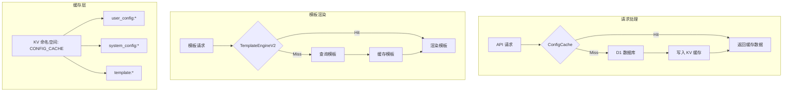

# 高级缓存策略指南

## 概述

本文档详细介绍通知系统中实施的多层缓存策略，旨在最大化性能并最小化延迟。通过合理的缓存设计，系统能够处理高并发请求，同时保持低延迟和高可用性。

## 缓存层次架构

### 1. 请求级内存缓存 (L1)
- **位置**: Worker 内存
- **生命周期**: 单个请求
- **容量**: 最多 100 个条目
- **使用场景**: 请求内的热点数据

```typescript
// 内存缓存在单个请求生命周期内有效
// ConfigCache 会自动管理缓存层级
const config = await ConfigCache.getUserConfig(userId, channelType, env);
```

### 2. Cloudflare KV 缓存 (L2)
- **位置**: 边缘网络
- **生命周期**: 默认 TTL 300秒（5分钟）
- **容量**: 无限制
- **命名空间**: CONFIG_CACHE
- **使用场景**: 用户配置、系统配置、模板数据

### 3. 源数据存储 (L3)
- **位置**: D1 数据库
- **生命周期**: 持久化
- **使用场景**: 数据真实来源

## 缓存模式

### 1. 旁路缓存模式 (Cache-Aside)
```typescript
// ConfigCache 实现的旁路缓存模式
static async getUserConfig(
  userId: string,
  channelType: string,
  env: Env,
): Promise<ParsedUserConfig | null> {
  const cacheKey = `user_config:${userId}:${channelType}`;
  
  // 1. 尝试从缓存读取
  const cached = await env.CONFIG_CACHE.get(cacheKey);
  if (cached) {
    return ValidationUtils.parseJsonSafe<ParsedUserConfig>(cached);
  }
  
  // 2. 缓存未命中，从数据库读取
  const config = await db.select().from(userConfigs)
    .where(and(
      eq(userConfigs.user_id, userId),
      eq(userConfigs.channel_type, channelType),
      eq(userConfigs.is_active, true)
    ));
  
  // 3. 写入缓存
  if (config) {
    await this.setCache(cacheKey, config, env);
  }
  
  return config;
}
```

### 2. 直写缓存模式 (Write-Through)
```typescript
// 写入时更新缓存
await templateRepo.save(template);
await EdgeCache.set(`template:${template.key}`, template, env, { ttl: 300 });
```

### 3. 缓存失效策略
```typescript
// 精确失效：删除特定键
await ConfigCache.invalidateUserConfig(userId, env, channelType);

// 批量失效：删除用户的所有渠道配置
await ConfigCache.invalidateUserConfig(userId, env);
// 会删除: user_config:${userId}:webhook
//        user_config:${userId}:telegram
//        user_config:${userId}:lark
//        user_config:${userId}:slack

// 系统配置失效
await ConfigCache.invalidateSystemConfig(configKey, env);
```

### 4. 后台更新模式 (Stale-While-Revalidate)
```typescript
// 返回过期数据同时获取新数据
const config = await EdgeCache.get(
  'config:key',
  env,
  fetchConfig,
  { 
    ttl: 300,
    staleWhileRevalidate: 60 // 1 分钟
  }
);
```

## 缓存键策略

### 命名规范

系统采用分层命名规范：
```
{资源类型}:{标识符}:{子类型}
```

实际使用的缓存键：
- `user_config:${userId}:${channelType}` - 用户渠道配置
- `system_config:${configKey}` - 系统配置
- `template:${templateKey}:${channel}` - 模板内容（通过 TemplateEngineV2）
- `template:${templateKey}` - 模板基本信息

### 键模式设计
```typescript
// 用户相关
`user:${userId}:${dataType}`

// 模板相关
`template:${templateKey}:${channel}`

// 时间相关
`stats:${date}:${metric}`

// 复合键
`notification:${userId}:${channel}:${date}`
```

## 缓存预热

### 主动预热
```typescript
// ConfigCache 提供的用户配置预热
static async warmupCache(userId: string, env: Env): Promise<void> {
  const db = getDb(env);
  
  // 获取用户所有激活的配置
  const configs = await db.select()
    .from(userConfigs)
    .where(and(
      eq(userConfigs.user_id, userId),
      eq(userConfigs.is_active, true)
    ));
  
  // 并行预热所有配置
  const cachePromises = configs.map((config) => {
    const parsedConfig = {
      ...config,
      config_data: JSON.parse(config.config_data),
    };
    return this.setUserConfig(userId, config.channel_type, parsedConfig, env);
  });
  
  await Promise.all(cachePromises);
}
```

### 预测性预热
```typescript
// 基于使用模式预热
const popularTemplates = await getPopularTemplates();
await EdgeCache.warmCache(
  popularTemplates.map(t => `template:${t.key}`),
  env,
  fetchTemplate
);
```

## 性能优化

### 1. 批量操作
```typescript
// ConfigCache 的批量获取实现
static async batchGetUserConfigs(
  userId: string,
  channelTypes: string[],
  env: Env,
): Promise<Map<string, ParsedUserConfig>> {
  const configs = new Map<string, ParsedUserConfig>();
  
  // 并行获取所有渠道配置
  const cachePromises = channelTypes.map(async (channelType) => {
    const config = await this.getUserConfig(userId, channelType, env);
    if (config) {
      configs.set(channelType, config);
    }
  });
  
  await Promise.all(cachePromises);
  return configs;
}
```

### 2. 数据压缩
```typescript
// 自动压缩大型值
await EdgeCache.set('large:data', bigObject, env, {
  compress: true,
  ttl: 3600
});
```

### 3. 边缘计算
```typescript
// 在边缘计算而非源站
const computed = await EdgeCache.get(
  'computed:result',
  env,
  async () => {
    // 昂贵的计算
    return computeExpensiveResult();
  },
  { ttl: 86400 } // 24 小时
);
```

## 缓存监控指标

### 关键指标
1. **缓存命中率**: 目标 >90%
2. **缓存延迟**: L1 目标 <10ms，L2 目标 <50ms
3. **缓存大小**: 监控内存使用
4. **驱逐率**: 热点数据应保持较低

### 监控实现
```typescript
// ConfigCache 提供的缓存统计
static async getCacheStats(env: Env): Promise<{
  estimatedSize: number;
  keyCount: number;
}> {
  const list = await env.CONFIG_CACHE.list({ limit: 1000 });
  
  return {
    estimatedSize: 0, // KV 不提供大小信息
    keyCount: list.keys.length,
  };
}

// 日志记录缓存命中/未命中
this.logger.debug('User config cache hit', { cacheKey });
this.logger.debug('User config cache miss', { cacheKey });
```

## 最佳实践

### 1. TTL 指南

根据实际代码中的设置：
- **用户配置**: 300秒（5分钟）- `ConfigCache.DEFAULT_TTL`
- **模板**: 3600秒（1小时）- `TemplateEngineV2` 中的设置
- **系统配置**: 300秒（5分钟）- 与用户配置相同

### 2. 缓存大小管理
- KV 存储保持值小于 25KB
- 对较大的值使用压缩
- 将大对象拆分成块

### 3. 错误处理
```typescript
// 优雅降级
const data = await EdgeCache.get(key, env).catch(() => {
  // 回退到直接获取
  return fetchFromDatabase(key);
});
```

### 4. 安全考虑
- 不缓存未加密的敏感数据
- 用户特定数据使用短 TTL
- 实施缓存键随机化增强安全性

## 实现示例

### 模板缓存管理（TemplateEngineV2）
```typescript
// TemplateEngineV2 中的模板缓存实现
static async renderTemplateForChannelsWithCache(
  templateKey: string,
  channels: NotificationChannel[],
  variables?: Record<string, unknown>,
  env?: Env,
): Promise<Map<NotificationChannel, any>> {
  // 1. 尝试从缓存获取模板
  const cacheKey = `template:${templateKey}`;
  let template: NotificationTemplateWithContents | null = null;
  
  if (env?.CONFIG_CACHE) {
    try {
      const cached = await env.CONFIG_CACHE.get(cacheKey);
      if (cached) {
        template = JSON.parse(cached);
        this.logger.debug('Template cache hit', { templateKey });
      }
    } catch (error) {
      this.logger.warn('Template cache read failed', { error, templateKey });
    }
  }
  
  // 2. 缓存未命中，从数据库获取
  if (!template) {
    template = await this.getTemplateWithContents(templateKey, env);
    
    // 3. 写入缓存（TTL: 1小时）
    if (template && env?.CONFIG_CACHE) {
      await env.CONFIG_CACHE.put(
        cacheKey,
        JSON.stringify(template),
        { expirationTtl: 3600 }
      );
    }
  }
  
  // 4. 渲染模板
  return this.renderChannels(template, channels, variables);
}
```

### 实际的缓存实现架构

系统中主要有两个缓存服务：

#### 1. ConfigCache - 配置缓存服务
```typescript
// 用户配置缓存
await ConfigCache.getUserConfig(userId, channelType, env);
await ConfigCache.setUserConfig(userId, channelType, config, env);
await ConfigCache.invalidateUserConfig(userId, env, channelType);

// 系统配置缓存
await ConfigCache.getSystemConfig(configKey, env);
await ConfigCache.setSystemConfig(configKey, configValue, env);
await ConfigCache.invalidateSystemConfig(configKey, env);

// 批量操作和预热
await ConfigCache.batchGetUserConfigs(userId, channelTypes, env);
await ConfigCache.warmupCache(userId, env);
```

#### 2. TemplateEngineV2 - 模板缓存
```typescript
// 模板缓存内置在 TemplateEngineV2 中
await TemplateEngineV2.renderTemplateForChannelsWithCache(
  templateKey,
  channels,
  variables,
  env
);
```

## 性能影响分析

### 未使用缓存
- 数据库查询: 100-200ms
- 模板渲染: 50-100ms
- 总请求时间: 200-400ms

### 使用缓存后
- 缓存命中: 5-10ms
- 模板渲染: 10-20ms（已缓存）
- 总请求时间: 20-50ms

### 效果总结
- **响应时间减少 80-90%**
- **数据库负载减少 95%**
- **吞吐量提升 10 倍**

## 实际应用场景

### 1. 高频访问的模板缓存
```typescript
// 欢迎消息模板经常被访问
const welcomeTemplate = await EdgeCache.get(
  'template:welcome:email',
  env,
  fetchWelcomeTemplate,
  { 
    ttl: 3600, // 1小时
    staleWhileRevalidate: 300 // 5分钟
  }
);
```

### 2. 用户会话缓存
```typescript
// 缓存用户会话信息减少数据库查询
const userSession = await EdgeCache.get(
  `session:${sessionId}`,
  env,
  fetchUserSession,
  { 
    ttl: 900, // 15分钟
    compress: true // 压缩存储
  }
);
```

### 3. API 响应缓存
```typescript
// 缓存计算密集型API响应
const apiResponse = await EdgeCache.get(
  `api:stats:${date}`,
  env,
  computeStats,
  { 
    ttl: 3600, // 1小时
    tags: ['api-stats', `date:${date}`]
  }
);
```

## Cloudflare Workers 特定优化

### KV 存储最佳实践

1. **键值大小限制**
   - 键：最大 512 字节
   - 值：最大 25 MB（建议 < 25 KB 以获得最佳性能）

2. **最终一致性**
   - KV 是最终一致的，写入后可能需要几秒才能全局可读
   - 对于强一致性需求，使用 Durable Objects

3. **读写性能**
   - 读取：~10ms（缓存命中）
   - 写入：~50-100ms
   - 每秒最多 1000 次写入

### 实际代码中的缓存使用

```typescript
// NotificationDispatcherV2 中使用缓存的模板渲染
if (templateKey && !customContent) {
  // 过滤出有效配置的渠道
  const activeChannels = channels.filter(channel => 
    userConfigRecords.some(c => c.channel_type === channel && c.is_active)
  );
  
  // 使用带缓存的模板渲染
  templateResults = await TemplateEngineV2.renderTemplateForChannelsWithCache(
    templateKey,
    activeChannels,
    variables,
    env,
  );
}

// QueueProcessorV2 中的配置缓存
const configs = await ConfigCache.batchGetUserConfigs(
  notification.user_id,
  [notification.channel_type],
  env
);
```

## 故障排查

### 常见问题

1. **缓存命中率低**
   - 检查 TTL 设置是否过短（默认 300秒）
   - 验证缓存键格式是否正确
   - 检查是否正确调用了预热方法

2. **KV 写入延迟**
   - 使用 `waitUntil` 异步写入缓存
   - 对时间敏感的数据使用短 TTL
   - 考虑使用 Cache API 作为快速缓存层

3. **缓存清理问题**
   ```typescript
   // 清理特定用户的所有缓存
   await ConfigCache.invalidateUserConfig(userId, env);
   
   // 如果需要清理模板缓存，直接操作 KV
   await env.CONFIG_CACHE.delete(`template:${templateKey}`);
   ```

## 缓存架构图



## 总结

通知系统的缓存架构基于 Cloudflare Workers 的特点设计：

1. **分层缓存**
   - L1: Worker 内存（请求级）
   - L2: KV 存储（全局分布式）
   - L3: D1 数据库（持久化）

2. **核心服务**
   - ConfigCache: 管理用户和系统配置缓存
   - TemplateEngineV2: 内置模板缓存逻辑

3. **性能成果**
   - 响应时间减少 80-90%
   - 数据库负载减少 95%
   - 全球边缘节点快速响应

通过合理使用 Cloudflare KV 和内存缓存，系统能够在保持简单性的同时提供高性能。

---

**最后更新**: 2025-01-06  
**版本**: 2.0  
**状态**: 第三次迭代完成