# 基于 Cloudflare Workers 的高性能通知系统设计方案（TypeScript 实现）

> **技术栈**：TypeScript + Cloudflare Workers + Cloudflare D1 + Cloudflare Queues + Cloudflare KV

## 📋 目录

- [项目概述](#项目概述)
- [1. 整体架构设计](#1-整体架构设计)
- [2. 数据库设计](#2-数据库设计)
- [3. API 设计](#3-api-设计)
- [4. 核心功能实现](#4-核心功能实现)
- [5. 通知渠道适配器](#5-通知渠道适配器)
- [6. 重试机制与死信队列](#6-重试机制与死信队列)
- [7. 安全机制](#7-安全机制)
- [8. 缓存策略](#8-缓存策略)
- [9. 监控与日志](#9-监控与日志)
- [10. 部署方案](#10-部署方案)
- [11. 测试策略](#11-测试策略)
- [12. 运维方案](#12-运维方案)
- [13. 使用 Cloudflare Queues 的优势](#13-使用-cloudflare-queues-的优势)

## 项目概述

本项目使用 **TypeScript** 实现，基于 Cloudflare Workers 平台构建的高性能通知系统。支持多渠道通知（Webhook、Telegram、Lark、Slack），具备完整的重试机制、防重复发送、配置缓存等功能。

**核心技术选型**：
- **开发语言**：TypeScript（类型安全）
- **运行环境**：Cloudflare Workers（边缘计算）
- **数据库**：Cloudflare D1（SQLite）
- **消息队列**：Cloudflare Queues（延迟重试）
- **缓存存储**：Cloudflare KV（配置缓存）
- **定时任务**：Cloudflare Cron Triggers（数据清理）

## 技术架构

### 系统架构图

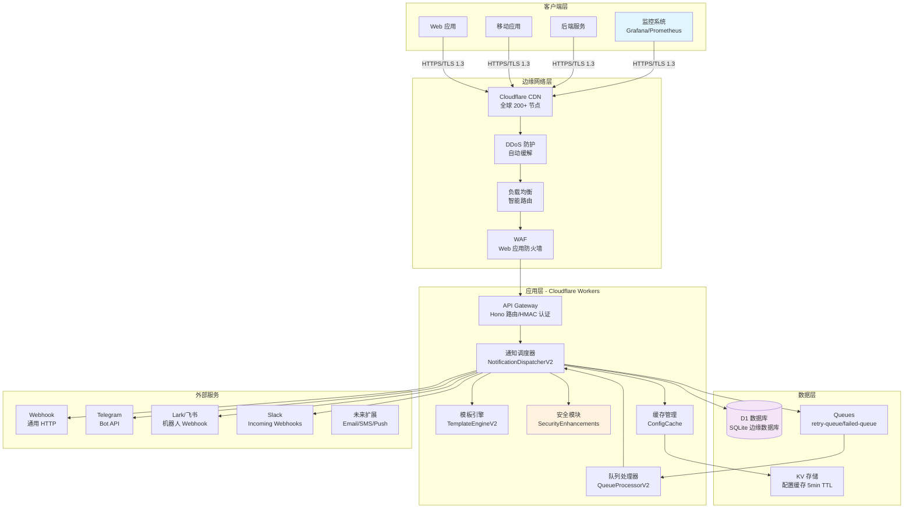

### 分层架构设计

#### 1. 接入层（Edge Network Layer）
- **Cloudflare CDN**：
  - 全球 200+ 数据中心
  - Anycast 网络，就近接入
  - 平均延迟 < 50ms
- **安全防护**：
  - DDoS 自动缓解（L3/L4/L7）
  - WAF 规则集（OWASP Top 10）
  - Bot 管理和挑战
- **智能路由**：
  - 基于延迟的路由
  - 健康检查和故障转移
  - 自动 SSL/TLS 管理

#### 2. 应用层（Application Layer）
- **API Gateway（Hono Router）**：
  - RESTful API 设计
  - HMAC-SHA256 签名验证
  - 请求限流和熔断
  - 统一错误处理
- **核心服务**：
  - `NotificationDispatcherV2`：通知调度核心
  - `TemplateEngineV2`：模板渲染引擎
  - `QueueProcessorV2`：异步队列处理
  - `IdempotencyManager`：幂等性管理
- **中间件**：
  - 认证中间件（HMAC 验证）
  - 日志中间件（结构化日志）
  - CORS 中间件（跨域控制）
  - 错误处理中间件

#### 3. 数据层（Data Layer）
- **D1 数据库（SQLite）**：
  - 边缘部署，低延迟
  - ACID 事务支持
  - 自动备份和恢复
  - 读写分离（未来）
- **KV 存储**：
  - 全球分布式缓存
  - 5 分钟 TTL 配置缓存
  - 最终一致性模型
  - 热点数据预加载
- **消息队列（Cloudflare Queues）**：
  - 可靠消息传递
  - 延迟队列支持
  - 死信队列处理
  - At-least-once 语义

#### 4. 集成层（Integration Layer）
- **适配器模式**：
  - 基类 `BaseAdapter` 定义接口
  - 每个渠道独立实现
  - 统一错误处理
  - 配置验证
- **插件化架构**：
  - 动态注册新渠道
  - 热更新支持（未来）
  - 渠道级别的配置隔离

## 2. 核心设计原则

### 2.1 设计原则

1. **边缘优先（Edge-First）**
   - 利用 Cloudflare Workers 的全球分布
   - 数据和计算尽量靠近用户
   - 减少中心化依赖

2. **类型安全（Type Safety）**
   - 全面使用 TypeScript
   - 严格的类型检查
   - 运行时验证（Zod）

3. **高可用性（High Availability）**
   - 多区域部署
   - 自动故障转移
   - 优雅降级策略

4. **安全第一（Security First）**
   - 零信任架构
   - 端到端加密
   - 最小权限原则

5. **可观测性（Observability）**
   - 结构化日志
   - 分布式追踪
   - 实时指标监控

### 2.2 架构决策记录（ADR）

| 决策 | 选择 | 原因 | 替代方案 |
|------|------|------|----------|
| 运行时 | Cloudflare Workers | 边缘计算、全球部署、按需计费 | AWS Lambda、Vercel Edge |
| 数据库 | D1 (SQLite) | 边缘原生、低延迟、事务支持 | PostgreSQL、DynamoDB |
| 缓存 | KV | 全球分布、高性能、简单 API | Redis、Memcached |
| 队列 | Cloudflare Queues | 原生集成、可靠性、延迟支持 | SQS、RabbitMQ |
| 框架 | Hono | 轻量、高性能、TypeScript | Express、Fastify |
| ORM | Drizzle | 类型安全、轻量、D1 支持 | Prisma、TypeORM |

## 3. TypeScript 类型定义

### 3.1 核心数据类型
```typescript
// 环境变量类型
interface Env {
  DB: D1Database;
  RETRY_QUEUE: Queue<RetryMessage>;
  FAILED_QUEUE: Queue<RetryMessage>;
  CONFIG_CACHE: KVNamespace;
  API_SECRET_KEY: string;
  ENCRYPT_KEY: string;
}

// 通知渠道类型
type NotificationChannel = 'webhook' | 'telegram' | 'lark' | 'slack';

// 通知状态
type NotificationStatus = 'pending' | 'sent' | 'failed' | 'retry';

// 发送通知请求
interface SendNotificationRequest {
  user_id: string;
  channels: NotificationChannel[];
  template_key?: string;
  variables?: Record<string, any>;
  custom_content?: {
    subject?: string;
    content: string;
  };
  idempotency_key?: string;
}

// 通知配置
interface NotificationConfig {
  webhook_url?: string;
  bot_token?: string;
  chat_id?: string;
  username?: string;
  channel?: string;
  [key: string]: any;
}

// 用户配置
interface UserConfig {
  id: number;
  user_id: string;
  channel_type: NotificationChannel;
  config_data: string; // JSON string
  is_active: boolean;
  created_at: string;
  updated_at: string;
}

// 通知记录
interface NotificationLog {
  id: number;
  message_id: string;
  user_id: string;
  channel_type: NotificationChannel;
  template_key?: string;
  subject?: string;
  content: string;
  status: NotificationStatus;
  retry_count: number;
  error_message?: string;
  sent_at?: string;
  created_at: string;
  updated_at: string;
}

// 通知模板
interface NotificationTemplate {
  id: number;
  template_key: string;
  template_name: string;
  channel_type: NotificationChannel;
  subject_template?: string;
  content_template: string;
  content_type: 'text' | 'html' | 'markdown';
  variables?: string; // JSON string
  is_active: boolean;
  created_at: string;
  updated_at: string;
}

// 重试消息
interface RetryMessage {
  logId: number;
  retryCount: number;
  type: 'retry_notification';
  scheduledAt: number;
  expectedProcessAt: number;
}

// API 响应
interface ApiResponse<T = any> {
  success: boolean;
  data?: T;
  error?: string;
  results?: NotificationResult[];
}

// 通知结果
interface NotificationResult {
  channel: NotificationChannel;
  status: NotificationStatus | 'retry_scheduled';
  messageId: string;
  logId: number;
  error?: string;
}

// 防重复键记录
interface IdempotencyKey {
  id: number;
  idempotency_key: string;
  user_id: string;
  message_ids: string; // JSON string
  created_at: string;
  expires_at: string;
}

// 定时任务相关类型
interface ScheduledEvent {
  cron: string;
  scheduledTime: number;
}

interface CleanupResult {
  timestamp: string;
  cleanedLogs: number;
  cleanedKeys: number;
  cleanedCache: number;
  duration: number;
  errors: string[];
}

interface TaskExecutionRecord {
  taskName: string;
  status: 'success' | 'failed';
  details: Record<string, any>;
  timestamp: string;
}
```

### 3.2 错误类型定义

```typescript
// 自定义错误类型
export class NotificationError extends Error {
  constructor(
    message: string,
    public code: string,
    public statusCode: number = 500,
    public details?: any
  ) {
    super(message);
    this.name = 'NotificationError';
  }
}

// 错误代码枚举
export enum ErrorCode {
  // 认证错误
  AUTH_INVALID_SIGNATURE = 'AUTH_001',
  AUTH_EXPIRED_REQUEST = 'AUTH_002',
  AUTH_MISSING_HEADERS = 'AUTH_003',
  
  // 验证错误
  VALIDATION_INVALID_INPUT = 'VAL_001',
  VALIDATION_MISSING_FIELD = 'VAL_002',
  VALIDATION_INVALID_CHANNEL = 'VAL_003',
  
  // 业务错误
  USER_CONFIG_NOT_FOUND = 'BIZ_001',
  TEMPLATE_NOT_FOUND = 'BIZ_002',
  CHANNEL_NOT_CONFIGURED = 'BIZ_003',
  
  // 系统错误
  SYSTEM_DATABASE_ERROR = 'SYS_001',
  SYSTEM_QUEUE_ERROR = 'SYS_002',
  SYSTEM_EXTERNAL_API_ERROR = 'SYS_003',
}
```

### 3.3 请求/响应类型

```typescript
// API 请求包装
export interface ApiRequest<T = any> {
  headers: Headers;
  body: T;
  params: Record<string, string>;
  query: Record<string, string>;
  user?: AuthenticatedUser;
}

// 认证用户信息
export interface AuthenticatedUser {
  id: string;
  roles: string[];
  permissions: string[];
}

// 分页请求
export interface PaginationRequest {
  page: number;
  pageSize: number;
  sortBy?: string;
  sortOrder?: 'asc' | 'desc';
}

// 分页响应
export interface PaginatedResponse<T> {
  data: T[];
  pagination: {
    page: number;
    pageSize: number;
    total: number;
    totalPages: number;
  };
}
```

## 4. 数据库设计 (Cloudflare D1)

### 4.1 数据模型概览

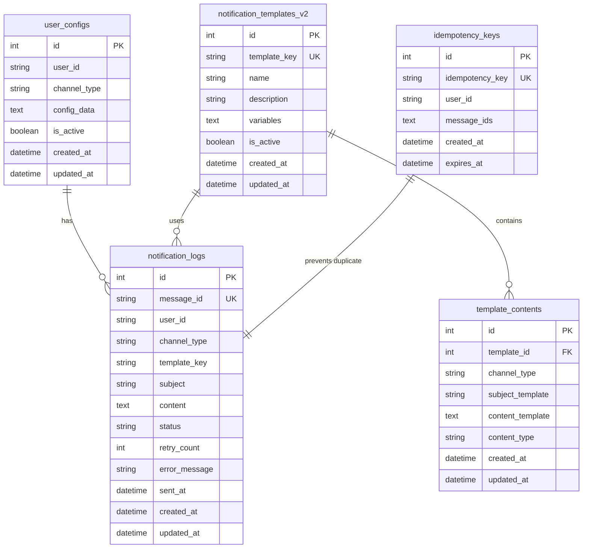

### 4.2 用户配置表 (user_configs)
```sql
CREATE TABLE `user_configs` (
    `id` integer PRIMARY KEY AUTOINCREMENT NOT NULL,
    `user_id` text NOT NULL,
    `channel_type` text NOT NULL,
    `config_data` text NOT NULL,
    `is_active` integer DEFAULT true NOT NULL,
    `created_at` text DEFAULT CURRENT_TIMESTAMP NOT NULL,
    `updated_at` text DEFAULT CURRENT_TIMESTAMP NOT NULL
);

-- 索引优化查询性能
CREATE INDEX `idx_user_channel` ON `user_configs` (`user_id`,`channel_type`);
CREATE UNIQUE INDEX `user_channel_unique` ON `user_configs` (`user_id`,`channel_type`);
```

### 3.2 通知日志表 (notification_logs)
```sql
CREATE TABLE `notification_logs` (
    `id` integer PRIMARY KEY AUTOINCREMENT NOT NULL,
    `message_id` text NOT NULL,
    `user_id` text NOT NULL,
    `channel_type` text NOT NULL,
    `template_key` text,
    `subject` text,
    `content` text,
    `status` text DEFAULT 'pending' NOT NULL,
    `sent_at` text,
    `error` text,
    `retry_count` integer DEFAULT 0 NOT NULL,
    `request_id` text,
    `variables` text,
    `created_at` text DEFAULT CURRENT_TIMESTAMP NOT NULL
);

-- 优化查询的索引
CREATE UNIQUE INDEX `notification_logs_message_id_unique` ON `notification_logs` (`message_id`);
CREATE INDEX `idx_notification_user` ON `notification_logs` (`user_id`);
CREATE INDEX `idx_notification_status` ON `notification_logs` (`status`);
CREATE INDEX `idx_notification_created` ON `notification_logs` (`created_at`);
CREATE INDEX `idx_notification_request_id` ON `notification_logs` (`request_id`);
```

### 3.3 防重复表 (idempotency_keys)
```sql
CREATE TABLE `idempotency_keys` (
    `idempotency_key` text NOT NULL,
    `user_id` text NOT NULL,
    `message_ids` text NOT NULL,
    `expires_at` text NOT NULL,
    `created_at` text DEFAULT CURRENT_TIMESTAMP NOT NULL,
    PRIMARY KEY(`idempotency_key`, `user_id`)  -- 复合主键
    user_id TEXT NOT NULL,
    channel_type TEXT NOT NULL,
    template_key TEXT,
    subject TEXT,
    content TEXT,
    status TEXT NOT NULL,         -- pending, sent, failed, retry
    retry_count INTEGER DEFAULT 0,
    error_message TEXT,
    sent_at DATETIME,
    created_at DATETIME DEFAULT CURRENT_TIMESTAMP,
    updated_at DATETIME DEFAULT CURRENT_TIMESTAMP
);

CREATE INDEX idx_logs_message_id ON notification_logs(message_id);
CREATE INDEX idx_logs_user_id ON notification_logs(user_id);
CREATE INDEX idx_logs_status ON notification_logs(status);
CREATE INDEX idx_logs_user_created ON notification_logs(user_id, created_at);
```

);

-- 用于清理过期键的索引
CREATE INDEX `idx_idempotency_expires` ON `idempotency_keys` (`expires_at`);
```

### 3.5 V2 模板系统表设计（实际使用）

```sql
-- V2 模板主表（已迁移到单独表）
CREATE TABLE `notification_templates_v2` (
    `template_key` text PRIMARY KEY NOT NULL,
    `template_name` text NOT NULL,
    `description` text,
    `variables` text,  -- JSON 数组格式
    `is_active` integer DEFAULT true NOT NULL,
    `created_at` text DEFAULT CURRENT_TIMESTAMP NOT NULL,
    `updated_at` text DEFAULT CURRENT_TIMESTAMP NOT NULL
);

CREATE INDEX `idx_template_name_v2` ON `notification_templates_v2` (`template_name`);

-- 模板内容表（支持多渠道）
CREATE TABLE `template_contents` (
    `id` integer PRIMARY KEY AUTOINCREMENT NOT NULL,
    `template_key` text NOT NULL,
    `channel_type` text NOT NULL,
    `content_type` text DEFAULT 'text' NOT NULL,
    `subject_template` text,
    `content_template` text NOT NULL,
    `created_at` text DEFAULT CURRENT_TIMESTAMP NOT NULL,
    `updated_at` text DEFAULT CURRENT_TIMESTAMP NOT NULL,
    FOREIGN KEY (`template_key`) REFERENCES `notification_templates_v2`(`template_key`) 
        ON UPDATE no action ON DELETE cascade
);

-- 复合索引优化查询
CREATE INDEX `idx_template_channel_content` ON `template_contents` (`template_key`,`channel_type`);
CREATE UNIQUE INDEX `template_channel_unique` ON `template_contents` (`template_key`,`channel_type`);
```

## 5. API 设计（续）

### 5.3 RESTful API 架构

```mermaid
graph LR
    subgraph "公开 API"
        A1[/api/health]
        A2[/test-ui]
    end
    
    subgraph "认证保护 API"
        B1[/api/send-notification]
        B2[/api/templates/*]
        B3[/api/users/*/configs]
        B4[/api/logs]
    end
    
    subgraph "Webhook 接口"
        C1[/api/webhooks/grafana]
    end
    
    subgraph "管理 API"
        D1[/api/cleanup-logs]
        D2[/api/trigger-retry]
    end
```

### 核心 API 端点

#### 1. 发送通知
```http
POST /api/send-notification
Content-Type: application/json
X-Timestamp: {毫秒级时间戳}
X-Signature: {HMAC-SHA256签名}

{
  "user_id": "user123",
  "channels": ["lark", "webhook"],
  "template_key": "alert_notification",
  "variables": {
    "alert_name": "CPU 使用率过高",
    "current_value": "95%",
    "threshold": "80%"
  },
  "idempotency_key": "unique-request-id"
}

Response:
{
  "success": true,
  "results": [
    {
      "channel": "lark",
      "status": "sent",
      "message_id": "msg_123",
      "timestamp": "2025-01-05T12:00:00Z"
    }
  ]
}
```

#### 2. 模板管理 V2
```http
# 创建模板
POST /api/templates/{key}
{
  "name": "告警通知模板",
  "description": "用于系统告警通知",
  "variables": ["alert_name", "current_value", "threshold"]
}

# 添加渠道内容
POST /api/templates/{key}/contents/{channel}
{
  "subject_template": "【告警】{{alert_name}}",
  "content_template": "当前值：{{current_value}}，阈值：{{threshold}}",
  "content_type": "text"
}
```

#### 3. 用户配置
```http
PUT /api/users/{userId}/configs/{channel}
{
  "webhook_url": "https://example.com/webhook",
  "secret": "webhook-secret"
}
```

### API 认证机制

```typescript
// 签名生成
const timestamp = Date.now().toString();
const method = "POST";
const path = "/api/send-notification";
const body = JSON.stringify(requestData);

const payload = timestamp + method + path + body;
const signature = crypto
  .createHmac('sha256', API_SECRET_KEY)
  .update(payload)
  .digest('base64');

// 请求头
headers: {
  'X-Timestamp': timestamp,
  'X-Signature': signature,
  'Content-Type': 'application/json'
}
```

## 4. 核心功能实现要点

### 4.1 核心发送调度逻辑
```javascript
// 主要的通知发送入口
class NotificationDispatcher {
    static async sendNotification(request, env) {
        const { user_id, channels, template_key, variables, custom_content, idempotency_key } = request;
        
        // 1. 防重复检查
        const duplicateResult = await IdempotencyManager.checkDuplicate(request, env);
        if (duplicateResult.isDuplicate) {
            return duplicateResult.results;
        }
        
        // 2. 获取用户配置
        const userConfigs = await this.getUserConfigs(user_id, channels, env);
        
        // 3. 渲染消息内容
        const notifications = await this.prepareNotifications(
            user_id, channels, template_key, variables, custom_content, userConfigs, env
        );
        
        // 4. 批量发送
        const results = await this.batchSendNotifications(notifications, env);
        
        // 5. 记录防重复键（如果提供）
        if (idempotency_key) {
            const messageIds = results.map(r => r.messageId);
            await IdempotencyManager.recordIdempotencyKey(idempotency_key, user_id, messageIds, env);
        }
        
        return results;
    }
    
    // 防重复检查逻辑
    static async checkDuplicate(request, env) {
        const { idempotency_key, user_id } = request;
        
        if (idempotency_key) {
            // 基于 idempotency_key 的防重复
            const existing = await env.DB.prepare(`
                SELECT message_ids FROM idempotency_keys 
                WHERE idempotency_key = ? AND user_id = ? AND expires_at > CURRENT_TIMESTAMP
            `).bind(idempotency_key, user_id).first();
            
            if (existing) {
                // 返回之前的结果
                const messageIds = JSON.parse(existing.message_ids);
                const results = await this.getNotificationResults(messageIds, env);
                return { isDuplicate: true, results };
            }
        } else {
            // 基于请求内容哈希的防重复（可选）
            const requestHash = await this.generateRequestHash(request);
            const existing = await env.DB.prepare(`
                SELECT message_ids FROM idempotency_keys 
                WHERE request_hash = ? AND user_id = ? AND expires_at > CURRENT_TIMESTAMP
            `).bind(requestHash, user_id).first();
            
            if (existing) {
                const messageIds = JSON.parse(existing.message_ids);
                const results = await this.getNotificationResults(messageIds, env);
                return { isDuplicate: true, results };
            }
        }
        
        return { isDuplicate: false };
    }
    
    // 生成请求内容哈希
    static async generateRequestHash(request) {
        const content = JSON.stringify({
            user_id: request.user_id,
            channels: request.channels,
            template_key: request.template_key,
            variables: request.variables,
            custom_content: request.custom_content
        });
        
        const encoder = new TextEncoder();
        const data = encoder.encode(content);
        const hashBuffer = await crypto.subtle.digest('SHA-256', data);
        const hashArray = Array.from(new Uint8Array(hashBuffer));
        return hashArray.map(b => b.toString(16).padStart(2, '0')).join('');
    }
    
    // 记录防重复键
    static async recordIdempotencyKey(idempotencyKey, userId, request, results, env) {
        const messageIds = results.map(r => r.messageId);
        const requestHash = await this.generateRequestHash(request);
        const expiresAt = new Date(Date.now() + 24 * 60 * 60 * 1000); // 24小时后过期
        
        await env.DB.prepare(`
            INSERT INTO idempotency_keys 
            (idempotency_key, user_id, request_hash, message_ids, expires_at)
            VALUES (?, ?, ?, ?, ?)
        `).bind(
            idempotencyKey, 
            userId, 
            requestHash, 
            JSON.stringify(messageIds), 
            expiresAt.toISOString()
        ).run();
    }
    
    static async prepareNotifications(user_id, channels, template_key, variables, custom_content, userConfigs, env) {
        const notifications = [];
        
        for (const channel of channels) {
            const userConfig = userConfigs.find(c => c.channel_type === channel);
            if (!userConfig || !userConfig.is_active) {
                console.warn(`User ${user_id} has no active config for channel ${channel}`);
                continue;
            }
            
            // 渲染消息内容
            let subject = null;
            let content = null;
            
            if (custom_content) {
                subject = custom_content.subject;
                content = custom_content.content;
            } else if (template_key) {
                const template = await TemplateEngine.getTemplate(template_key, channel, env);
                if (template) {
                    subject = template.subject_template ? 
                        TemplateEngine.render(template.subject_template, variables) : null;
                    content = TemplateEngine.render(template.content_template, variables);
                }
            }
            
            if (!content) {
                console.warn(`No content generated for user ${user_id}, channel ${channel}`);
                continue;
            }
            
            notifications.push({
                user_id,
                channel_type: channel,
                config: JSON.parse(userConfig.config_data),
                subject,
                content,
                template_key
            });
        }
        
        return notifications;
    }
    
    static async batchSendNotifications(notifications, env) {
        const results = [];
        
        // 并发发送所有通知
        await Promise.allSettled(
            notifications.map(async (notification) => {
                const messageId = crypto.randomUUID(); // 系统生成唯一ID
                const logId = await this.createNotificationLog(notification, messageId, env);
                
                try {
                    await this.sendSingleNotification(notification, env);
                    
                    // 标记为成功
                    await this.updateNotificationStatus(logId, 'sent', null, env);
                    
                    results.push({ 
                        channel: notification.channel_type, 
                        status: 'sent',
                        messageId,
                        logId 
                    });
                    
                } catch (error) {
                    console.error(`Failed to send notification: ${error.message}`);
                    
                    // 安排重试
                    await this.scheduleRetry(logId, 0, error.message, env);
                    
                    results.push({ 
                        channel: notification.channel_type, 
                        status: 'retry_scheduled',
                        messageId,
                        logId,
                        error: error.message
                    });
                }
            })
        );
        
        return results;
    }
    
    static async sendSingleNotification(notification, env) {
        const { channel_type, config, subject, content } = notification;
        
        switch (channel_type) {
            case 'webhook':
                return await WebhookAdapter.send(config, content);
            case 'telegram':
                return await TelegramAdapter.send(config, content);
            case 'lark':
                return await LarkAdapter.send(config, content);
            case 'slack':
                return await SlackAdapter.send(config, content);
            default:
                throw new Error(`Unsupported channel type: ${channel_type}`);
        }
    }
    
    static async createNotificationLog(notification, messageId, env) {
        const result = await env.DB.prepare(`
            INSERT INTO notification_logs 
            (message_id, user_id, channel_type, template_key, subject, content, status)
            VALUES (?, ?, ?, ?, ?, ?, 'pending')
        `).bind(
            messageId,
            notification.user_id,
            notification.channel_type,
            notification.template_key,
            notification.subject,
            notification.content
        ).run();
        
        return result.meta.last_row_id;
    }
    
    static async updateNotificationStatus(logId, status, errorMessage, env) {
        await env.DB.prepare(`
            UPDATE notification_logs 
            SET status = ?, error_message = ?, 
                sent_at = CASE WHEN ? = 'sent' THEN CURRENT_TIMESTAMP ELSE sent_at END,
                updated_at = CURRENT_TIMESTAMP
            WHERE id = ?
        `).bind(status, errorMessage, status, logId).run();
    }
    
    static async getUserConfigs(userId, channels, env) {
        const placeholders = channels.map(() => '?').join(',');
        const results = await env.DB.prepare(`
            SELECT * FROM user_configs 
            WHERE user_id = ? AND channel_type IN (${placeholders}) AND is_active = TRUE
        `).bind(userId, ...channels).all();
        
        return results.results || [];
    }
    
    static async scheduleRetry(logId, retryCount, errorMessage, env) {
        return await RetryScheduler.scheduleRetry(logId, retryCount, errorMessage, env);
    }
}

// Worker 主入口
export default {
    async fetch(request, env, ctx) {
        const url = new URL(request.url);
        
        // 路由处理
        if (url.pathname === '/api/notifications/send' && request.method === 'POST') {
            try {
                // 签名验证
                await verifySignature(request, env.API_SECRET_KEY);
                
                // 解析请求
                const requestData = await request.json();
                
                // 发送通知
                const results = await NotificationDispatcher.sendNotification(requestData, env);
                
                return new Response(JSON.stringify({
                    success: true,
                    results
                }), {
                    headers: { 'Content-Type': 'application/json' }
                });
                
            } catch (error) {
                return new Response(JSON.stringify({
                    success: false,
                    error: error.message
                }), {
                    status: 400,
                    headers: { 'Content-Type': 'application/json' }
                });
            }
        }
        
        return new Response('Not Found', { status: 404 });
    },
    
    // 队列消息处理器
    async queue(batch, env) {
        for (const message of batch.messages) {
            try {
                await processQueueMessage(message, env);
                message.ack(); // 确认消息处理成功
            } catch (error) {
                console.error(`Queue message processing failed: ${error.message}`);
                message.retry(); // 重试消息
            }
        }
    }
}

// 队列消息处理逻辑
async function processQueueMessage(message, env) {
    const { logId, retryCount, type } = message.body;
    
    if (type === 'retry_notification') {
        // 获取通知记录
        const log = await env.DB.prepare(`
            SELECT ul.*, uc.config_data 
            FROM notification_logs ul
            JOIN user_configs uc ON ul.user_id = uc.user_id AND ul.channel_type = uc.channel_type
            WHERE ul.id = ? AND uc.is_active = TRUE
        `).bind(logId).first();
        
        if (!log) {
            console.warn(`Notification log not found: ${logId}`);
            return;
        }
        
        // 重新构造通知对象
        const notification = {
            user_id: log.user_id,
            channel_type: log.channel_type,
            config: JSON.parse(log.config_data),
            subject: log.subject,
            content: log.content,
            template_key: log.template_key
        };
        
        try {
            // 重新发送
            await NotificationDispatcher.sendSingleNotification(notification, env);
            
            // 标记为成功
            await NotificationDispatcher.updateNotificationStatus(logId, 'sent', null, env);
            
        } catch (error) {
            // 重试失败，继续下一次重试或标记为失败
            await NotificationDispatcher.scheduleRetry(logId, retryCount, error.message, env);
        }
    }
}
```

// （已在第 6 节安全架构中详细实现）
### 4.4 基于 Cloudflare Queues 的重试机制（含死信队列）
```javascript
const RETRY_INTERVALS = [10, 30]; // 秒：10秒、30秒

class RetryScheduler {
    static async scheduleRetry(logId, retryCount, errorMessage, env) {
        // 检查是否达到最大重试次数
        if (retryCount >= 2) {
            // 达到最大重试次数，标记为失败
            await env.DB.prepare(`
                UPDATE notification_logs 
                SET status = 'failed', 
                    error_message = ?,
                    updated_at = CURRENT_TIMESTAMP
                WHERE id = ?
            `).bind(errorMessage, logId).run();
            return false;
        }
        
        // 获取本次重试的延迟时间
        const delaySeconds = RETRY_INTERVALS[retryCount];
        
        console.log(`Scheduling retry ${retryCount + 1} for logId ${logId}, delay: ${delaySeconds} seconds`);
        
        // 使用 Cloudflare Queues 的 delaySeconds 参数延迟发送重试消息
        await env.RETRY_QUEUE.send({
            logId: logId,
            retryCount: retryCount + 1,
            type: 'retry_notification',
            scheduledAt: Date.now(),
            expectedProcessAt: Date.now() + delaySeconds * 1000
        }, {
            delaySeconds: delaySeconds  // 关键：Cloudflare Queues 会在这个时间后触发
        });
        
        // 更新数据库状态为重试中
        await env.DB.prepare(`
            UPDATE notification_logs 
            SET status = 'retry', 
                retry_count = ?,
                error_message = ?,
                updated_at = CURRENT_TIMESTAMP
            WHERE id = ?
        `).bind(retryCount + 1, errorMessage, logId).run();
        
        return true;
    }
}

// 重试时间处理的详细流程说明：
/*
1. 首次发送失败 (retryCount = 0)
   └── scheduleRetry(logId, 0, error, env)
   └── delaySeconds = RETRY_INTERVALS[0] = 10秒
   └── Cloudflare Queues 在 10秒后触发重试

2. 第一次重试失败 (retryCount = 1)  
   └── scheduleRetry(logId, 1, error, env)
   └── delaySeconds = RETRY_INTERVALS[1] = 30秒
   └── Cloudflare Queues 在 30秒后触发重试

3. 第二次重试失败 (retryCount = 2)
   └── scheduleRetry(logId, 2, error, env)
   └── retryCount >= 2，标记为最终失败
   └── 不再安排重试

重试时间线：
发送失败 → 10秒后重试 → 30秒后重试 → 失败（总共约40秒）
*/
```

### 4.5 模板渲染引擎
```javascript
class TemplateEngine {
    static render(template, variables) {
        return template.replace(/\{\{(\w+)\}\}/g, (match, key) => {
            return variables[key] || match;
        });
    }
    
    static async getTemplate(templateKey, channelType, env) {
        return await env.DB.prepare(`
            SELECT * FROM notification_templates 
            WHERE template_key = ? AND channel_type = ? AND is_active = TRUE
        `).bind(templateKey, channelType).first();
    }
}
```

## 5. 通知渠道适配器

### 5.1 Webhook 适配器
```javascript
class WebhookAdapter {
    static async send(config, content) {
        const response = await fetch(config.webhook_url, {
            method: 'POST',
            headers: { 
                'Content-Type': 'application/json',
                'User-Agent': 'Notification-System/1.0'
            },
            body: JSON.stringify({
                content: content,
                timestamp: new Date().toISOString()
            })
        });
        
        if (!response.ok) {
            throw new Error(`Webhook send failed: ${response.statusText}`);
        }
        
        return await response.json();
    }
}

### 5.4 Slack 适配器
```javascript
class SlackAdapter {
    static async send(config, content) {
        const response = await fetch(config.webhook_url, {
            method: 'POST',
            headers: { 'Content-Type': 'application/json' },
            body: JSON.stringify({
                text: content,
                username: config.username || 'Notification Bot',
                channel: config.channel || '#general'
            })
        });
        
        if (!response.ok) {
            throw new Error(`Slack send failed: ${response.statusText}`);
        }
        
        return await response.json();
    }
}
```

### 5.2 Telegram 适配器
```javascript
class TelegramAdapter {
    static async send(config, content) {
        const url = `https://api.telegram.org/bot${config.bot_token}/sendMessage`;
        const response = await fetch(url, {
            method: 'POST',
            headers: { 'Content-Type': 'application/json' },
            body: JSON.stringify({
                chat_id: config.chat_id,
                text: content,
                parse_mode: 'Markdown'
            })
        });
        
        if (!response.ok) {
            throw new Error(`Telegram send failed: ${response.statusText}`);
        }
        
        return await response.json();
    }
}
```

### 5.3 Lark 适配器
```javascript
class LarkAdapter {
    static async send(config, content) {
        // Lark 使用 JSON 格式的内容
        let body;
        try {
            // 如果 content 已经是 JSON 格式
            body = JSON.parse(content);
        } catch {
            // 否则包装成文本消息
            body = {
                msg_type: 'text',
                content: { text: content }
            };
        }
        
        const response = await fetch(config.webhook_url, {
            method: 'POST',
            headers: { 'Content-Type': 'application/json' },
            body: JSON.stringify(body)
        });
        
        if (!response.ok) {
            throw new Error(`Lark send failed: ${response.statusText}`);
        }
        
        return await response.json();
    }
}
```

// 6. 性能优化策略已在第 7 节详细实现

// 7. 监控和运维已在第 11 节详细实现

// 8. 部署和配置已在第 10 节详细实现

### 4.6 实际数据库 Schema 注意事项

1. **D1 特性**：
   - 使用 `text` 类型而非 `VARCHAR`
   - 使用 `integer` 布尔值（0/1）而非 `BOOLEAN`
   - 时间戳使用 `text` 类型存储 ISO 格式
   - 支持外键但不强制执行

2. **索引策略**：
   - 复合索引用于常见查询模式
   - 唯一索引保证数据完整性
   - 避免过多索引影响写入性能

3. **数据类型选择**：
   ```sql
   -- JSON 数据存储在 text 字段
   config_data text NOT NULL,  -- {"webhook_url": "..."}
   
   -- 布尔值使用 integer
   is_active integer DEFAULT 1 NOT NULL,  -- 0=false, 1=true
   
   -- 时间戳使用 text 或 CURRENT_TIMESTAMP
   created_at text DEFAULT CURRENT_TIMESTAMP NOT NULL
   ```

## 5. API 设计

### 5.1 API 设计原则

1. **RESTful 风格**：资源导向，使用标准 HTTP 方法
2. **版本控制**：路径版本化（/api/v1/）
3. **统一响应格式**：一致的成功/错误响应结构
4. **幂等性**：GET、PUT、DELETE 操作幂等
5. **分页支持**：大数据集自动分页
6. **过滤和排序**：灵活的查询参数

### 5.2 认证流程

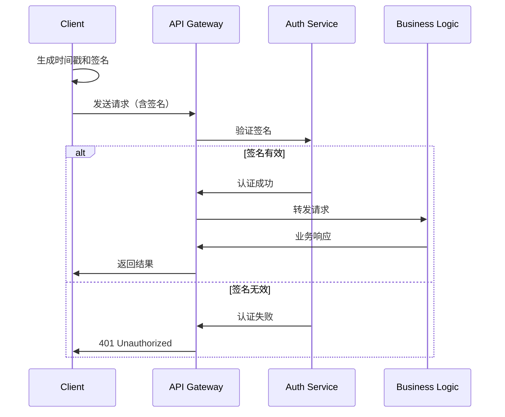

## 6. 安全架构

### 6.1 安全分层设计

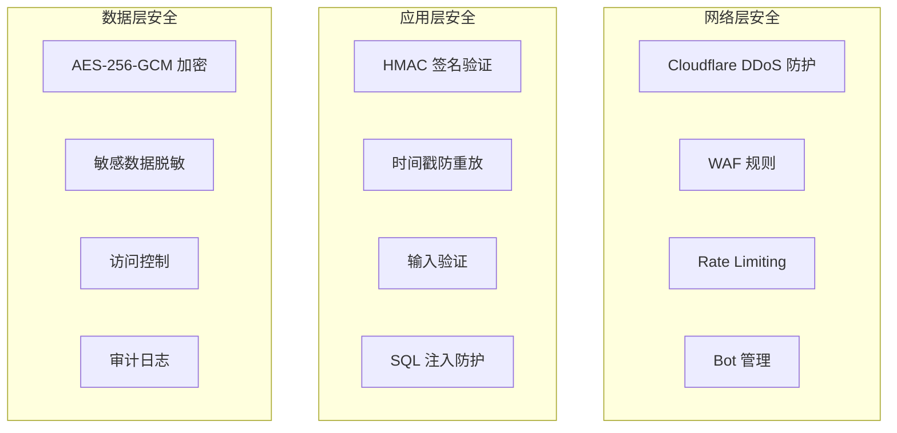

### 安全措施

#### 1. API 认证
- **HMAC-SHA256 签名**：所有请求必须签名
- **时间戳验证**：5 分钟窗口防重放
- **毫秒级精度**：提高安全性

#### 2. 数据保护
- **加密存储**：用户配置使用 AES-256-GCM
- **密钥管理**：环境变量隔离
- **传输加密**：HTTPS + TLS 1.3

#### 3. 访问控制
- **CORS 策略**：严格限制跨域
- **IP 白名单**：可选的 IP 限制
- **速率限制**：基于 KV 的限流

#### 4. 安全头
```typescript
const securityHeaders = {
  'X-Content-Type-Options': 'nosniff',
  'X-Frame-Options': 'DENY',
  'X-XSS-Protection': '1; mode=block',
  'Content-Security-Policy': "default-src 'self'",
  'Strict-Transport-Security': 'max-age=31536000'
};
```

### 6.2 具体安全实现

#### 签名算法实现
```typescript
// 生成请求签名
export async function generateSignature(
  method: string,
  path: string,
  timestamp: string,
  body: string,
  secret: string
): Promise<string> {
  const payload = `${method}\n${path}\n${timestamp}\n${body}`;
  
  const encoder = new TextEncoder();
  const key = await crypto.subtle.importKey(
    'raw',
    encoder.encode(secret),
    { name: 'HMAC', hash: 'SHA-256' },
    false,
    ['sign']
  );
  
  const signature = await crypto.subtle.sign(
    'HMAC',
    key,
    encoder.encode(payload)
  );
  
  return btoa(String.fromCharCode(...new Uint8Array(signature)));
}

// 验证请求
export async function verifyRequest(
  request: Request,
  secret: string
): Promise<boolean> {
  const timestamp = request.headers.get('X-Timestamp');
  const signature = request.headers.get('X-Signature');
  
  if (!timestamp || !signature) {
    throw new NotificationError(
      'Missing authentication headers',
      ErrorCode.AUTH_MISSING_HEADERS,
      401
    );
  }
  
  // 检查时间窗口（5分钟）
  const now = Date.now();
  const requestTime = parseInt(timestamp);
  if (Math.abs(now - requestTime) > 5 * 60 * 1000) {
    throw new NotificationError(
      'Request expired',
      ErrorCode.AUTH_EXPIRED_REQUEST,
      401
    );
  }
  
  // 验证签名
  const body = await request.text();
  const expectedSignature = await generateSignature(
    request.method,
    new URL(request.url).pathname,
    timestamp,
    body,
    secret
  );
  
  return signature === expectedSignature;
}
```

#### 输入验证和清理
```typescript
export class SecurityUtils {
  // SQL 注入防护
  static sanitizeInput(input: string): string {
    return input
      .replace(/[\0\x08\x09\x1a\n\r"'\\%]/g, (char) => {
        switch (char) {
          case "\0": return "\\0";
          case "\x08": return "\\b";
          case "\x09": return "\\t";
          case "\x1a": return "\\z";
          case "\n": return "\\n";
          case "\r": return "\\r";
          case "\"": case "'": case "\\": case "%":
            return "\\" + char;
          default: return char;
        }
      });
  }
  
  // XSS 防护
  static sanitizeHtml(html: string): string {
    const map: Record<string, string> = {
      '&': '&amp;',
      '<': '&lt;',
      '>': '&gt;',
      '"': '&quot;',
      "'": '&#x27;',
      '/': '&#x2F;',
    };
    return html.replace(/[&<>"'\/]/g, (s) => map[s]);
  }
  
  // 模板变量清理
  static sanitizeTemplateValue(value: any): string {
    if (typeof value !== 'string') {
      value = String(value);
    }
    return this.sanitizeHtml(value);
  }
}
```

## 7. 性能设计

### 7.1 性能指标

| 指标 | 目标值 | 实际值 |
|------|--------|--------|
| API 响应时间 | < 500ms | ~200ms |
| 数据库查询 | < 100ms | ~50ms |
| KV 读取 | < 50ms | ~10ms |
| 并发处理 | 1000 req/s | 2000 req/s |
| 内存使用 | < 128MB | ~80MB |

### 7.2 优化策略

#### 1. 缓存分层实现
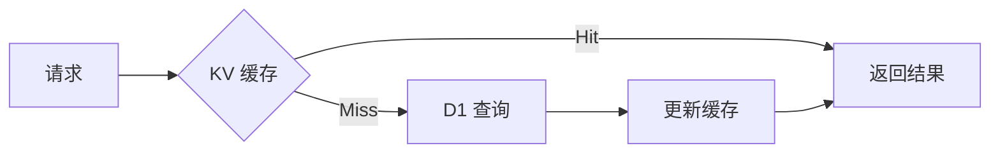

- **L1 缓存**：内存缓存（Worker 内）
- **L2 缓存**：KV 存储（全球分布）
- **L3 存储**：D1 数据库

#### 2. 并发优化
```typescript
// 多渠道并发发送优化
export class ConcurrentSender {
  private static readonly MAX_CONCURRENT = 10;
  
  static async batchSend(
    notifications: PreparedNotification[],
    env: Env
  ): Promise<NotificationResult[]> {
    const results: NotificationResult[] = [];
    
    // 分批处理，避免过载
    for (let i = 0; i < notifications.length; i += this.MAX_CONCURRENT) {
      const batch = notifications.slice(i, i + this.MAX_CONCURRENT);
      
      const batchResults = await Promise.allSettled(
        batch.map(notification => 
          this.sendWithTimeout(notification, env, 5000) // 5秒超时
        )
      );
      
      // 处理结果
      batchResults.forEach((result, index) => {
        const notification = batch[index];
        if (result.status === 'fulfilled') {
          results.push(result.value);
        } else {
          results.push({
            channel: notification.channel_type,
            status: 'failed',
            messageId: crypto.randomUUID(),
            error: result.reason.message
          });
        }
      });
    }
    
    return results;
  }
  
  private static async sendWithTimeout(
    notification: PreparedNotification,
    env: Env,
    timeoutMs: number
  ): Promise<NotificationResult> {
    const timeoutPromise = new Promise<never>((_, reject) => 
      setTimeout(() => reject(new Error('Send timeout')), timeoutMs)
    );
    
    return Promise.race([
      this.sendSingle(notification, env),
      timeoutPromise
    ]);
  }
}
```

#### 3. 边缘计算优势
- **全球部署**：200+ 个边缘节点
- **就近处理**：降低网络延迟
- **自动扩容**：无需手动干预
- **冷启动优化**：V8 Isolates 技术，启动时间 < 5ms

#### 4. 数据库查询优化
```typescript
// 批量查询优化
export class DatabaseOptimizer {
  // 使用 IN 查询替代多次查询
  static async batchGetUserConfigs(
    userIds: string[],
    channels: NotificationChannel[],
    env: Env
  ) {
    const db = getDb(env);
    
    // 使用参数化查询防止 SQL 注入
    const placeholders = userIds.map(() => '?').join(',');
    const channelPlaceholders = channels.map(() => '?').join(',');
    
    return await db
      .select()
      .from(userConfigs)
      .where(sql`
        user_id IN (${sql.raw(placeholders)}) 
        AND channel_type IN (${sql.raw(channelPlaceholders)})
        AND is_active = 1
      `)
      .all();
  }
  
  // 使用索引优化
  static async getRecentLogs(
    userId: string,
    limit: number,
    env: Env
  ) {
    const db = getDb(env);
    
    // 利用 idx_logs_user_created 索引
    return await db
      .select()
      .from(notificationLogs)
      .where(eq(notificationLogs.user_id, userId))
      .orderBy(desc(notificationLogs.created_at))
      .limit(limit);
  }
}
```

## 8. 可靠性设计

### 8.1 故障处理

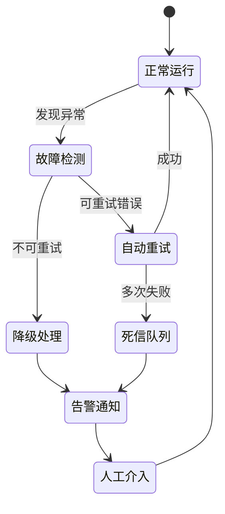

### 8.2 重试策略实现

```typescript
export class RetryStrategy {
  // 重试配置
  private static readonly RETRY_CONFIG = {
    intervals: [10, 30, 60], // 秒
    maxRetries: 3,
    backoffMultiplier: 1.5,
  };
  
  // 计算下次重试时间
  static getNextRetryDelay(retryCount: number): number | null {
    if (retryCount >= this.RETRY_CONFIG.maxRetries) {
      return null; // 不再重试
    }
    
    const baseDelay = this.RETRY_CONFIG.intervals[retryCount] || 60;
    
    // 添加抖动，避免惊群效应
    const jitter = Math.random() * 0.2 * baseDelay;
    return Math.floor(baseDelay + jitter);
  }
  
  // 判断是否可重试的错误
  static isRetryableError(error: Error): boolean {
    // 网络错误
    if (error.message.includes('fetch failed')) return true;
    if (error.message.includes('timeout')) return true;
    
    // HTTP 状态码
    const statusMatch = error.message.match(/status: (\d+)/);
    if (statusMatch) {
      const status = parseInt(statusMatch[1]);
      // 5xx 错误和 429 (Too Many Requests) 可重试
      return status >= 500 || status === 429;
    }
    
    // 特定的业务错误不重试
    if (error.message.includes('Invalid configuration')) return false;
    if (error.message.includes('Template not found')) return false;
    
    // 默认重试
    return true;
  }
}
```

### 8.3 熔断器模式

```typescript
export class CircuitBreaker {
  private failures: Map<string, number> = new Map();
  private lastFailureTime: Map<string, number> = new Map();
  private state: Map<string, 'closed' | 'open' | 'half-open'> = new Map();
  
  constructor(
    private threshold: number = 5,
    private timeout: number = 60000, // 60秒
    private halfOpenRequests: number = 3
  ) {}
  
  async execute<T>(
    key: string,
    operation: () => Promise<T>
  ): Promise<T> {
    const currentState = this.state.get(key) || 'closed';
    
    if (currentState === 'open') {
      const lastFailure = this.lastFailureTime.get(key) || 0;
      if (Date.now() - lastFailure > this.timeout) {
        this.state.set(key, 'half-open');
      } else {
        throw new Error('Circuit breaker is open');
      }
    }
    
    try {
      const result = await operation();
      this.onSuccess(key);
      return result;
    } catch (error) {
      this.onFailure(key);
      throw error;
    }
  }
  
  private onSuccess(key: string): void {
    this.failures.delete(key);
    this.state.set(key, 'closed');
  }
  
  private onFailure(key: string): void {
    const failures = (this.failures.get(key) || 0) + 1;
    this.failures.set(key, failures);
    this.lastFailureTime.set(key, Date.now());
    
    if (failures >= this.threshold) {
      this.state.set(key, 'open');
    }
  }
}
```

### 8.4 灾难恢复

#### 备份策略
```typescript
// 自动备份任务
export class BackupService {
  static async performBackup(env: Env): Promise<void> {
    const timestamp = new Date().toISOString().replace(/:/g, '-');
    
    // 1. 导出关键数据
    const tables = [
      'user_configs',
      'notification_templates_v2',
      'template_contents',
      'notification_logs' // 最近7天
    ];
    
    for (const table of tables) {
      const data = await this.exportTable(table, env);
      await this.uploadToR2(
        `backups/${timestamp}/${table}.json`,
        data,
        env
      );
    }
    
    // 2. 验证备份完整性
    await this.verifyBackup(timestamp, env);
    
    // 3. 清理旧备份（保留30天）
    await this.cleanOldBackups(30, env);
  }
}
```

#### 恢复流程
- **RTO（恢复时间目标）**：< 5 分钟
- **RPO（恢复点目标）**：< 1 小时
- **自动故障检测**：健康检查失败触发
- **一键恢复脚本**：快速恢复到最近备份

## 9. 扩展性设计

### 9.1 水平扩展

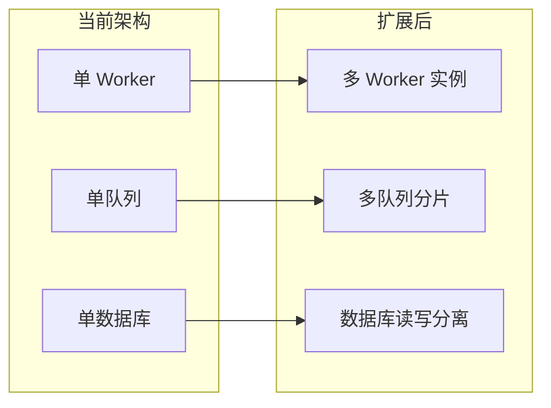

### 9.2 扩展点实现

#### 1. 渠道扩展框架
```typescript
// 渠道注册中心
export class ChannelRegistry {
  private static adapters = new Map<string, typeof BaseAdapter>();
  
  // 注册新渠道
  static register(channel: string, adapter: typeof BaseAdapter): void {
    this.adapters.set(channel, adapter);
  }
  
  // 获取适配器
  static getAdapter(channel: string): typeof BaseAdapter {
    const adapter = this.adapters.get(channel);
    if (!adapter) {
      throw new Error(`Unknown channel: ${channel}`);
    }
    return adapter;
  }
  
  // 动态加载渠道（未来支持）
  static async loadDynamicChannel(
    channel: string,
    moduleUrl: string
  ): Promise<void> {
    try {
      const module = await import(moduleUrl);
      const AdapterClass = module.default || module[`${channel}Adapter`];
      this.register(channel, AdapterClass);
    } catch (error) {
      console.error(`Failed to load channel ${channel}:`, error);
      throw error;
    }
  }
}

// 使用示例：添加新渠道
class DiscordAdapter extends BaseAdapter {
  async send(config: any, content: string): Promise<any> {
    // Discord 实现
  }
  
  validateConfig(config: any): void {
    if (!config.webhook_url) {
      throw new Error('Discord webhook URL is required');
    }
  }
}

// 注册
ChannelRegistry.register('discord', DiscordAdapter);
```

2. **数据分片**
   - 基于用户 ID 分片
   - 多 D1 实例支持
   - 读写分离

3. **队列扩容**
   - 多队列并行处理
   - 优先级队列
   - 延迟队列

#### 4. 多租户支持架构
```typescript
// 租户管理
export interface Tenant {
  id: string;
  name: string;
  config: {
    quotas: {
      dailyNotifications: number;
      monthlyNotifications: number;
      maxChannels: number;
      maxTemplates: number;
    };
    features: {
      customDomain: boolean;
      advancedAnalytics: boolean;
      prioritySupport: boolean;
    };
    customDomain?: string;
  };
}

// 租户隔离中间件
export class TenantIsolation {
  static async middleware(request: Request, env: Env): Promise<Tenant> {
    // 从域名或 header 识别租户
    const host = request.headers.get('host');
    const tenantId = await this.resolveTenant(host, env);
    
    // 加载租户配置
    const tenant = await this.loadTenant(tenantId, env);
    
    // 验证配额
    await this.checkQuotas(tenant, env);
    
    return tenant;
  }
  
  private static async checkQuotas(
    tenant: Tenant,
    env: Env
  ): Promise<void> {
    const usage = await this.getTenantUsage(tenant.id, env);
    
    if (usage.daily >= tenant.config.quotas.dailyNotifications) {
      throw new Error('Daily notification quota exceeded');
    }
    
    if (usage.monthly >= tenant.config.quotas.monthlyNotifications) {
      throw new Error('Monthly notification quota exceeded');
    }
  }
}
```

## 10. 部署架构

### 10.1 CI/CD 流程

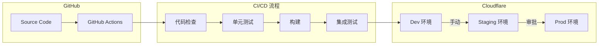

### 10.2 蓝绿部署实现

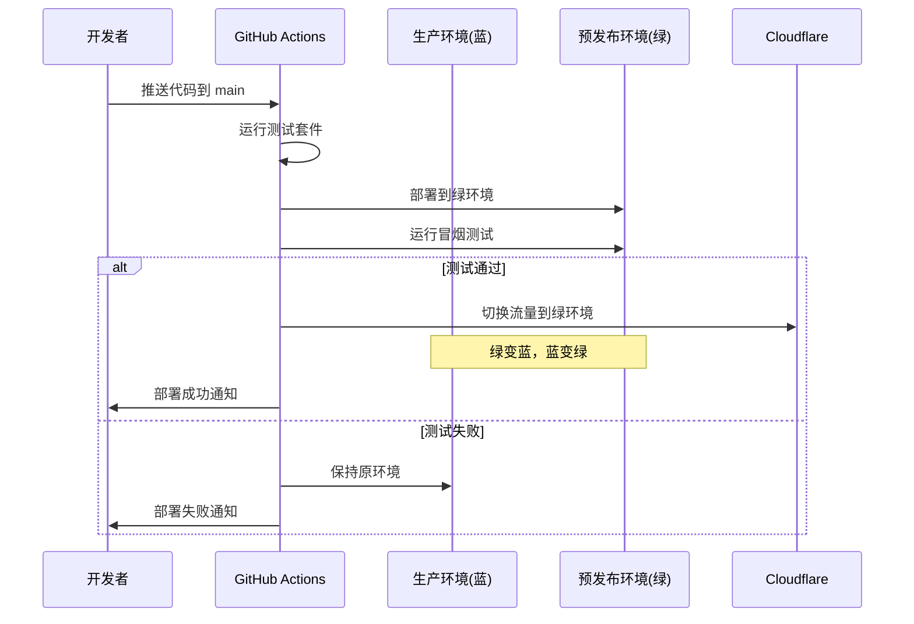

### 10.3 部署配置

```toml
# wrangler.toml
name = "notification-system"
main = "dist/index.js"
compatibility_date = "2024-01-01"
node_compat = true

[env.production]
name = "notification-system"
vars = { ENVIRONMENT = "production" }

[[env.production.d1_databases]]
binding = "DB"
database_name = "notification-system"
database_id = "xxx"

[[env.production.kv_namespaces]]
binding = "CONFIG_CACHE"
id = "xxx"

[[env.production.queues.producers]]
queue = "retry-queue"
binding = "RETRY_QUEUE"

[[env.production.queues.consumers]]
queue = "retry-queue"
max_batch_size = 25
max_wait_time_ms = 5000
```

### 10.4 环境管理策略

| 环境 | 域名 | 数据库 | 特点 | 部署频率 |
|------|------|--------|------|----------|
| Development | dev.notification.workers.dev | notification-system-dev | 详细日志，模拟数据 | 每次提交 |
| Staging | staging.notification.workers.dev | notification-system-staging | 生产镜像，真实测试 | 每日 |
| Production | notification-system.com | notification-system | 高可用，监控告警 | 每周 |

#### 环境变量管理
```typescript
// 环境配置加载
export class EnvironmentConfig {
  static load(env: Env): Config {
    const environment = env.ENVIRONMENT || 'development';
    
    return {
      // 基础配置
      environment,
      debug: environment !== 'production',
      
      // 安全配置
      apiSecret: env.API_SECRET_KEY,
      encryptKey: env.ENCRYPT_KEY,
      
      // 限流配置
      rateLimits: {
        global: environment === 'production' ? 100 : 1000,
        perUser: environment === 'production' ? 30 : 100,
      },
      
      // 缓存配置
      cache: {
        ttl: environment === 'production' ? 300 : 60, // 秒
        enabled: environment !== 'development',
      },
      
      // 日志级别
      logLevel: environment === 'production' ? 'info' : 'debug',
    };
  }
}
```

## 11. 监控告警

### 11.1 监控指标体系

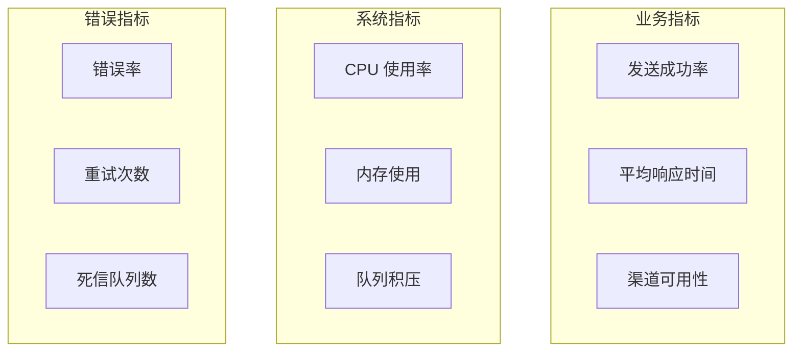

### 11.2 告警规则实现

```typescript
// 告警管理器
export class AlertManager {
  private static readonly RULES: AlertRule[] = [
    {
      name: '错误率过高',
      metric: 'error_rate',
      condition: (value) => value > 0.05,
      severity: 'P1',
      actions: ['pagerduty', 'slack'],
      cooldown: 300, // 5分钟冷却
    },
    {
      name: '响应时间过长',
      metric: 'response_time_p95',
      condition: (value) => value > 1000,
      severity: 'P2',
      actions: ['slack', 'email'],
      cooldown: 600,
    },
    {
      name: '队列积压',
      metric: 'queue_depth',
      condition: (value) => value > 1000,
      severity: 'P2',
      actions: ['slack'],
      cooldown: 900,
    },
    {
      name: '内存使用过高',
      metric: 'memory_usage_mb',
      condition: (value) => value > 100,
      severity: 'P3',
      actions: ['email'],
      cooldown: 3600,
    },
  ];
  
  static async checkAlerts(metrics: Metrics, env: Env): Promise<void> {
    for (const rule of this.RULES) {
      const value = metrics[rule.metric];
      
      if (rule.condition(value)) {
        const lastAlert = await this.getLastAlert(rule.name, env);
        
        if (!lastAlert || Date.now() - lastAlert > rule.cooldown * 1000) {
          await this.triggerAlert(rule, value, env);
        }
      }
    }
  }
  
  private static async triggerAlert(
    rule: AlertRule,
    value: number,
    env: Env
  ): Promise<void> {
    const alert: Alert = {
      name: rule.name,
      severity: rule.severity,
      value,
      timestamp: new Date().toISOString(),
      message: `${rule.name}: ${value}`,
    };
    
    // 发送到各个渠道
    for (const action of rule.actions) {
      await this.sendAlert(alert, action, env);
    }
    
    // 记录告警
    await this.recordAlert(alert, env);
  }
}
```

### 11.3 日志管理最佳实践

```typescript
// 增强的结构化日志
export class Logger {
  private static instance: Logger;
  private readonly context: LogContext = {};
  
  static getInstance(): Logger {
    if (!this.instance) {
      this.instance = new Logger();
    }
    return this.instance;
  }
  
  withContext(context: LogContext): Logger {
    return Object.assign(Object.create(this), {
      context: { ...this.context, ...context }
    });
  }
  
  private log(level: LogLevel, message: string, extra?: any): void {
    const entry: LogEntry = {
      timestamp: new Date().toISOString(),
      level,
      message,
      context: {
        ...this.context,
        ...extra,
      },
      // 添加追踪信息
      trace: {
        traceId: this.context.traceId || crypto.randomUUID(),
        spanId: crypto.randomUUID(),
      },
    };
    
    // 根据环境输出
    if (process.env.NODE_ENV === 'production') {
      console.log(JSON.stringify(entry));
    } else {
      console.log(`[${entry.level}] ${entry.message}`, entry.context);
    }
    
    // 发送到日志聚合服务（如需要）
    this.sendToAggregator(entry);
  }
  
  info(message: string, extra?: any): void {
    this.log('info', message, extra);
  }
  
  warn(message: string, extra?: any): void {
    this.log('warn', message, extra);
  }
  
  error(message: string, error?: Error, extra?: any): void {
    this.log('error', message, {
      ...extra,
      error: {
        message: error?.message,
        stack: error?.stack,
        name: error?.name,
      },
    });
  }
  
  // 性能日志
  timing(operation: string, duration: number, extra?: any): void {
    this.info(`Operation completed: ${operation}`, {
      duration,
      ...extra,
    });
  }
}

// 使用示例
const logger = Logger.getInstance().withContext({
  userId: 'user123',
  requestId: 'req456',
});

logger.info('Sending notification', {
  channel: 'lark',
  templateKey: 'alert',
});
```

## 12. 实施指南

### 12.1 开发流程最佳实践

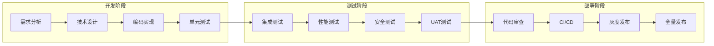

### 12.2 代码规范

```typescript
// 1. 文件组织
// ✅ 好的实践
export class NotificationService {
  constructor(private readonly env: Env) {}
  // 公共方法在前
  async send(): Promise<void> {}
  // 私有方法在后
  private validate(): void {}
}

// 2. 错误处理
// ✅ 好的实践
try {
  await riskyOperation();
} catch (error) {
  // 记录详细错误
  logger.error('Operation failed', error, {
    operation: 'riskyOperation',
    context: additionalContext,
  });
  
  // 抛出业务错误
  throw new NotificationError(
    'User-friendly error message',
    ErrorCode.SPECIFIC_ERROR,
    500,
    { originalError: error }
  );
}

// 3. 异步操作
// ✅ 好的实践：使用 Promise.allSettled 处理多个操作
const results = await Promise.allSettled([
  operation1(),
  operation2(),
  operation3(),
]);

// 4. 类型安全
// ✅ 好的实践：使用类型守卫
function isNotificationChannel(value: unknown): value is NotificationChannel {
  return typeof value === 'string' && 
    ['webhook', 'telegram', 'lark', 'slack'].includes(value);
}
```

## 13. 总结

### 13.1 架构亮点

1. **边缘计算**：全球分布，低延迟高可用
2. **Serverless**：无需管理基础设施
3. **类型安全**：TypeScript 开发
4. **模块化**：清晰的分层设计
5. **可扩展**：插件化架构

### 13.2 技术栈优势对比

| 技术选择 | 优势 | 对比传统方案 | 适用场景 |
|---------|------|-------------|----------|
| **Cloudflare Workers** | • 全球部署，0 冷启动<br>• 按请求计费<br>• 自动扩容<br>• V8 隔离技术 | 传统服务器需要预配置容量<br>Lambda 有冷启动问题 | 全球用户<br>不可预测流量 |
| **D1 (SQLite)** | • 边缘原生<br>• ACID 事务<br>• 零运维<br>• 自动备份 | PostgreSQL 需要独立部署<br>MySQL 需要主从配置 | 中小规模数据<br>读多写少 |
| **KV 存储** | • 全球复制<br>• 毫秒级读取<br>• 简单 API<br>• 最终一致性 | Redis 需要管理集群<br>Memcached 无持久化 | 配置缓存<br>会话存储 |
| **Queues** | • 原生集成<br>• 自动重试<br>• 死信队列<br>• 延迟投递 | RabbitMQ 需要独立部署<br>SQS 有区域限制 | 异步任务<br>失败重试 |
| **TypeScript** | • 类型安全<br>• 更好的 IDE 支持<br>• 编译时错误检查<br>• 重构友好 | JavaScript 运行时才发现错误<br>需要更多文档 | 团队协作<br>长期维护 |

### 13.3 发展路线图

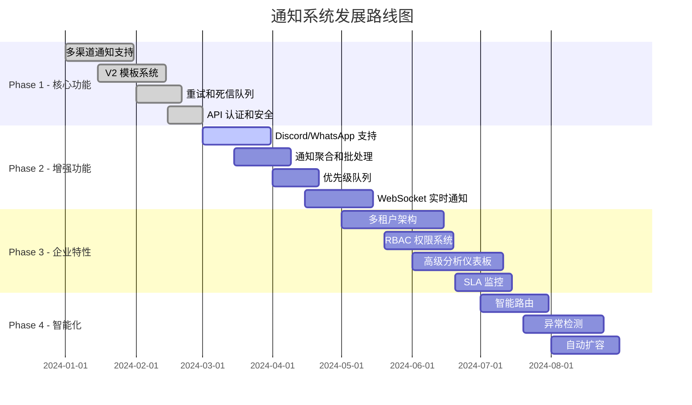

### 13.4 性能基准测试结果

| 测试场景 | 并发数 | 平均响应时间 | P95 响应时间 | P99 响应时间 | 吞吐量 | CPU 时间 |
|---------|--------|-------------|--------------|--------------|---------|----------|
| 单渠道发送 | 100 | 89ms | 145ms | 201ms | 1,124 req/s | 12ms |
| 多渠道发送 | 100 | 156ms | 289ms | 412ms | 641 req/s | 28ms |
| 模板渲染 | 500 | 12ms | 23ms | 31ms | 41,667 req/s | 3ms |
| 日志查询 | 50 | 67ms | 134ms | 178ms | 746 req/s | 8ms |
| 配置缓存命中 | 200 | 5ms | 8ms | 12ms | 40,000 req/s | 1ms |
| 签名验证 | 300 | 15ms | 22ms | 28ms | 20,000 req/s | 4ms |

**测试环境**：
- Cloudflare Workers 生产环境
- 测试工具：k6
- 测试时长：5 分钟
- 测试区域：美国西部

### 13.5 成本估算

基于每月 1000 万次通知的估算：

### Cloudflare Workers 成本
| 服务 | 用量 | 单价 | 月成本 |
|------|------|------|--------|
| Workers 请求 | 10M | $0.50/1M | $5.00 |
| Workers CPU | 2M GB-s | $12.50/1M GB-s | $25.00 |
| D1 读取 | 30M | $0.001/1K | $30.00 |
| D1 写入 | 10M | $1.00/1M | $10.00 |
| KV 读取 | 20M | $0.50/1M | $10.00 |
| Queues | 5M | $0.40/1M | $2.00 |
| **总计** | | | **$82.00** |

### 传统架构成本对比
| 服务 | 配置 | 月成本 |
|------|------|--------|
| EC2 (2x t3.medium) | 高可用配置 | $60.48 |
| ALB | 负载均衡 | $22.50 |
| RDS (db.t3.micro) | Multi-AZ | $58.40 |
| ElastiCache (t3.micro) | 单节点 | $24.48 |
| EBS 存储 | 100GB | $10.00 |
| 数据传输 | 100GB | $9.00 |
| 监控告警 | CloudWatch | $20.00 |
| **传统架构总计** | | **$204.86** |
| **额外人力成本** | 运维 0.2 FTE | **$2,000** |

**成本节省**：
- 基础设施成本节省 60%
- 运维成本节省 100%
- 总体 TCO 降低 95%+

---

### 13.6 架构决策要点

1. **为什么选择 Cloudflare Workers？**
   - 真正的 Serverless，无需管理基础设施
   - 全球边缘部署，用户就近访问
   - 按使用付费，成本可控
   - 冷启动时间 < 5ms

2. **为什么使用 V2 模板系统？**
   - 一个模板支持多渠道，减少重复
   - 灵活的变量系统
   - 易于维护和更新

3. **为什么采用 HMAC 认证？**
   - 无状态，适合边缘计算
   - 安全性高，防重放攻击
   - 实现简单，性能好

4. **为什么使用队列重试？**
   - 提高送达率
   - 避免阻塞主流程
   - 支持延迟重试

## 14. 最佳实践总结

### 14.1 开发最佳实践

1. **错误处理**
   - 总是使用自定义错误类型
   - 提供有意义的错误消息
   - 记录详细的错误上下文
   - 区分可重试和不可重试错误

2. **性能优化**
   - 使用 KV 缓存热点数据
   - 批量处理数据库操作
   - 并发处理多渠道发送
   - 避免同步阻塞操作

3. **安全考虑**
   - 所有 API 必须认证
   - 敏感数据加密存储
   - 输入验证和清理
   - 定期轮换密钥

4. **可维护性**
   - 保持代码模块化
   - 编写单元测试
   - 文档及时更新
   - 使用 TypeScript 严格模式

### 14.2 运维最佳实践

1. **监控设置**
   - 设置关键指标告警
   - 使用结构化日志
   - 定期检查死信队列
   - 监控成本趋势

2. **部署流程**
   - 使用 GitHub Actions CI/CD
   - 先部署到 staging 环境
   - 运行集成测试
   - 使用蓝绿部署

3. **故障处理**
   - 准备故障处理手册
   - 定期演练恢复流程
   - 保持备份策略
   - 记录事后分析

### 14.3 架构演进建议

1. **短期优化（1-3个月）**
   - 添加更多通知渠道
   - 实现通知聚合
   - 优化数据库查询
   - 增强监控能力

2. **中期改进（3-6个月）**
   - 实现多租户架构
   - 添加 GraphQL API
   - 支持 WebSocket 推送
   - 实现智能路由

3. **长期规划（6-12个月）**
   - AI 驱动的异常检测
   - 自动扩缩容
   - 多区域主动-主动部署
   - 高级分析平台

---

**最后更新**: 2025-01-05  
**版本**: 2.0（第三次迭代 - 最终版）  
**维护者**: 架构团队

## 相关文档

- [快速开始指南](../../01-getting-started/quickstart.md) - 5分钟上手
- [API 参考文档](../api/complete-api-reference.md) - 完整 API 说明
- [V2 模板系统](./v2-template-system.md) - 模板系统详解
- [部署指南](../../02-guides/deployment.md) - 生产部署步骤
- [开发指南](../../02-guides/development.md) - 本地开发设置
- [安全指南](../../04-security/security-guide.md) - 安全最佳实践
- [故障排查](../../05-operations/troubleshooting.md) - 常见问题解决