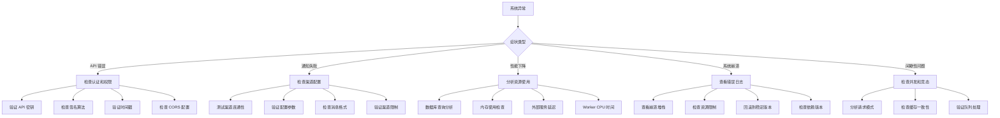
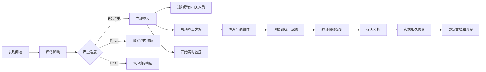

# 故障排查完整指南

本文档提供通知系统的全面故障排查指南，包括问题诊断、解决方案、调试工具和预防措施。

## 目录

- [概述](#概述)
- [快速诊断](#快速诊断)
- [常见问题](#常见问题)
  - [API 错误](#api-错误)
  - [通知发送失败](#通知发送失败)
  - [数据库问题](#数据库问题)
  - [性能问题](#性能问题)
  - [配置错误](#配置错误)
- [高级诊断](#高级诊断)
- [调试工具](#调试工具)
- [紧急响应](#紧急响应)
- [预防措施](#预防措施)
- [故障案例](#故障案例)

## 概述

故障排查的核心原则：
1. **快速定位** - 使用系统化的方法缩小问题范围
2. **数据驱动** - 基于日志和监控数据做决策
3. **最小影响** - 优先恢复服务，后续深入分析
4. **根因分析** - 找到问题根源，防止再次发生

## 快速诊断

### 诊断决策树



### 初步检查清单

```bash
#!/bin/bash
# quick-diagnosis.sh

set -euo pipefail

# 配置
WORKER_URL=${WORKER_URL:-"https://your-worker.workers.dev"}
ENV=${ENV:-"production"}
DB_NAME=${DB_NAME:-"notification-system"}

# 颜色输出
RED='\033[0;31m'
GREEN='\033[0;32m'
YELLOW='\033[1;33m'
NC='\033[0m' # No Color

echo "=== 通知系统快速诊断 ==="
echo "开始时间: $(date)"
echo "环境: $ENV"
echo "Worker URL: $WORKER_URL"

# 1. API 健康检查
echo -e "\n[1/6] 检查 API 健康状态..."
if HEALTH_RESPONSE=$(curl -s -w "\n%{http_code}" "$WORKER_URL/api/health" 2>/dev/null); then
    HTTP_CODE=$(echo "$HEALTH_RESPONSE" | tail -n1)
    BODY=$(echo "$HEALTH_RESPONSE" | head -n-1)
    
    if [ "$HTTP_CODE" = "200" ]; then
        echo -e "${GREEN}✅ API 健康检查通过${NC}"
        if command -v jq &> /dev/null; then
            echo "$BODY" | jq '.services' 2>/dev/null || echo "$BODY"
        else
            echo "$BODY"
        fi
    else
        echo -e "${RED}❌ API 健康检查失败 (HTTP $HTTP_CODE)${NC}"
        echo "响应: $BODY"
    fi
else
    echo -e "${RED}❌ 无法连接到 API${NC}"
fi

# 2. 数据库状态
echo -e "\n[2/6] 检查数据库状态..."
if command -v wrangler &> /dev/null; then
    DB_RESULT=$(wrangler d1 execute "$DB_NAME" \
        --command="SELECT COUNT(*) as total, 
                   COUNT(CASE WHEN status = 'failed' THEN 1 END) as failed,
                   COUNT(CASE WHEN status = 'sent' THEN 1 END) as sent
                   FROM notification_logs 
                   WHERE created_at > datetime('now', '-1 hour')" \
        --json 2>/dev/null || echo '{"error": "查询失败"}')
    
    if echo "$DB_RESULT" | grep -q "error"; then
        echo -e "${RED}❌ 数据库查询失败${NC}"
    else
        echo -e "${GREEN}✅ 数据库状态正常${NC}"
        echo "最近一小时:"
        echo "$DB_RESULT" | jq -r '.result[0] | "  总计: \(.total)\n  成功: \(.sent)\n  失败: \(.failed)"' 2>/dev/null
    fi
else
    echo -e "${YELLOW}⚠️  wrangler 未安装，跳过数据库检查${NC}"
fi

# 3. 错误日志分析
echo -e "\n[3/6] 分析最近错误..."
if command -v wrangler &> /dev/null; then
    ERROR_LOGS=$(wrangler tail --env "$ENV" --search "ERROR" --once 2>/dev/null | head -20)
    if [ -n "$ERROR_LOGS" ]; then
        echo -e "${YELLOW}⚠️  发现错误日志:${NC}"
        echo "$ERROR_LOGS" | grep -E "ERROR|WARN" | head -10
        
        # 错误统计
        echo -e "\n错误类型统计:"
        echo "$ERROR_LOGS" | grep -oE "Error: [^\"]*" | sort | uniq -c | sort -nr | head -5
    else
        echo -e "${GREEN}✅ 未发现错误日志${NC}"
    fi
fi

# 4. 队列状态
echo -e "\n[4/6] 检查队列状态..."
if command -v wrangler &> /dev/null; then
    QUEUE_STATUS=$(wrangler queues list 2>/dev/null | grep -i notification || echo "未找到队列")
    echo "队列状态: $QUEUE_STATUS"
fi

# 5. 性能指标
echo -e "\n[5/6] 收集性能指标..."
if METRICS_RESPONSE=$(curl -s "$WORKER_URL/api/metrics" 2>/dev/null); then
    if echo "$METRICS_RESPONSE" | jq . &>/dev/null; then
        echo -e "${GREEN}✅ 性能指标:${NC}"
        echo "$METRICS_RESPONSE" | jq '.performance // {"note": "性能指标不可用"}'
    else
        echo -e "${YELLOW}⚠️  性能指标端点未实现${NC}"
    fi
fi

# 6. 系统资源检查
echo -e "\n[6/6] 检查系统资源..."
if DETAILED_HEALTH=$(curl -s "$WORKER_URL/api/health?detailed=true" 2>/dev/null); then
    if echo "$DETAILED_HEALTH" | jq . &>/dev/null; then
        echo "详细健康状态:"
        echo "$DETAILED_HEALTH" | jq '{database: .database, cache: .cache, queue: .queue}'
    fi
fi

# 生成诊断报告
echo -e "\n=== 诊断摘要 ==="
echo "完成时间: $(date)"

# 生成建议
echo -e "\n${YELLOW}建议:${NC}"
if [ "${HTTP_CODE:-0}" != "200" ]; then
    echo "- 检查 Worker 部署状态和 DNS 配置"
fi

if echo "${ERROR_LOGS:-}" | grep -q "signature"; then
    echo "- 发现签名验证错误，请检查 API 密钥配置"
fi

if echo "${ERROR_LOGS:-}" | grep -q "timeout"; then
    echo "- 发现超时错误，考虑优化查询或增加超时限制"
fi

echo -e "\n诊断完成"
```

## 常见问题

### API 错误

#### 1. 401 未授权错误

**症状**：
```json
{
  "success": false,
  "error": "Invalid signature"
}
```

**原因分析**：
- API 密钥不正确
- 签名算法实现错误
- 时间戳超出允许范围
- 请求体被修改

**解决步骤**：

```typescript
// 1. 验证签名生成 - 注意：实际实现使用毫秒级时间戳
import { createHmac } from 'crypto';

function debugSignature(apiKey: string, body: string) {
  // 重要：系统实际使用毫秒级时间戳
  const timestamp = Date.now().toString(); // 毫秒
  const payload = timestamp + body;
  const signature = createHmac('sha256', apiKey)
    .update(payload)
    .digest('hex');
    
  console.log('=== 签名调试信息 ===');
  console.log('API Key:', apiKey.substring(0, 8) + '...');
  console.log('Timestamp (毫秒):', timestamp);
  console.log('Timestamp (Date):', new Date(parseInt(timestamp)).toISOString());
  console.log('Body Length:', body.length);
  console.log('Payload Length:', payload.length);
  console.log('Signature:', signature);
  
  // 验证签名格式
  if (signature.length !== 64) {
    console.error('❌ 签名长度错误，应为 64 个字符');
  }
  
  // 检查时间戳精度
  if (timestamp.length < 13) {
    console.error('❌ 时间戳精度错误，应使用毫秒级时间戳');
  }
  
  return { timestamp, signature };
}

// 2. 测试 API 调用
async function testAPICall() {
  const body = JSON.stringify({ test: true });
  const { timestamp, signature } = debugSignature(API_KEY, body);
  
  const response = await fetch('https://your-worker.workers.dev/api/health', {
    method: 'POST',
    headers: {
      'Content-Type': 'application/json',
      'X-Timestamp': timestamp,
      'X-Signature': signature
    },
    body
  });
  
  console.log('Response:', response.status, await response.text());
}
```

**验证时钟同步**：
```bash
# 检查本地时间
date -u

# 检查与 NTP 服务器的时间差
ntpdate -q pool.ntp.org

# 同步时间（需要管理员权限）
sudo ntpdate pool.ntp.org
```

#### 2. 429 请求过多

**症状**：频繁收到 429 错误

**解决方案**：

```typescript
// 实现指数退避重试
class RateLimitHandler {
  private queue: Array<() => Promise<any>> = [];
  private processing = false;
  private requestsPerMinute = 50;
  
  async execute<T>(fn: () => Promise<T>): Promise<T> {
    return new Promise((resolve, reject) => {
      this.queue.push(async () => {
        try {
          const result = await fn();
          resolve(result);
        } catch (error) {
          if (error.status === 429) {
            // 指数退避
            const retryAfter = parseInt(error.headers.get('Retry-After') || '60');
            console.log(`Rate limited. Retrying after ${retryAfter}s`);
            setTimeout(() => this.execute(fn).then(resolve).catch(reject), retryAfter * 1000);
          } else {
            reject(error);
          }
        }
      });
      
      this.processQueue();
    });
  }
  
  private async processQueue() {
    if (this.processing || this.queue.length === 0) return;
    
    this.processing = true;
    const delay = 60000 / this.requestsPerMinute;
    
    while (this.queue.length > 0) {
      const task = this.queue.shift()!;
      await task();
      await new Promise(resolve => setTimeout(resolve, delay));
    }
    
    this.processing = false;
  }
}
```

#### 3. 500 服务器错误

**诊断步骤**：

```bash
# 1. 查看详细错误日志
wrangler tail --env production --format=json | jq 'select(.outcome == "exception")'

# 2. 检查 Worker 限制
wrangler tail --env production --format=json | jq 'select(.logs[].message | contains("limit"))'

# 3. 分析错误模式
wrangler tail --env production --search "ERROR" --once | \
  grep -oE "Error: [^\"]*" | sort | uniq -c | sort -nr
```

**Cloudflare Workers 特定限制检查**：

```typescript
// worker-limits-checker.ts
export class WorkerLimitsChecker {
  static checkLimits() {
    const limits = {
      memoryLimit: 128 * 1024 * 1024, // 128 MB
      cpuTime: 50, // 50ms (付费计划)
      subrequests: 50, // 每个请求的子请求限制
      scriptSize: 10 * 1024 * 1024, // 10 MB 压缩后
      responseSize: 100 * 1024 * 1024, // 100 MB
    };
    
    return limits;
  }
  
  static async diagnoseError(error: Error, env: Env) {
    const diagnosis = {
      error: error.message,
      stack: error.stack,
      type: 'unknown',
      solution: ''
    };
    
    // CPU 超时
    if (error.message.includes('exceeded CPU')) {
      diagnosis.type = 'cpu_limit';
      diagnosis.solution = '优化算法，减少计算密集型操作，考虑分批处理';
    }
    
    // 内存限制
    else if (error.message.includes('memory limit')) {
      diagnosis.type = 'memory_limit';
      diagnosis.solution = '减少内存使用，避免大对象，使用流式处理';
    }
    
    // 子请求限制
    else if (error.message.includes('subrequest limit')) {
      diagnosis.type = 'subrequest_limit';
      diagnosis.solution = '批量合并请求，使用缓存减少外部调用';
    }
    
    // 脚本大小
    else if (error.message.includes('script too large')) {
      diagnosis.type = 'script_size';
      diagnosis.solution = '移除未使用的依赖，代码分割，使用动态导入';
    }
    
    return diagnosis;
  }
}

### 通知发送失败

#### 1. 飞书（Lark）通知失败

**常见错误**：
- `Invalid webhook URL`
- `Signature verification failed`
- `Message format error`

**诊断脚本**：

```typescript
// test-lark-webhook.ts
async function testLarkWebhook(webhookUrl: string, secret?: string) {
  const timestamp = Math.floor(Date.now() / 1000).toString();
  const message = {
    timestamp,
    msg_type: "text",
    content: {
      text: "测试消息 - " + new Date().toISOString()
    }
  };
  
  const headers: any = {
    'Content-Type': 'application/json'
  };
  
  // 如果有密钥，生成签名
  if (secret) {
    const stringToSign = `${timestamp}\n${secret}`;
    const signature = createHmac('sha256', stringToSign)
      .update('')
      .digest('base64');
    headers['X-Lark-Signature'] = signature;
  }
  
  try {
    const response = await fetch(webhookUrl, {
      method: 'POST',
      headers,
      body: JSON.stringify(message)
    });
    
    const result = await response.json();
    console.log('Response:', response.status, result);
    
    if (result.code !== 0) {
      console.error('Lark API Error:', result.msg);
      // 常见错误码
      switch (result.code) {
        case 9499:
          console.error('解决方案: 检查 webhook URL 是否正确');
          break;
        case 19021:
          console.error('解决方案: 检查签名算法实现');
          break;
        case 9408:
          console.error('解决方案: 检查消息格式');
          break;
      }
    }
  } catch (error) {
    console.error('Network error:', error);
  }
}
```

**飞书卡片消息调试**：

```typescript
// 验证卡片 JSON 格式
function validateLarkCard(card: any) {
  const required = ['config', 'elements'];
  const missing = required.filter(field => !card.hasOwnProperty(field));
  
  if (missing.length > 0) {
    throw new Error(`Missing required fields: ${missing.join(', ')}`);
  }
  
  // 验证元素
  card.elements.forEach((element: any, index: number) => {
    if (!element.tag) {
      throw new Error(`Element ${index} missing tag`);
    }
    
    if (element.tag === 'div' && !element.text) {
      throw new Error(`Div element ${index} missing text`);
    }
  });
  
  return true;
}
```

#### 2. Telegram 通知失败

**常见错误和解决方案**：

```typescript
// telegram-troubleshoot.ts
async function diagnoseTelegramIssue(botToken: string, chatId: string) {
  console.log('=== Telegram 诊断开始 ===');
  
  // 1. 验证 Bot Token
  console.log('\n1. 验证 Bot Token...');
  try {
    const botInfo = await fetch(`https://api.telegram.org/bot${botToken}/getMe`);
    const botData = await botInfo.json();
    
    if (!botData.ok) {
      console.error('❌ Bot Token 无效:', botData.description);
      return;
    }
    console.log('✅ Bot 信息:', botData.result);
  } catch (error) {
    console.error('❌ 无法连接到 Telegram API:', error);
    return;
  }
  
  // 2. 验证 Chat ID
  console.log('\n2. 验证 Chat ID...');
  try {
    const chatInfo = await fetch(
      `https://api.telegram.org/bot${botToken}/getChat?chat_id=${chatId}`
    );
    const chatData = await chatInfo.json();
    
    if (!chatData.ok) {
      console.error('❌ Chat ID 无效:', chatData.description);
      
      // 提供解决方案
      if (chatData.description.includes('chat not found')) {
        console.log('\n💡 解决方案:');
        console.log('1. 确保 bot 已被添加到群组/频道');
        console.log('2. 对于频道，Chat ID 格式应为 @channelname 或 -100xxxxxxxxxx');
        console.log('3. 对于群组，需要将 bot 设置为管理员');
      }
      return;
    }
    console.log('✅ Chat 信息:', chatData.result);
  } catch (error) {
    console.error('❌ 验证 Chat ID 失败:', error);
  }
  
  // 3. 测试发送消息
  console.log('\n3. 测试发送消息...');
  try {
    const testMessage = {
      chat_id: chatId,
      text: `测试消息 - ${new Date().toISOString()}`,
      parse_mode: 'Markdown'
    };
    
    const sendResponse = await fetch(
      `https://api.telegram.org/bot${botToken}/sendMessage`,
      {
        method: 'POST',
        headers: { 'Content-Type': 'application/json' },
        body: JSON.stringify(testMessage)
      }
    );
    
    const sendResult = await sendResponse.json();
    
    if (!sendResult.ok) {
      console.error('❌ 发送失败:', sendResult.description);
      
      // 常见错误处理
      if (sendResult.error_code === 403) {
        console.log('\n💡 Bot 被阻止或没有权限');
      } else if (sendResult.error_code === 400) {
        console.log('\n💡 消息格式错误或 Chat ID 格式不正确');
      }
    } else {
      console.log('✅ 消息发送成功! Message ID:', sendResult.result.message_id);
    }
  } catch (error) {
    console.error('❌ 发送测试消息失败:', error);
  }
}
```

#### 3. Webhook 通知失败

**通用 Webhook 调试工具**：

```typescript
// webhook-debugger.ts
class WebhookDebugger {
  async debug(webhookUrl: string, payload: any, headers?: Record<string, string>) {
    console.log('=== Webhook 调试 ===');
    console.log('URL:', webhookUrl);
    console.log('Headers:', headers);
    console.log('Payload:', JSON.stringify(payload, null, 2));
    
    // 1. DNS 解析测试
    try {
      const url = new URL(webhookUrl);
      console.log('\n1. DNS 解析...');
      console.log('Host:', url.hostname);
      console.log('Protocol:', url.protocol);
      console.log('Port:', url.port || (url.protocol === 'https:' ? 443 : 80));
    } catch (error) {
      console.error('❌ URL 格式错误:', error);
      return;
    }
    
    // 2. 连接测试
    console.log('\n2. 测试连接...');
    const startTime = Date.now();
    
    try {
      const response = await fetch(webhookUrl, {
        method: 'POST',
        headers: {
          'Content-Type': 'application/json',
          ...headers
        },
        body: JSON.stringify(payload),
        signal: AbortSignal.timeout(30000) // 30秒超时
      });
      
      const duration = Date.now() - startTime;
      console.log(`✅ 连接成功 (${duration}ms)`);
      console.log('Status:', response.status, response.statusText);
      console.log('Headers:', Object.fromEntries(response.headers.entries()));
      
      // 3. 响应分析
      const contentType = response.headers.get('content-type');
      let body;
      
      if (contentType?.includes('application/json')) {
        body = await response.json();
      } else {
        body = await response.text();
      }
      
      console.log('\n3. 响应内容:');
      console.log(body);
      
      // 4. 性能分析
      if (duration > 5000) {
        console.warn('\n⚠️ 响应时间过长，可能需要优化');
      }
      
    } catch (error) {
      console.error('❌ 请求失败:', error);
      
      if (error.name === 'AbortError') {
        console.error('请求超时（30秒）');
      } else if (error.code === 'ECONNREFUSED') {
        console.error('连接被拒绝，请检查目标服务是否正在运行');
      } else if (error.code === 'ENOTFOUND') {
        console.error('域名无法解析，请检查 URL');
      }
    }
  }
  
  // 生成测试报告
  generateReport(results: any[]) {
    const report = {
      timestamp: new Date().toISOString(),
      summary: {
        total: results.length,
        success: results.filter(r => r.success).length,
        failed: results.filter(r => !r.success).length
      },
      details: results
    };
    
    return report;
  }
}
```

### 数据库问题

#### 1. D1 数据库查询超时

**症状**：
- 查询执行时间超过 5 秒
- `D1_ERROR: timeout` 错误
- `Error: D1_ERROR: A prepared SQL statement timed out` 错误

**D1 特定限制**：
- 单次查询最大返回 1000 行
- 查询超时时间 5 秒
- 单次批量操作最多 100 条语句
- 数据库大小限制 10 GB（付费计划）

**诊断和优化**：

```sql
-- 1. 分析查询计划
EXPLAIN QUERY PLAN
SELECT * FROM notification_logs 
WHERE user_id = ? AND created_at > datetime('now', '-7 days')
LIMIT 100; -- D1 最佳实践：始终使用 LIMIT

-- 2. 检查索引使用情况
SELECT name, tbl_name, sql 
FROM sqlite_master 
WHERE type = 'index';

-- 3. 添加必要索引
CREATE INDEX IF NOT EXISTS idx_logs_user_created 
ON notification_logs(user_id, created_at DESC);

CREATE INDEX IF NOT EXISTS idx_logs_status_retry 
ON notification_logs(status, retry_count) 
WHERE status IN ('pending', 'retrying');

-- 4. 优化慢查询
-- 原始慢查询
SELECT * FROM notification_logs WHERE status = 'failed';

-- 优化后（添加时间限制和分页）
SELECT * FROM notification_logs 
WHERE status = 'failed' 
  AND created_at > datetime('now', '-24 hours')
ORDER BY created_at DESC
LIMIT 100;
```

**批量操作优化**：

```typescript
// 批量插入优化
async function batchInsertNotifications(notifications: Notification[]) {
  const BATCH_SIZE = 100;
  const batches = [];
  
  for (let i = 0; i < notifications.length; i += BATCH_SIZE) {
    const batch = notifications.slice(i, i + BATCH_SIZE);
    
    // 使用事务和预编译语句
    const insertQuery = `
      INSERT INTO notification_logs 
      (message_id, user_id, channel_type, status, content, created_at)
      VALUES (?, ?, ?, ?, ?, ?)
    `;
    
    const statements = batch.map(n => 
      db.prepare(insertQuery).bind(
        n.message_id,
        n.user_id,
        n.channel_type,
        n.status,
        JSON.stringify(n.content),
        new Date().toISOString()
      )
    );
    
    batches.push(db.batch(statements));
  }
  
  await Promise.all(batches);
}
```

#### 2. 数据库锁定问题

**症状**：`database is locked` 错误

**解决方案**：

```typescript
// 1. 实现重试机制
async function executeWithRetry<T>(
  operation: () => Promise<T>,
  maxRetries = 3
): Promise<T> {
  let lastError;
  
  for (let i = 0; i < maxRetries; i++) {
    try {
      return await operation();
    } catch (error) {
      lastError = error;
      
      if (error.message.includes('database is locked')) {
        // 指数退避
        const delay = Math.min(100 * Math.pow(2, i), 1000);
        await new Promise(resolve => setTimeout(resolve, delay));
        continue;
      }
      
      throw error;
    }
  }
  
  throw lastError;
}

// 2. 优化事务范围
async function updateUserConfigs(userId: string, configs: Config[]) {
  // 不好：长事务
  // await db.transaction(async (tx) => {
  //   await tx.delete(userConfigs).where(eq(userConfigs.userId, userId));
  //   for (const config of configs) {
  //     await validateConfig(config); // 耗时操作
  //     await tx.insert(userConfigs).values(config);
  //   }
  // });
  
  // 好：短事务
  const validatedConfigs = await Promise.all(
    configs.map(config => validateConfig(config))
  );
  
  await db.transaction(async (tx) => {
    await tx.delete(userConfigs).where(eq(userConfigs.userId, userId));
    await tx.insert(userConfigs).values(validatedConfigs);
  });
}
```

### 性能问题

#### 1. API 响应缓慢

**Cloudflare Workers 性能特点**：
- 冷启动时间：通常 < 5ms
- 热请求响应：< 1ms 基础延迟
- 全球边缘节点：自动就近路由
- CPU 限制：10ms（免费）/ 50ms（付费）

**性能分析工具**：

```typescript
// performance-analyzer.ts
class PerformanceAnalyzer {
  private metrics: Map<string, number[]> = new Map();
  
  async measureOperation<T>(
    name: string,
    operation: () => Promise<T>
  ): Promise<T> {
    const start = performance.now();
    
    try {
      const result = await operation();
      const duration = performance.now() - start;
      
      this.recordMetric(name, duration);
      
      if (duration > 1000) {
        console.warn(`Slow operation: ${name} took ${duration}ms`);
      }
      
      return result;
    } catch (error) {
      const duration = performance.now() - start;
      this.recordMetric(`${name}_error`, duration);
      throw error;
    }
  }
  
  private recordMetric(name: string, value: number) {
    if (!this.metrics.has(name)) {
      this.metrics.set(name, []);
    }
    
    const values = this.metrics.get(name)!;
    values.push(value);
    
    // 保留最近 1000 个数据点
    if (values.length > 1000) {
      values.shift();
    }
  }
  
  getStatistics(name: string) {
    const values = this.metrics.get(name) || [];
    if (values.length === 0) return null;
    
    const sorted = [...values].sort((a, b) => a - b);
    const sum = values.reduce((a, b) => a + b, 0);
    
    return {
      count: values.length,
      mean: sum / values.length,
      min: sorted[0],
      max: sorted[sorted.length - 1],
      p50: sorted[Math.floor(values.length * 0.5)],
      p95: sorted[Math.floor(values.length * 0.95)],
      p99: sorted[Math.floor(values.length * 0.99)]
    };
  }
  
  generateReport() {
    const report: any = {};
    
    for (const [name, values] of this.metrics) {
      report[name] = this.getStatistics(name);
    }
    
    return report;
  }
}

// 使用示例
const analyzer = new PerformanceAnalyzer();

// 测量数据库查询
const users = await analyzer.measureOperation(
  'db.getUserConfigs',
  () => db.select().from(userConfigs).where(eq(userConfigs.userId, userId))
);

// 测量 API 调用
const result = await analyzer.measureOperation(
  'api.sendNotification',
  () => sendNotification(request)
);

// 生成性能报告
console.log(analyzer.generateReport());
```

#### 2. 内存使用优化

**Cloudflare Workers 内存特点**：
- 内存限制：128 MB
- 无持久化状态（每次请求独立）
- 全局变量在请求间共享（同一实例）

**内存泄漏检测**：

```typescript
// memory-monitor.ts
class MemoryMonitor {
  private baseline: number = 0;
  private samples: number[] = [];
  
  start() {
    if (typeof process !== 'undefined' && process.memoryUsage) {
      this.baseline = process.memoryUsage().heapUsed;
    }
    
    // 定期采样
    setInterval(() => this.sample(), 10000); // 每10秒
  }
  
  sample() {
    if (typeof process !== 'undefined' && process.memoryUsage) {
      const current = process.memoryUsage().heapUsed;
      const delta = current - this.baseline;
      
      this.samples.push(delta);
      
      // 检测异常增长
      if (this.samples.length > 10) {
        const recent = this.samples.slice(-10);
        const avgGrowth = recent.reduce((a, b) => a + b) / recent.length;
        
        if (avgGrowth > 10 * 1024 * 1024) { // 10MB/分钟
          console.warn('⚠️ 可能存在内存泄漏');
          this.dumpMemoryInfo();
        }
      }
    }
  }
  
  dumpMemoryInfo() {
    if (typeof process !== 'undefined' && process.memoryUsage) {
      const usage = process.memoryUsage();
      console.log('内存使用情况:');
      console.log(`- RSS: ${(usage.rss / 1024 / 1024).toFixed(2)} MB`);
      console.log(`- Heap Total: ${(usage.heapTotal / 1024 / 1024).toFixed(2)} MB`);
      console.log(`- Heap Used: ${(usage.heapUsed / 1024 / 1024).toFixed(2)} MB`);
      console.log(`- External: ${(usage.external / 1024 / 1024).toFixed(2)} MB`);
    }
  }
}
```

### 配置错误

#### 1. 环境变量问题

**诊断脚本**：

```typescript
// check-environment.ts
async function checkEnvironment(env: Env) {
  const requiredVars = [
    'API_SECRET_KEY',
    'ENCRYPT_KEY',
    'DB',
    'CONFIG_CACHE',
    'NOTIFICATION_QUEUE'
  ];
  
  const missing: string[] = [];
  const invalid: string[] = [];
  
  console.log('=== 环境变量检查 ===\n');
  
  for (const varName of requiredVars) {
    if (!env[varName]) {
      missing.push(varName);
      console.log(`❌ ${varName}: 缺失`);
    } else {
      console.log(`✅ ${varName}: 已配置`);
      
      // 验证特定变量
      if (varName === 'ENCRYPT_KEY' && env[varName].length !== 32) {
        invalid.push(`${varName} 必须是 32 字符`);
      }
    }
  }
  
  // 检查数据库绑定
  if (env.DB) {
    try {
      await env.DB.prepare('SELECT 1').first();
      console.log('✅ 数据库连接: 正常');
    } catch (error) {
      console.log('❌ 数据库连接: 失败', error);
    }
  }
  
  // 检查 KV 命名空间
  if (env.CONFIG_CACHE) {
    try {
      await env.CONFIG_CACHE.get('__test__');
      console.log('✅ KV 存储: 正常');
    } catch (error) {
      console.log('❌ KV 存储: 失败', error);
    }
  }
  
  return { missing, invalid };
}
```

#### 2. 模板配置错误

**模板验证工具**：

```typescript
// template-validator.ts
class TemplateValidator {
  validateTemplate(template: any): ValidationResult {
    const errors: string[] = [];
    const warnings: string[] = [];
    
    // 1. 检查必需字段
    if (!template.template_key) {
      errors.push('缺少 template_key');
    }
    
    if (!template.template_name) {
      errors.push('缺少 template_name');
    }
    
    // 2. 验证变量定义
    if (template.variables) {
      if (!Array.isArray(template.variables)) {
        errors.push('variables 必须是数组');
      } else {
        template.variables.forEach((v: any, i: number) => {
          if (typeof v !== 'string') {
            errors.push(`变量 ${i} 必须是字符串`);
          }
          if (!/^[a-zA-Z_]\w*$/.test(v)) {
            errors.push(`变量 ${v} 格式不正确`);
          }
        });
      }
    }
    
    // 3. 验证渠道内容
    if (template.contents) {
      for (const [channel, content] of Object.entries(template.contents)) {
        this.validateChannelContent(channel, content, errors, warnings);
      }
    }
    
    return { valid: errors.length === 0, errors, warnings };
  }
  
  private validateChannelContent(
    channel: string,
    content: any,
    errors: string[],
    warnings: string[]
  ) {
    switch (channel) {
      case 'lark':
        this.validateLarkContent(content, errors);
        break;
      case 'telegram':
        this.validateTelegramContent(content, errors);
        break;
      case 'webhook':
        this.validateWebhookContent(content, warnings);
        break;
    }
  }
  
  private validateLarkContent(content: any, errors: string[]) {
    if (!content.msg_type) {
      errors.push('Lark 内容缺少 msg_type');
    }
    
    if (content.msg_type === 'interactive' && !content.card) {
      errors.push('交互式消息缺少 card 字段');
    }
  }
  
  // 测试模板渲染
  async testTemplateRender(
    template: string,
    variables: Record<string, any>
  ) {
    const engine = new TemplateEngineV2();
    
    try {
      const result = engine.render(template, variables);
      console.log('✅ 模板渲染成功:');
      console.log(result);
      
      // 检查未替换的变量
      const unreplaced = result.match(/\{\{(\w+)\}\}/g);
      if (unreplaced) {
        console.warn('⚠️ 发现未替换的变量:', unreplaced);
      }
      
      return { success: true, result };
    } catch (error) {
      console.error('❌ 模板渲染失败:', error);
      return { success: false, error };
    }
  }
}
```

## 高级诊断

### 分布式追踪

```typescript
// distributed-tracing.ts
class DistributedTracer {
  private traces: Map<string, Trace> = new Map();
  
  startTrace(operationName: string, parentId?: string): string {
    const traceId = parentId || this.generateTraceId();
    const spanId = this.generateSpanId();
    
    const trace: Trace = {
      traceId,
      spanId,
      parentId,
      operationName,
      startTime: Date.now(),
      logs: [],
      tags: {}
    };
    
    this.traces.set(spanId, trace);
    
    return spanId;
  }
  
  addLog(spanId: string, message: string, level: 'info' | 'warn' | 'error' = 'info') {
    const trace = this.traces.get(spanId);
    if (trace) {
      trace.logs.push({
        timestamp: Date.now(),
        level,
        message
      });
    }
  }
  
  endTrace(spanId: string, error?: Error) {
    const trace = this.traces.get(spanId);
    if (trace) {
      trace.endTime = Date.now();
      trace.duration = trace.endTime - trace.startTime;
      
      if (error) {
        trace.error = {
          message: error.message,
          stack: error.stack
        };
      }
      
      // 发送到监控系统
      this.exportTrace(trace);
    }
  }
  
  private exportTrace(trace: Trace) {
    // 发送到 Jaeger, Zipkin 或其他追踪系统
    console.log('Trace:', JSON.stringify(trace, null, 2));
  }
  
  private generateTraceId(): string {
    return crypto.randomUUID();
  }
  
  private generateSpanId(): string {
    return crypto.randomUUID().split('-')[0];
  }
}

// 使用示例
const tracer = new DistributedTracer();

async function handleNotification(request: Request, env: Env) {
  const traceId = tracer.startTrace('handleNotification');
  
  try {
    tracer.addLog(traceId, 'Starting notification processing');
    
    // 验证请求
    const validateSpan = tracer.startTrace('validateRequest', traceId);
    const validation = await validateRequest(request);
    tracer.endTrace(validateSpan);
    
    // 发送通知
    const sendSpan = tracer.startTrace('sendNotification', traceId);
    const result = await sendNotification(validation.data, env);
    tracer.endTrace(sendSpan);
    
    tracer.addLog(traceId, `Notification sent successfully: ${result.messageId}`);
    tracer.endTrace(traceId);
    
    return result;
  } catch (error) {
    tracer.addLog(traceId, `Error: ${error.message}`, 'error');
    tracer.endTrace(traceId, error);
    throw error;
  }
}
```

### 实时监控仪表板

```typescript
// realtime-dashboard.ts
class RealtimeDashboard {
  private ws: WebSocket;
  private metrics: Map<string, any> = new Map();
  
  constructor(wsUrl: string) {
    this.ws = new WebSocket(wsUrl);
    this.setupWebSocket();
    this.startMetricsCollection();
  }
  
  private setupWebSocket() {
    this.ws.on('open', () => {
      console.log('Connected to dashboard');
    });
    
    this.ws.on('message', (data: string) => {
      const command = JSON.parse(data);
      this.handleCommand(command);
    });
  }
  
  private startMetricsCollection() {
    setInterval(() => {
      this.collectMetrics();
      this.sendMetrics();
    }, 1000); // 每秒更新
  }
  
  private async collectMetrics() {
    // 收集各种指标
    this.metrics.set('timestamp', Date.now());
    this.metrics.set('activeRequests', getActiveRequests());
    this.metrics.set('errorRate', calculateErrorRate());
    this.metrics.set('avgResponseTime', getAverageResponseTime());
    this.metrics.set('queueDepth', await getQueueDepth());
    this.metrics.set('cacheHitRate', getCacheHitRate());
  }
  
  private sendMetrics() {
    const data = {
      type: 'metrics',
      data: Object.fromEntries(this.metrics)
    };
    
    if (this.ws.readyState === WebSocket.OPEN) {
      this.ws.send(JSON.stringify(data));
    }
  }
  
  private handleCommand(command: any) {
    switch (command.type) {
      case 'getDetails':
        this.sendDetailedMetrics(command.metric);
        break;
      case 'clearCache':
        this.clearCache();
        break;
      case 'triggerGC':
        this.triggerGarbageCollection();
        break;
    }
  }
}
```

## 调试工具

### 综合诊断工具包

```typescript
// diagnostic-toolkit.ts
export class DiagnosticToolkit {
  async runFullDiagnostics(env: Env) {
    const results = {
      timestamp: new Date().toISOString(),
      health: await this.checkHealth(env),
      performance: await this.checkPerformance(env),
      configuration: await this.checkConfiguration(env),
      dependencies: await this.checkDependencies(env),
      recommendations: []
    };
    
    // 生成建议
    this.generateRecommendations(results);
    
    return results;
  }
  
  private async checkHealth(env: Env) {
    const checks = {
      api: false,
      database: false,
      queue: false,
      cache: false
    };
    
    // API 健康检查
    try {
      const response = await fetch(`${env.WORKER_URL}/api/health`);
      checks.api = response.ok;
    } catch (error) {
      console.error('API health check failed:', error);
    }
    
    // 数据库健康检查
    try {
      await env.DB.prepare('SELECT 1').first();
      checks.database = true;
    } catch (error) {
      console.error('Database health check failed:', error);
    }
    
    // 队列健康检查
    try {
      // 检查队列状态的逻辑
      checks.queue = true;
    } catch (error) {
      console.error('Queue health check failed:', error);
    }
    
    // 缓存健康检查
    try {
      await env.CONFIG_CACHE.get('__health_check__');
      checks.cache = true;
    } catch (error) {
      console.error('Cache health check failed:', error);
    }
    
    return checks;
  }
  
  private async checkPerformance(env: Env) {
    const metrics = {
      apiLatency: 0,
      dbQueryTime: 0,
      cacheHitRate: 0,
      queueBacklog: 0
    };
    
    // 测试 API 延迟
    const start = Date.now();
    await fetch(`${env.WORKER_URL}/api/health`);
    metrics.apiLatency = Date.now() - start;
    
    // 测试数据库查询时间
    const dbStart = Date.now();
    await env.DB.prepare('SELECT COUNT(*) FROM notification_logs').first();
    metrics.dbQueryTime = Date.now() - dbStart;
    
    // 获取缓存命中率
    // 实际实现需要从监控系统获取
    metrics.cacheHitRate = 0.85;
    
    return metrics;
  }
  
  private generateRecommendations(results: any) {
    const recommendations = [];
    
    // 基于健康检查
    if (!results.health.database) {
      recommendations.push({
        severity: 'critical',
        category: 'database',
        message: '数据库连接失败，请检查配置和网络连接'
      });
    }
    
    // 基于性能指标
    if (results.performance.apiLatency > 1000) {
      recommendations.push({
        severity: 'warning',
        category: 'performance',
        message: 'API 响应时间过长，建议优化查询或增加缓存'
      });
    }
    
    if (results.performance.cacheHitRate < 0.8) {
      recommendations.push({
        severity: 'info',
        category: 'performance',
        message: '缓存命中率较低，考虑调整缓存策略'
      });
    }
    
    results.recommendations = recommendations;
  }
}
```

### 日志分析器

```typescript
// log-analyzer.ts
export class LogAnalyzer {
  async analyzeLogs(startTime: Date, endTime: Date) {
    const logs = await this.fetchLogs(startTime, endTime);
    
    const analysis = {
      totalLogs: logs.length,
      errorLogs: logs.filter(l => l.level === 'error').length,
      warningLogs: logs.filter(l => l.level === 'warning').length,
      errorPatterns: this.findErrorPatterns(logs),
      performanceIssues: this.findPerformanceIssues(logs),
      topErrors: this.getTopErrors(logs),
      timeline: this.generateTimeline(logs)
    };
    
    return analysis;
  }
  
  private findErrorPatterns(logs: LogEntry[]) {
    const patterns = new Map<string, number>();
    
    logs.filter(l => l.level === 'error').forEach(log => {
      // 提取错误模式
      const pattern = this.extractErrorPattern(log.message);
      patterns.set(pattern, (patterns.get(pattern) || 0) + 1);
    });
    
    // 按频率排序
    return Array.from(patterns.entries())
      .sort((a, b) => b[1] - a[1])
      .slice(0, 10);
  }
  
  private extractErrorPattern(message: string): string {
    // 移除具体值，保留模式
    return message
      .replace(/\b\d+\b/g, 'N')
      .replace(/\b[a-f0-9]{8}-[a-f0-9]{4}-[a-f0-9]{4}-[a-f0-9]{4}-[a-f0-9]{12}\b/gi, 'UUID')
      .replace(/\b\w+@\w+\.\w+\b/g, 'EMAIL')
      .replace(/https?:\/\/[^\s]+/g, 'URL');
  }
  
  private findPerformanceIssues(logs: LogEntry[]) {
    const slowOperations = logs.filter(log => {
      const match = log.message.match(/duration: (\d+)ms/);
      return match && parseInt(match[1]) > 1000;
    });
    
    return slowOperations.map(log => ({
      timestamp: log.timestamp,
      operation: this.extractOperation(log.message),
      duration: parseInt(log.message.match(/duration: (\d+)ms/)![1])
    }));
  }
  
  private generateTimeline(logs: LogEntry[]) {
    const timeline = new Map<string, number>();
    
    logs.forEach(log => {
      const hour = new Date(log.timestamp).toISOString().slice(0, 13);
      timeline.set(hour, (timeline.get(hour) || 0) + 1);
    });
    
    return Array.from(timeline.entries()).sort();
  }
}
```

## 紧急响应

### 紧急响应流程图



### 应急工具箱

```bash
#!/bin/bash
# emergency-toolkit.sh

set -euo pipefail

# 配置
WORKER_URL=${WORKER_URL:-"https://your-worker.workers.dev"}
ENV=${ENV:-"production"}
ADMIN_KEY=${ADMIN_KEY:-""}

# 颜色
RED='\033[0;31m'
GREEN='\033[0;32m'
YELLOW='\033[1;33m'
NC='\033[0m'

# 日志函数
log_info() { echo -e "${GREEN}[INFO]${NC} $1"; }
log_warn() { echo -e "${YELLOW}[WARN]${NC} $1"; }
log_error() { echo -e "${RED}[ERROR]${NC} $1"; }

case "$1" in
  "rollback")
    log_info "执行版本回滚..."
    
    # 显示最近的部署
    echo "最近的提交:"
    git log --oneline -n 10 --graph --decorate
    
    read -p "输入要回滚到的 commit hash (或 'cancel' 取消): " commit_hash
    
    if [[ "$commit_hash" == "cancel" ]]; then
        log_warn "回滚已取消"
        exit 0
    fi
    
    # 验证 commit 存在
    if ! git rev-parse --verify "$commit_hash" >/dev/null 2>&1; then
        log_error "无效的 commit hash"
        exit 1
    fi
    
    # 创建备份标签
    backup_tag="backup-$(date +%Y%m%d-%H%M%S)"
    git tag "$backup_tag"
    log_info "创建备份标签: $backup_tag"
    
    # 执行回滚
    git checkout "$commit_hash"
    
    # 部署确认
    read -p "确认部署到 $ENV 环境? (yes/no): " confirm
    if [[ "$confirm" == "yes" ]]; then
        wrangler deploy --env "$ENV"
        log_info "回滚完成"
        
        # 验证部署
        sleep 5
        if curl -s "$WORKER_URL/api/health" | grep -q "ok"; then
            log_info "健康检查通过"
        else
            log_error "健康检查失败，考虑再次回滚"
        fi
    fi
    ;;
    
  "disable-feature")
    log_info "禁用功能..."
    
    # 列出当前功能标志
    echo "常用功能标志:"
    echo "  - WEBHOOK (Webhook 通知)"
    echo "  - TELEGRAM (Telegram 通知)"
    echo "  - LARK (飞书通知)"
    echo "  - RETRY (重试机制)"
    echo "  - CACHE (缓存功能)"
    
    read -p "输入要禁用的功能标志: " feature
    
    log_warn "即将禁用功能: $feature"
    read -p "确认禁用? (yes/no): " confirm
    
    if [[ "$confirm" == "yes" ]]; then
        echo "false" | wrangler secret put "FEATURE_${feature^^}_ENABLED" --env "$ENV"
        log_info "功能已禁用: $feature"
    fi
    ;;
    
  "increase-capacity")
    log_info "增加系统容量..."
    
    # 更新 Worker 配置
    cat > wrangler.emergency.toml << EOF
name = "notification-system"
compatibility_date = "2024-01-01"

[env.production]
# 增加限制
workers_dev = false
route = "notification.example.com/*"

# 使用付费计划限制
[limits]
cpu_ms = 50

# 启用所有兼容性标志
compatibility_flags = ["nodejs_compat", "streams_enable_constructors"]
EOF
    
    log_info "部署高容量配置..."
    wrangler deploy --env "$ENV" --config wrangler.emergency.toml
    ;;
    
  "clear-queue")
    log_info "清理队列..."
    
    if [[ -z "$ADMIN_KEY" ]]; then
        log_error "需要设置 ADMIN_KEY 环境变量"
        exit 1
    fi
    
    response=$(curl -s -w "\n%{http_code}" -X POST "$WORKER_URL/api/admin/clear-queue" \
      -H "X-Admin-Key: $ADMIN_KEY" \
      -H "Content-Type: application/json")
    
    http_code=$(echo "$response" | tail -n1)
    body=$(echo "$response" | head -n-1)
    
    if [[ "$http_code" == "200" ]]; then
        log_info "队列已清理"
        echo "$body" | jq .
    else
        log_error "清理失败 (HTTP $http_code)"
        echo "$body"
    fi
    ;;
    
  "emergency-cache-clear")
    log_info "紧急清理缓存..."
    
    if [[ -z "$ADMIN_KEY" ]]; then
        log_error "需要设置 ADMIN_KEY 环境变量"
        exit 1
    fi
    
    # 清理 KV 缓存
    log_info "清理 CONFIG_CACHE..."
    
    # 获取所有缓存键
    cache_keys=$(wrangler kv:key list --namespace-id="$KV_NAMESPACE_ID" --env="$ENV" | jq -r '.[].name')
    
    for key in $cache_keys; do
        log_info "删除缓存键: $key"
        wrangler kv:key delete --namespace-id="$KV_NAMESPACE_ID" --env="$ENV" "$key"
    done
    
    log_info "缓存清理完成"
    ;;
    
  "health-check")
    log_info "执行健康检查..."
    
    # 运行完整诊断
    ./scripts/quick-diagnosis.sh
    ;;
    
  "enable-maintenance")
    log_info "启用维护模式..."
    
    echo "true" | wrangler secret put "MAINTENANCE_MODE" --env "$ENV"
    
    # 部署维护页面
    cat > maintenance-worker.js << 'EOF'
export default {
  async fetch(request) {
    return new Response(JSON.stringify({
      error: "系统维护中",
      message: "我们正在进行系统升级，预计 30 分钟后恢复服务",
      maintenance: true
    }), {
      status: 503,
      headers: {
        'Content-Type': 'application/json',
        'Retry-After': '1800'
      }
    });
  }
};
EOF
    
    wrangler deploy maintenance-worker.js --env "$ENV"
    log_info "维护模式已启用"
    ;;
    
  *)
    echo "紧急响应工具箱"
    echo "用法: $0 <command>"
    echo ""
    echo "可用命令:"
    echo "  rollback              - 回滚到之前的版本"
    echo "  disable-feature       - 禁用特定功能"
    echo "  increase-capacity     - 增加系统容量"
    echo "  clear-queue          - 清理消息队列"
    echo "  emergency-cache-clear - 紧急清理缓存"
    echo "  health-check         - 执行健康检查"
    echo "  enable-maintenance   - 启用维护模式"
    echo ""
    echo "环境变量:"
    echo "  WORKER_URL - Worker URL (默认: https://your-worker.workers.dev)"
    echo "  ENV - 环境 (默认: production)"
    echo "  ADMIN_KEY - 管理员密钥"
    exit 1
    ;;
esac
```

### 降级方案

```typescript
// degraded-mode.ts
export class DegradedModeManager {
  private degradedFeatures = new Set<string>();
  
  enableDegradedMode(features: string[]) {
    features.forEach(f => this.degradedFeatures.add(f));
    console.log('已启用降级模式:', features);
  }
  
  isFeatureDegraded(feature: string): boolean {
    return this.degradedFeatures.has(feature);
  }
  
  async handleRequest(request: Request, env: Env): Promise<Response> {
    // 检查是否处于降级模式
    if (this.isFeatureDegraded('notifications')) {
      return new Response(JSON.stringify({
        success: false,
        error: '系统维护中，请稍后重试',
        degraded: true
      }), {
        status: 503,
        headers: {
          'Content-Type': 'application/json',
          'Retry-After': '300'
        }
      });
    }
    
    // 降级模式下的简化处理
    if (this.isFeatureDegraded('templates')) {
      // 使用默认模板，跳过复杂的模板渲染
      return this.sendSimpleNotification(request, env);
    }
    
    // 正常处理
    return this.handleNormalRequest(request, env);
  }
  
  private async sendSimpleNotification(request: Request, env: Env) {
    // 简化的通知发送逻辑
    const { user_id, content } = await request.json();
    
    // 只使用最基本的通知渠道
    const result = await env.NOTIFICATION_QUEUE.send({
      type: 'simple',
      userId: user_id,
      content: content || '系统通知'
    });
    
    return new Response(JSON.stringify({
      success: true,
      messageId: result.id,
      degraded: true
    }));
  }
}
```

## 预防措施

### 监控策略

```yaml
# monitoring-config.yaml
alerts:
  - name: high_error_rate
    condition: error_rate > 0.01
    duration: 5m
    severity: critical
    actions:
      - notify: oncall
      - auto_scale: true
      
  - name: slow_response_time
    condition: p95_latency > 1000
    duration: 10m
    severity: warning
    actions:
      - notify: team
      - enable_cache: aggressive
      
  - name: database_connection_pool_exhausted
    condition: db_connections >= max_connections * 0.9
    duration: 2m
    severity: critical
    actions:
      - notify: oncall
      - increase_pool_size: true
      
  - name: queue_backlog_high
    condition: queue_depth > 1000
    duration: 5m
    severity: warning
    actions:
      - notify: team
      - scale_workers: 2x
```

### 定期健康检查

```typescript
// scheduled-health-checks.ts
export async function scheduledHealthCheck(event: ScheduledEvent, env: Env) {
  const toolkit = new DiagnosticToolkit();
  const results = await toolkit.runFullDiagnostics(env);
  
  // 存储结果
  await env.CONFIG_CACHE.put(
    `health_check_${Date.now()}`,
    JSON.stringify(results),
    { expirationTtl: 86400 * 7 } // 保留7天
  );
  
  // 检查是否需要告警
  const criticalIssues = results.recommendations.filter(
    r => r.severity === 'critical'
  );
  
  if (criticalIssues.length > 0) {
    await sendAlert(env, {
      type: 'health_check_failed',
      issues: criticalIssues,
      timestamp: results.timestamp
    });
  }
  
  // 生成报告
  await generateHealthReport(env, results);
}
```

### 灾难恢复计划

```typescript
// disaster-recovery.ts
export class DisasterRecoveryPlan {
  async backup(env: Env) {
    const backup = {
      timestamp: new Date().toISOString(),
      data: {
        configurations: await this.backupConfigurations(env),
        templates: await this.backupTemplates(env),
        recentLogs: await this.backupRecentLogs(env)
      }
    };
    
    // 存储到持久化存储
    await this.storeBackup(backup, env);
    
    return backup;
  }
  
  async restore(backupId: string, env: Env) {
    const backup = await this.getBackup(backupId, env);
    
    if (!backup) {
      throw new Error('Backup not found');
    }
    
    // 恢复步骤
    console.log('开始恢复流程...');
    
    // 1. 恢复配置
    await this.restoreConfigurations(backup.data.configurations, env);
    
    // 2. 恢复模板
    await this.restoreTemplates(backup.data.templates, env);
    
    // 3. 验证恢复
    const validation = await this.validateRestoration(env);
    
    if (!validation.success) {
      throw new Error('恢复验证失败: ' + validation.errors.join(', '));
    }
    
    console.log('恢复完成');
    return validation;
  }
  
  private async validateRestoration(env: Env) {
    const checks = {
      database: await this.checkDatabase(env),
      cache: await this.checkCache(env),
      api: await this.checkAPI(env)
    };
    
    const success = Object.values(checks).every(c => c);
    
    return {
      success,
      checks,
      errors: Object.entries(checks)
        .filter(([_, status]) => !status)
        .map(([name]) => `${name} 验证失败`)
    };
  }
}
```

## 故障案例

### 案例 1：签名验证间歇性失败

**问题描述**：
部分 API 请求随机返回 401 错误，但使用相同参数重试后成功。

**根因分析**：
- 客户端和服务器时钟不同步
- 文档错误：早期文档显示使用秒级时间戳，但实际实现使用毫秒级
- 时间戳字符串化导致的精度问题

**解决方案**：
```typescript
// 正确的实现（与系统一致）
const timestamp = Date.now().toString(); // 毫秒级时间戳
const payload = timestamp + JSON.stringify(body);
const signature = createHmac('sha256', apiKey)
  .update(payload)
  .digest('hex');

// 服务端验证（src/utils/crypto.ts）
export async function verifySignature(
  signature: string,
  timestamp: string,
  body: string,
  secret: string
): Promise<boolean> {
  const now = Date.now();
  const requestTime = parseInt(timestamp);
  
  // 检查时间戳有效性（5分钟窗口）
  if (Math.abs(now - requestTime) > 5 * 60 * 1000) {
    throw new Error('Timestamp expired');
  }
  
  // 验证签名
  const expectedSignature = await generateSignature(
    timestamp + body,
    secret
  );
  
  return signature === expectedSignature;
}

// 客户端重试机制
class ApiClient {
  async sendRequest(data: any, maxRetries = 3) {
    for (let i = 0; i < maxRetries; i++) {
      try {
        // 每次重试生成新的时间戳
        const timestamp = Date.now().toString();
        const body = JSON.stringify(data);
        const signature = await this.generateSignature(timestamp, body);
        
        const response = await fetch(this.apiUrl, {
          method: 'POST',
          headers: {
            'Content-Type': 'application/json',
            'X-Timestamp': timestamp,
            'X-Signature': signature
          },
          body
        });
        
        if (response.ok) return response;
        
        if (response.status === 401 && i < maxRetries - 1) {
          console.warn(`认证失败，重试 ${i + 1}/${maxRetries}`);
          await new Promise(resolve => setTimeout(resolve, 1000 * (i + 1)));
          continue;
        }
        
        throw new Error(`HTTP ${response.status}: ${await response.text()}`);
      } catch (error) {
        if (i === maxRetries - 1) throw error;
      }
    }
  }
}
```

### 案例 2：数据库连接池耗尽

**问题描述**：
高峰期出现大量 "too many connections" 错误。

**根因分析**：
- 未正确释放数据库连接
- 长事务占用连接

**解决方案**：
```typescript
// 实现连接池管理
class ConnectionPool {
  private pool: Connection[] = [];
  private inUse = new Set<Connection>();
  
  async getConnection(): Promise<Connection> {
    // 清理超时连接
    this.cleanupStaleConnections();
    
    const available = this.pool.find(c => !this.inUse.has(c));
    if (available) {
      this.inUse.add(available);
      return available;
    }
    
    if (this.pool.length < this.maxConnections) {
      const conn = await this.createConnection();
      this.pool.push(conn);
      this.inUse.add(conn);
      return conn;
    }
    
    // 等待可用连接
    return this.waitForConnection();
  }
  
  releaseConnection(conn: Connection) {
    this.inUse.delete(conn);
  }
}
```

### 案例 3：通知重复发送

**问题描述**：
用户收到多条相同的通知。

**根因分析**：
- 请求超时导致客户端重试
- 服务端已处理但响应未到达客户端
- Worker 实例在处理过程中被终止
- 队列消息重复消费

**解决方案**：
```typescript
// 1. 请求级幂等性（已实现）
async function handleNotification(request: Request, env: Env) {
  const data = await request.json();
  const { idempotency_key } = data;
  
  // 检查是否已处理
  const existing = await env.CONFIG_CACHE.get(`idem_${idempotency_key}`);
  if (existing) {
    return new Response(existing);
  }
  
  // 处理请求
  const result = await processNotification(request, env);
  
  // 缓存结果
  await env.CONFIG_CACHE.put(
    `idem_${idempotency_key}`,
    JSON.stringify(result),
    { expirationTtl: 86400 } // 24小时
  );
  
  return new Response(JSON.stringify(result));
}
```

### 案例 4：Cloudflare Workers 特定问题

#### CPU 时间超限

**问题描述**：
Worker 执行超过 CPU 时间限制，请求被终止。

**解决方案**：
```typescript
// 1. 分批处理大量数据
async function processBatch<T>(
  items: T[],
  processor: (item: T) => Promise<void>,
  batchSize = 10
) {
  for (let i = 0; i < items.length; i += batchSize) {
    const batch = items.slice(i, i + batchSize);
    
    // 使用 Promise.all 并行处理
    await Promise.all(batch.map(processor));
    
    // 让出 CPU 时间
    await new Promise(resolve => setTimeout(resolve, 0));
  }
}

// 2. 使用 Durable Objects 进行状态管理
export class NotificationProcessor {
  constructor(private state: DurableObjectState) {}
  
  async fetch(request: Request) {
    // 将长时间运行的任务分解
    const tasks = await request.json();
    
    for (const task of tasks) {
      // 存储中间状态
      await this.state.storage.put(`task_${task.id}`, task);
      
      // 异步处理
      this.processTask(task).catch(console.error);
    }
    
    return new Response('Processing started');
  }
}
```

#### KV 存储一致性问题

**问题描述**：
KV 存储的最终一致性导致缓存不一致。

**解决方案**：
```typescript
// 使用版本控制确保一致性
class ConsistentCache {
  constructor(private kv: KVNamespace) {}
  
  async get(key: string): Promise<any> {
    const data = await this.kv.get(key, 'json');
    if (!data) return null;
    
    // 检查版本
    if (data.version && data.expires > Date.now()) {
      return data.value;
    }
    
    return null;
  }
  
  async set(key: string, value: any, ttl: number) {
    const data = {
      value,
      version: Date.now(),
      expires: Date.now() + ttl * 1000
    };
    
    await this.kv.put(key, JSON.stringify(data), {
      expirationTtl: ttl
    });
  }
  
  async invalidate(pattern: string) {
    // 使用版本号软删除
    const keys = await this.kv.list({ prefix: pattern });
    
    await Promise.all(
      keys.keys.map(key => 
        this.kv.put(key.name, JSON.stringify({ version: 0 }), {
          expirationTtl: 60 // 1分钟后物理删除
        })
      )
    );
  }
}
```

## 性能优化最佳实践

### 1. 减少冷启动时间

```typescript
// 延迟加载大型依赖
let heavyModule: any;

async function getHeavyModule() {
  if (!heavyModule) {
    heavyModule = await import('./heavy-module');
  }
  return heavyModule;
}

// 预热关键路径
export default {
  async fetch(request: Request, env: Env) {
    // 快速路径：健康检查
    if (request.url.endsWith('/health')) {
      return new Response('OK');
    }
    
    // 其他请求才加载完整应用
    const app = await import('./app');
    return app.handleRequest(request, env);
  }
};
```

### 2. 优化数据库查询

```typescript
// 使用预编译语句和连接复用
class OptimizedDatabase {
  private statements = new Map<string, D1PreparedStatement>();
  
  constructor(private db: D1Database) {}
  
  getPreparedStatement(sql: string): D1PreparedStatement {
    if (!this.statements.has(sql)) {
      this.statements.set(sql, this.db.prepare(sql));
    }
    return this.statements.get(sql)!;
  }
  
  async batchQuery<T>(queries: Array<{ sql: string; params: any[] }>): Promise<T[]> {
    // D1 批量操作
    const statements = queries.map(q => {
      const stmt = this.getPreparedStatement(q.sql);
      return stmt.bind(...q.params);
    });
    
    const results = await this.db.batch(statements);
    return results as T[];
  }
}
```

### 3. 智能缓存策略

```typescript
// 多级缓存
class MultiLevelCache {
  private memoryCache = new Map<string, { value: any; expires: number }>();
  
  constructor(
    private kv: KVNamespace,
    private cacheDuration = 300 // 5分钟
  ) {}
  
  async get(key: string): Promise<any> {
    // L1: 内存缓存
    const memory = this.memoryCache.get(key);
    if (memory && memory.expires > Date.now()) {
      return memory.value;
    }
    
    // L2: KV 缓存
    const cached = await this.kv.get(key, 'json');
    if (cached) {
      // 更新内存缓存
      this.memoryCache.set(key, {
        value: cached,
        expires: Date.now() + 60000 // 1分钟内存缓存
      });
      return cached;
    }
    
    return null;
  }
  
  async set(key: string, value: any) {
    // 同时更新两级缓存
    this.memoryCache.set(key, {
      value,
      expires: Date.now() + 60000
    });
    
    await this.kv.put(key, JSON.stringify(value), {
      expirationTtl: this.cacheDuration
    });
  }
}
```

## 监控和告警配置

### Cloudflare Analytics 集成

```typescript
// 自定义分析事件
export async function logAnalytics(env: Env, event: AnalyticsEvent) {
  const analytics = {
    timestamp: new Date().toISOString(),
    event: event.name,
    properties: event.properties,
    // Worker 特定信息
    cf: {
      colo: env.CF?.colo,
      country: env.CF?.country,
      asn: env.CF?.asn
    }
  };
  
  // 发送到分析端点
  await env.ANALYTICS_QUEUE.send(analytics);
}

// 性能监控
export function withMetrics<T>(
  operation: string,
  fn: () => Promise<T>
): Promise<T> {
  const start = Date.now();
  
  return fn()
    .then(result => {
      const duration = Date.now() - start;
      
      // 记录成功指标
      logAnalytics(env, {
        name: 'operation_success',
        properties: {
          operation,
          duration,
          timestamp: start
        }
      });
      
      return result;
    })
    .catch(error => {
      const duration = Date.now() - start;
      
      // 记录失败指标
      logAnalytics(env, {
        name: 'operation_failure',
        properties: {
          operation,
          duration,
          error: error.message,
          timestamp: start
        }
      });
      
      throw error;
    });
}
```

## 相关文档

- [监控运维指南](./monitoring.md)
- [测试指南](./testing.md)
- [API 参考](../03-reference/api/complete-api-reference.md)
- [性能优化](../03-reference/architecture/performance-tuning.md)
- [安全指南](../04-security/security-guide.md)
- [数据库管理](./database.md)

---

**最后更新**: 2025-01-06
**版本**: 2.1